# Awesome Gemini Nano Banana Prompts

A collection of **high-quality, tested prompts** for Gemini Nano Banana.
This repository is tailored for developers, creators, and AI enthusiasts who want to get the most out of the model.

## Features

- **Categorized Prompts**: Organized by use case (3D, Arts, Icons, Portraits, Thumbnails).
- **Visual Examples**: Each prompt includes an example output image.
- **Copy-Paste Ready**: Optimized structures for consistent results.

---

## 📂 Categories

| Category | Count | Description |
|----------|-------|-------------|
| 🎲 **3d** | 39 | 3D renders, figures, miniatures, and dioramas |
| 🎨 **Creative** | 59 | Creative art styles, effects, and transformations |
| ✨ **Icons** | 16 | Emojis, stickers, badges, and icon designs |
| 👤 **Portraits** | 21 | Portraits, selfies, and character photography |
| 🖼️ **Posters** | 20 | Posters, magazine covers, and layout designs |
| 📸 **Thumbnails** | 10 | YouTube thumbnails, posters, and covers |

---

### 🎲 3d

#### 3D Chibi Chinese Wedding Scene

**Tags:** `3d`, `chibi`, `cartoon`, `realistic`, `wedding`

Transform the two people in the photo into chibi-style 3D cartoon characters, dressed in traditional Chinese wedding attire. The overall theme is a festive red Chinese-style wedding. The background features a decorative “囍” (double happiness) paper-cut pattern in a classic folk style. 
Clothing (realistic texture, traditional details):
Male: Wearing a red changpao and magua (traditional robe and jacket) embroidered with golden dragon motifs, symbolizing nobility and grandeur. A large red flower is tied on his chest, representing celebration and good fortune.
Female: Dressed in a red xiuhe wedding gown adorned with exquisite golden floral and phoenix embroidery, showcasing elegance and luxury. She wears delicate floral hair ornaments to enhance her gentle and graceful appearance.
Headwear:
Male: A traditional red zhuangyuan (scholar) hat with golden patterns and a refined golden ornament at the top, exuding classic scholarly dignity.
Female: A phoenix crown adorned with a central red flower, gold 3D decorative elements, and hanging tassels—luxurious and full of classical charm.
This image should reflect the joy and blessing of a traditional Chinese wedding, with realistic textures for costumes and accessories, combined with stylized 3D chibi characters.

## Reference Image
A couple's photo.

## Source
- [Original Post](https://x.com/balconychy/status/1909418699150237917)

## Example Output
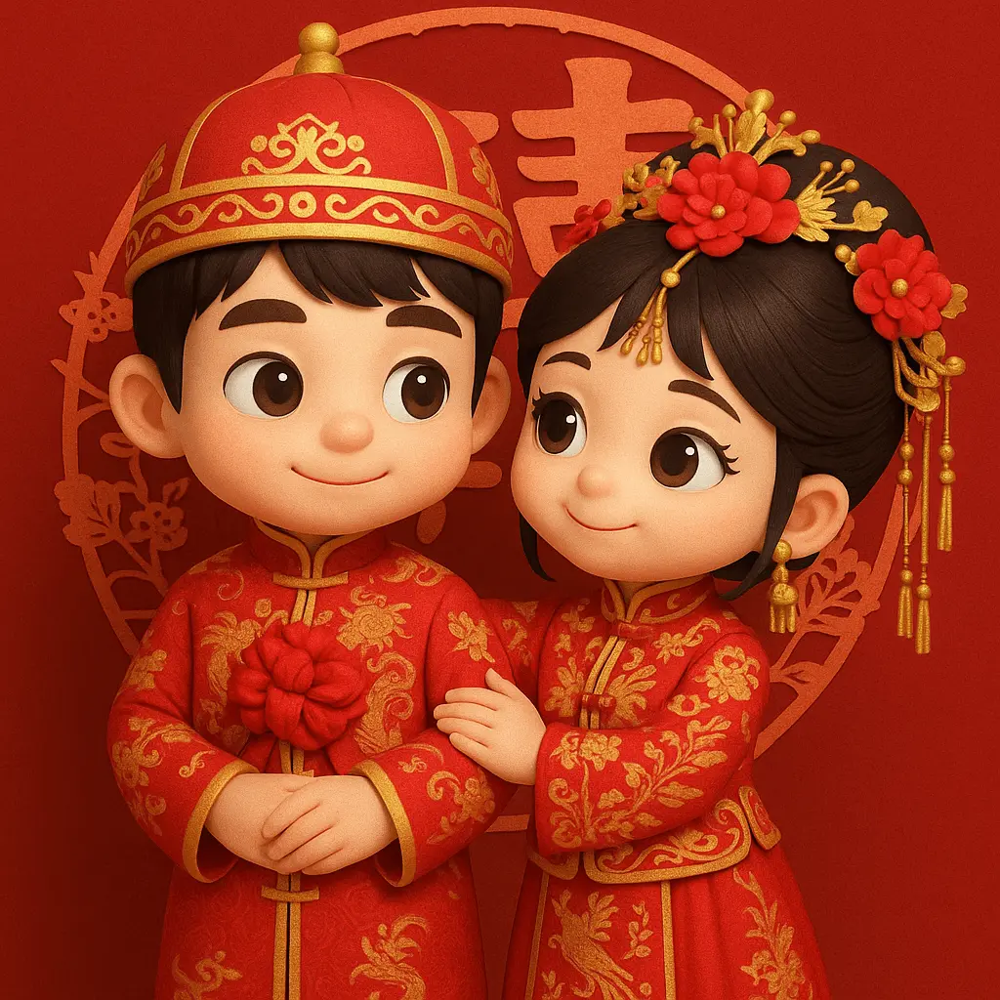

---

#### 3D Chibi Proposal Scene

**Tags:** `3d`, `chibi`, `cartoon`, `realistic`, `cute`

Transform the two people in the photo into chibi-style 3D cartoon characters. Change the scene to a proposal setting, with a soft pastel-colored floral arch in the background. Use romantic tones for the overall background. Rose petals are scattered on the ground. While the characters are rendered in cute chibi 3D style, the environment—including the arch, lighting, and textures—should be realistic and photorealistic.

## Reference Image
A couple's photo.

## Source
- [Original Post](https://x.com/balconychy/status/1909417750587486469)

## Example Output
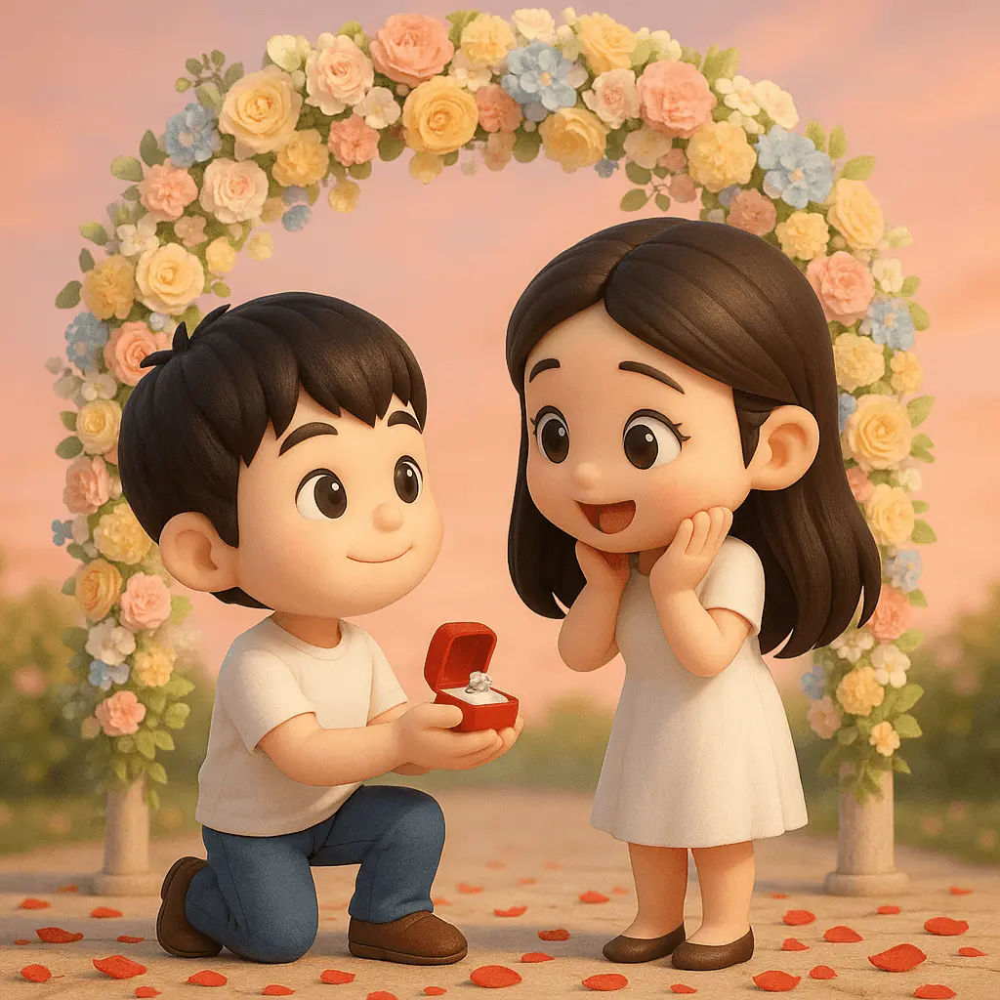

---

#### 3D Chibi-style University Anthropomorphic Mascot

**Tags:** `3d`, `chibi`, `anime`, `character`

Create a personified 3D chibi-style anime girl character representing {Northwestern Polytechnical University}, embodying the school’s distinctive strengths in {aeronautics, astronautics, and marine engineering}.

## Notes
Replace the university name {Northwestern Polytechnical University} and characteristic description {Aeronautics, Astronautics, and Marine Technology - "Three Ais"} within the square brackets to generate anthropomorphic mascots for different universities.

## Source
- [Original Post](https://x.com/dotey/status/1911988003729203648)

## Example Output


---

#### 3D Couple Jewelry Box Figurine

**Tags:** `3d`, `chibi`, `figurine`, `pastel`, `couple`

Create a finely crafted, adorably charming 3D-rendered collectible figure based on the subjects in the photo, displayed inside a pastel-toned, warm and romantic presentation box. The box is designed in a soft cream color with gentle gold accents, resembling an elegant portable jewelry case.

When opened, the box reveals a heartwarming romantic scene: two chibi-style characters gazing sweetly at each other. The lid is engraved with the words “FOREVER TOGETHER,” surrounded by delicate star and heart motifs.

Inside the box stands the female from the photo, holding a small bouquet of white flowers. Beside her is her partner, the male from the photo. Both characters have large, expressive, sparkling eyes and soft, warm smiles that radiate affection and charm.

Behind them is a round window, through which a sunny skyline of a traditional Chinese town can be seen, along with gently drifting clouds. The interior is softly lit with warm ambient lighting, and petals float in the background to enhance the atmosphere.

The overall color scheme of both the display box and the characters is elegant and harmonious, creating a luxurious and dreamlike miniature keepsake.

Aspect ratio: 9:16

## Reference Image
A couple's photo.

## Source
- [Original Post](https://x.com/dotey/status/1909332895115714835)

## Example Output
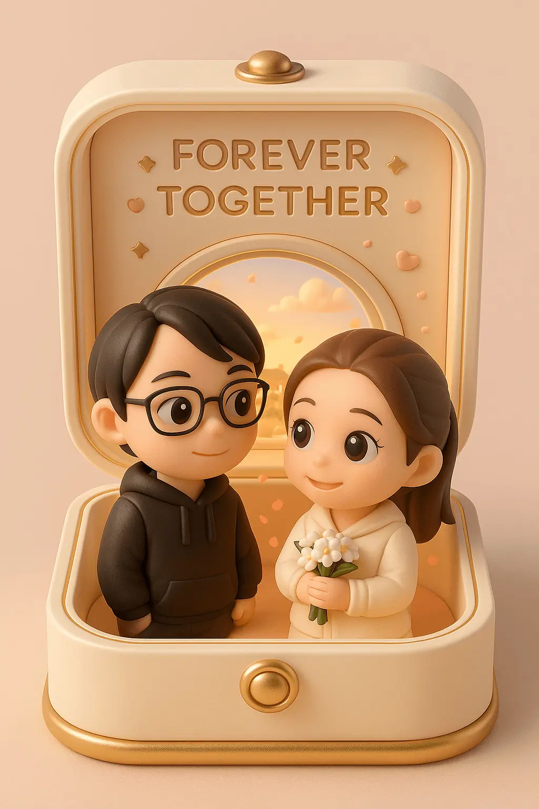

---

#### 3D Papercraft Pop-up Book

**Tags:** `3d`, `realistic`

Multi-layered foldable paper sculpture pop-up book, placed on a desk, with a clean background highlighting the main subject. The book presents a 3D flip-book style, with a 2:3 vertical aspect ratio. The open pages display the scene of [Nezha Demon Child version battling Ao Bing]. All elements are finely foldable and assembled, showcasing a realistic and delicate texture of folded paper. The composition uniformly adopts a frontal perspective, with an overall dreamy and beautiful visual style, vibrant and gorgeous colors, full of a fantastical and lively story atmosphere.

## Notes
Please modify the scene description within the square brackets 【】 as appropriate, and you can also add more details.

## Source
- [Original Post](https://x.com/dotey/status/1923264349050675329)

## Example Output


---

#### 3D Polaroid Breakout Effect

**Tags:** `3d`, `chibi`, `character`

Convert the character in the scene into a 3D chibi-style figure, placed inside a Polaroid photo. The photo paper is being held by a human hand. The character is stepping out of the Polaroid frame, creating a visual effect of breaking through the two-dimensional photo border and entering the real-world 3D space.

## Reference Image
A half-body or full-body single person photo.

## Source
- [Original Post](https://x.com/dotey/status/1908238003169903060)

## Example Output
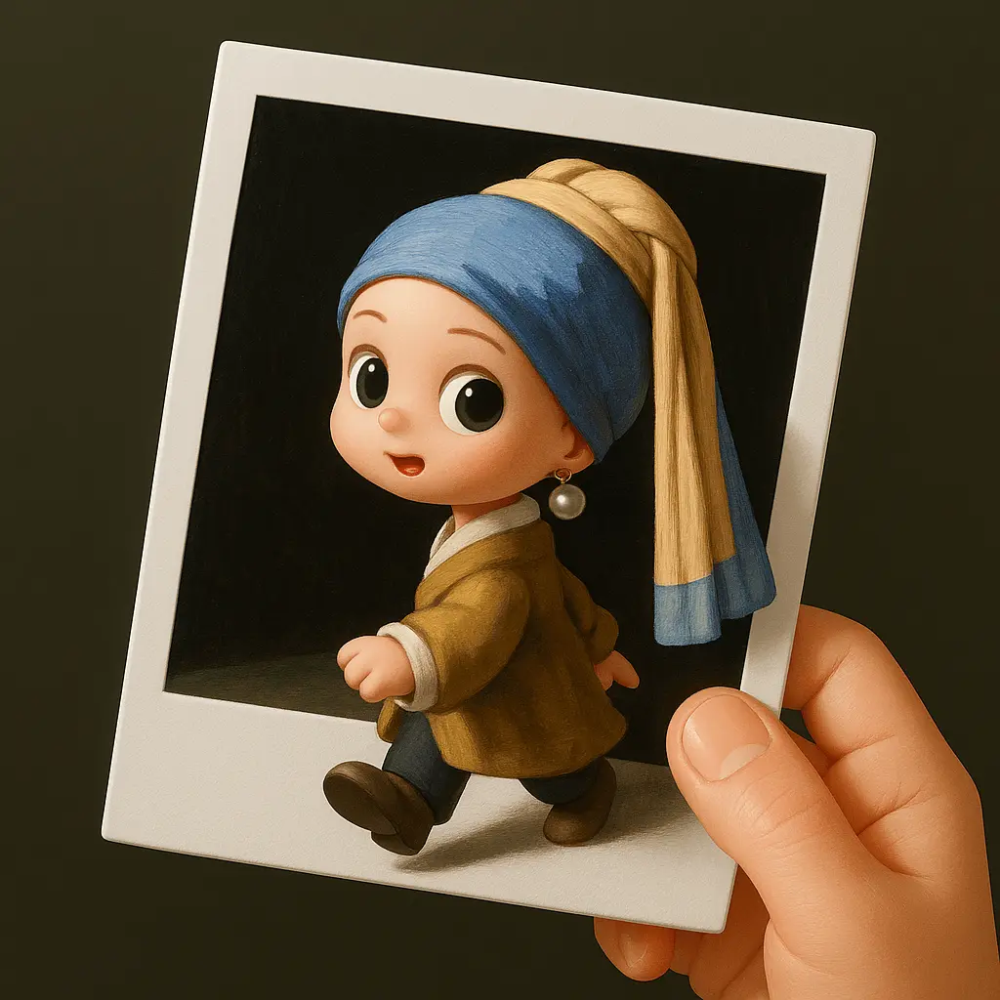

---

#### 3D Q-version Couple Snow Globe

**Tags:** `3d`, `chibi`, `cute`, `couple`, `character`

Transform the person in the attached image into a snow globe scene.
Overall environment: The snow globe is placed on a tabletop by the window, with a blurred, warm-toned background. Sunlight passes through the globe, casting golden sparkles that gently illuminate the surrounding darkness.
Inside the globe: The characters are in a cute chibi-style 3D design, gazing at each other with eyes full of love.

## Reference Image
A photo of a couple or another person.

## Source
- [Original Post](https://x.com/balconychy/status/1909908568129655248)

## Example Output


---

#### 3D Translucent Glass Transformation

**Tags:** `3d`, `glass`

A soft, 3D translucent glass of the attached image with a frosty matte finish and detailed texture, original colors, centered on a light gray background, floats gently in space, soft shadows, natural lighting

## Reference Image
Need to upload a reference image of a physical object

## Source
- [Original Post](https://x.com/azed_ai/status/1917948899098243407)

## Example Output
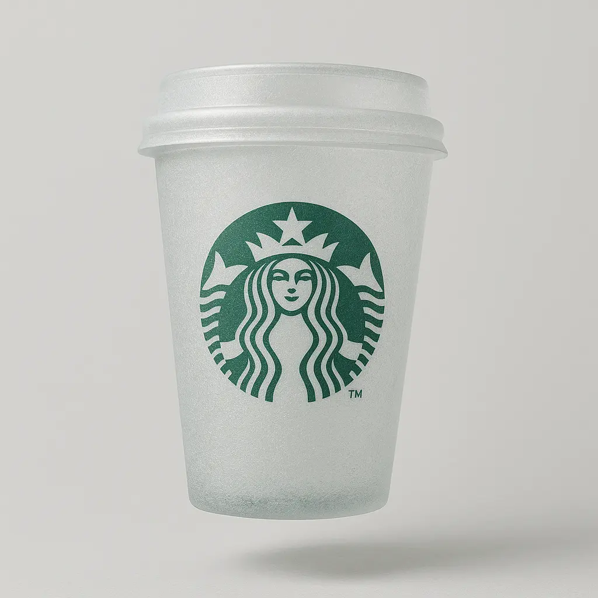

---

#### Action Figure and Real Person in the Same Frame

**Tags:** `anime`, `ai-art`

In a casual, everyday style as if shot on a mobile phone, an anime figure of [Jackie Chan] is placed on a desk, striking an exaggerated and cool pose, fully equipped. Simultaneously, the corresponding real-life person also appears in the frame, striking a similar pose to the figure, creating an interesting visual contrast with the figure and the real person in the same frame. The overall composition is harmonious and natural, delivering a warm and vibrant, true-to-life visual experience.

## Notes
The [Jackie Chan] in the prompt can be replaced with the name of any figurine character you want, or other types of characters.

## Source
- [Original Post](https://x.com/dotey/status/1920994118580183316)

## Example Output
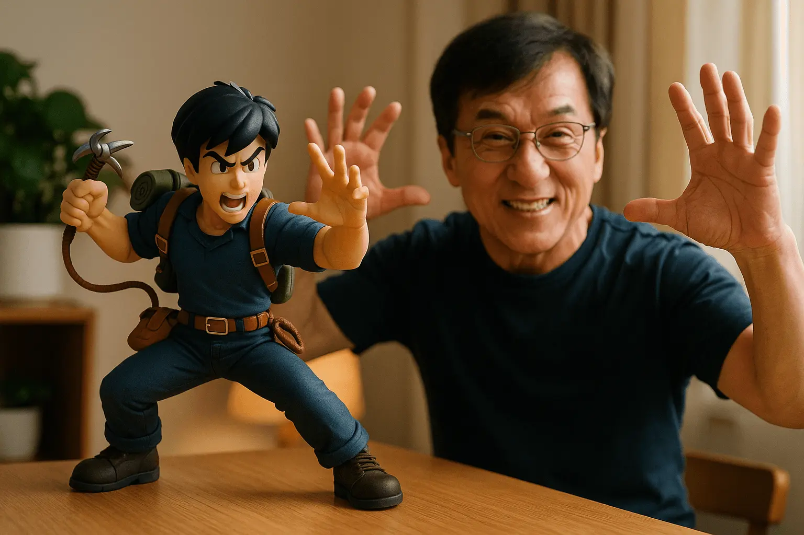

---

#### Bobblehead Generator from Selfie

**Tags:** `cartoon`, `ai-art`

Turn this photo into a bobblehead: enlarge the head slightly, keep the face accurate and cartoonify the body. [Place it on a bookshelf].

## Notes
Please replace [Place it on a bookshelf] in the prompt with your desired specific scene or background, for example "Place it on a bookshelf" or "Place it on an office desk", or "Place it on a neutral background" or "Generate with a transparent background".

## Reference Image
A selfie needs to be uploaded as the basis for generating the bobblehead.

## Source
- [Original Post](https://x.com/thisdudelikesAI/status/1920433372243136730)

## Example Output


---

#### Chibi Character Sticker Pack

**Tags:** `chibi`, `cartoon`, `cute`, `ghibli`, `sticker`

Please create a set of 9 Chibi stickers featuring [the character in the reference image], arranged in a 3x3 grid.
Design requirements:
- Transparent background.
- 1:1 square aspect ratio.
- Consistent Chibi Ghibli cartoon style with vibrant colors.
- Each sticker must have a unique action, expression, and theme, reflecting diverse emotions like "sassy, mischievous, cute, frantic" (e.g., rolling eyes, laughing hysterically on the floor, soul leaving body, petrified, throwing money, foodie mode, social anxiety attack). Incorporate elements related to office workers and internet memes.
- Each character depiction must be complete, with no missing parts.
- Each sticker must have a uniform white outline, giving it a sticker-like appearance.
- No extraneous or detached elements in the image.
- Strictly no text, or ensure any text is 100% accurate (no text preferred).

## Notes
Please replace "[the character in the reference image]" in the prompt with a specific description of the character's features, or directly upload a reference image.

## Reference Image
A character image needs to be uploaded as the main reference for creating the sticker pack.

## Source
- [Original Post](https://x.com/leon_yuan2001/status/1923712069209293014)

## Example Output
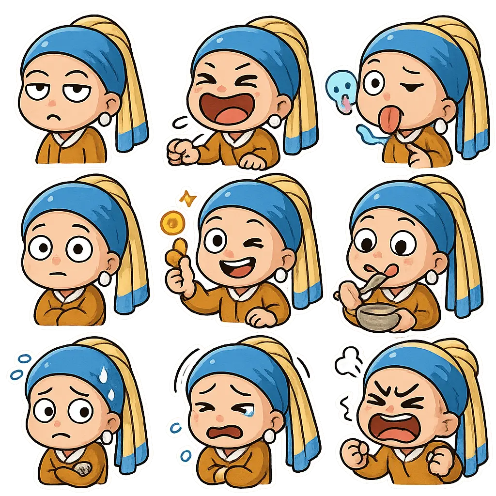

---

#### Country Diorama in a Toy Box

**Tags:** `3d`, `realistic`, `icon`, `diorama`

An ultra-realistic top-down photograph of a 3D-printed diorama inside a beige cardboard box, with the lid being held open by two human hands. The interior of the box reveals a miniature landscape of [COUNTRY NAME], featuring iconic landmarks, terrain, buildings, rivers, vegetation, and crowds of tiny, detailed human figures. The diorama is filled with vibrant, geographically appropriate elements, all crafted in a tactile, toy-like style using matte 3D-printed textures with visible layer lines. At the top, the inside of the box lid displays the phrase “[COUNTRY NAME]” in large, colorful, raised plastic letters—each letter in a different bright color. The lighting is warm and cinematic, highlighting the textures and shadows to evoke a sense of realism and charm, as if the viewer is opening a magical miniature version of the nation

## Notes
Please replace `[COUNTRY NAME]` in the prompt with a specific country name.

## Source
- [Original Post](https://x.com/TheRelianceAI/status/1925223613055017251)

## Example Output


---

#### Custom Anime Figure

**Tags:** `anime`, `realistic`, `character`

Generate an anime-style figure photo placed on a desktop, presented from a casual, everyday snapshot perspective as if taken with a mobile phone. The figure model is based on the attached character photo, accurately reproducing the full body posture, facial expression, and clothing style of the person in the photo, ensuring the entire figure is fully rendered. The overall design is exquisite and detailed, with hair and clothing featuring natural, soft gradient colors and fine textures. The style leans towards Japanese anime, rich in detail, with realistic textures and a beautiful appearance.

## Reference Image
Please upload a photo showing the person's full body posture, facial expression, and clothing style to be used as the basis for the figure model.

## Source
- [Original Post](https://x.com/dotey/status/1920851135516082246)

## Example Output
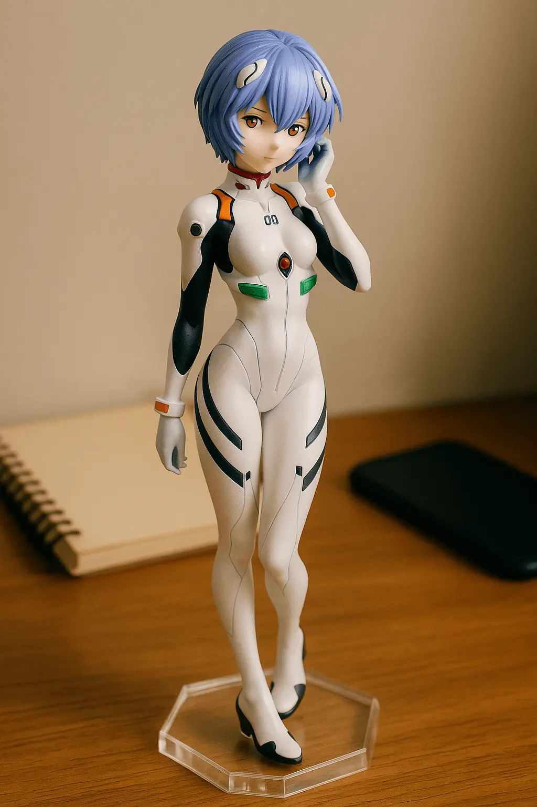

---

#### Cute Chibi Keychain

**Tags:** `chibi`, `cute`

A close-up photo of a cute, colorful keychain held by person's hand. The keychain features a chibi-style of the [attached image ]. The keychain is made of soft rubber with bold black outlines and attached to a small silver keyring, neutral background

## Notes
The `[attached image]` part of the prompt needs to be used in conjunction with an uploaded image.

## Reference Image
A photo of a person or object as the subject for the keychain design.

## Source
- [Original Post](https://x.com/azed_ai/status/1916521742052503804)

## Example Output


---

#### Cute Chibi Matryoshka Dolls (Girl with a Pearl Earring)

**Tags:** `chibi`, `cute`

Transform the person in the image into a set of cute chibi-style Russian nesting dolls (🪆), with a total of five dolls arranged from largest to smallest. Place them on an elegant wooden table. Horizontal aspect ratio: 3:2.

## Reference Image
Requires uploading a person's image as the subject for transformation (The original post used ['Girl with a Pearl Earring'](https://commons.wikimedia.org/w/index.php?curid=55017931)).

## Source
- [Original Post](https://x.com/ZHO_ZHO_ZHO/status/1911669883315818497)

## Example Output


---

#### ESC Keycap Miniature Diorama

**Tags:** `3d`, `realistic`, `diorama`, `glass`

A hyper-realistic isometric 3D render of a miniature computer setup inside a translucent mechanical keyboard keycap, specifically placed on the ESC key of a real matte-finished mechanical keyboard. Inside the keycap, a tiny figure sits in a modern ergonomic chair, wearing a cozy textured hoodie, working at a glowing ultra-realistic computer screen. The environment is packed with lifelike miniature tech accessories: real-material desk lamps, monitors with reflections, tiny speaker grills, tangled cables, and ceramic mugs. The base of the scene is made of soil, rocks, and moss, with photorealistic textures and imperfections. The lighting inside the cap mimics natural morning sun, casting soft shadows and warm tones, while the outside has cold ambient reflections from the surrounding keyboard. The word “ESC” is subtly etched onto the top of the translucent keycap with a faint frosted glass effect — just barely visible depending on the angle. The surrounding keyboard keys like F1, Q, Shift, and CTRL are crisp, textured, and photorealistically lit. Shot as if taken with a high-end mobile phone camera, with shallow depth of field, perfect white balance, and cinematic detail.

## Source
- [Original Post](https://x.com/egeberkina/status/1911368319212408926)

## Example Output
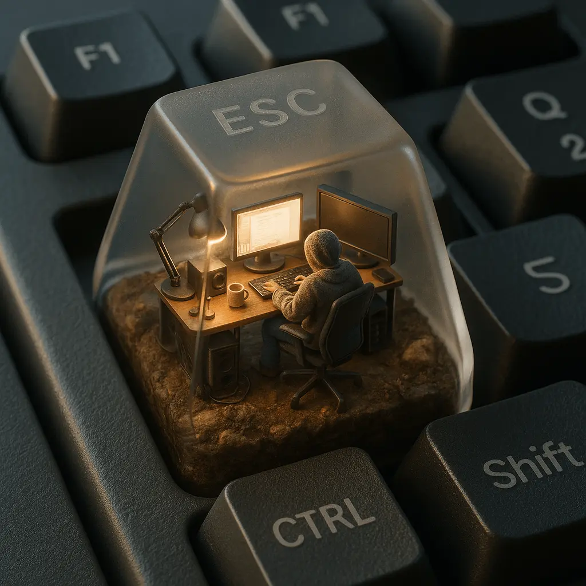

---

#### Funko Pop Figure Creation

**Tags:** `chibi`, `realistic`

Transform the person in the photo into the style of a Funko Pop figure box, presented in isometric view.
The packaging is labeled with the title “JAMES BOND.”
Inside the box, display a chibi-style figure based on the person in the photo, along with their essential accessories: a pistol, a wristwatch, a suit, and other signature items.
Next to the box, show a realistic rendering of the actual figure outside the packaging, with detailed textures and lighting to achieve a lifelike product display.

## Reference Image
A clear half-body or full-body photo.

## Source
- [Original Post](https://x.com/dotey/status/1909047283485671924)

## Example Output
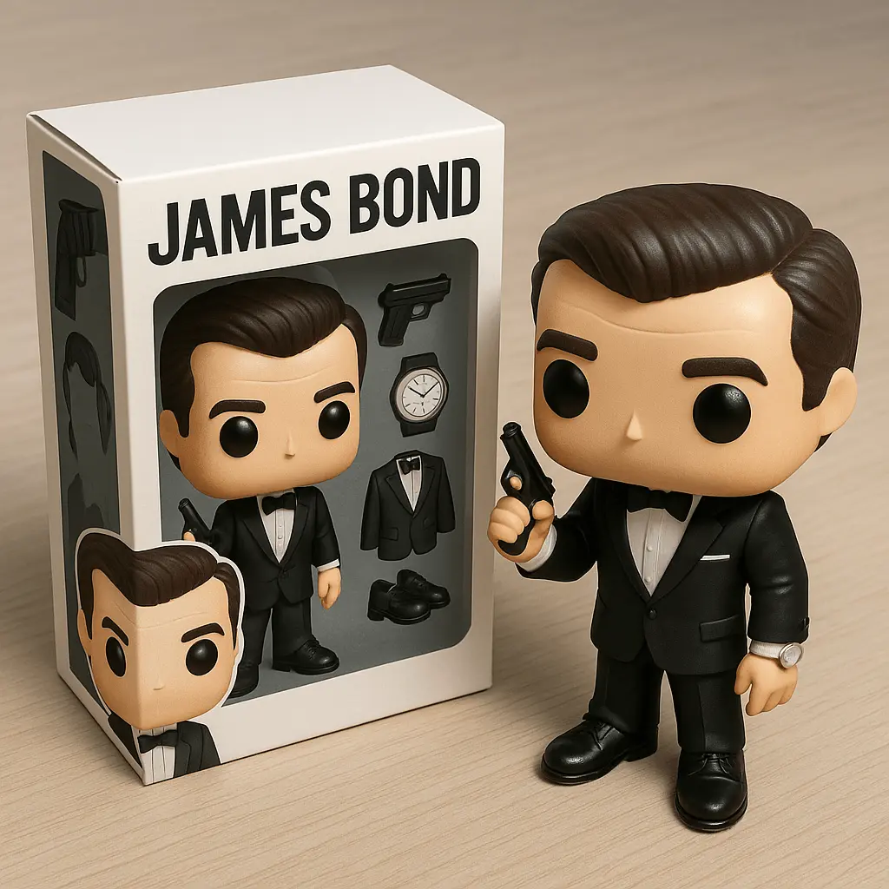

---

#### Gold Pendant Necklace

**Tags:** `realistic`, `emoji`

A photorealistic close-up of a gold pendant necklace held by female hand. The pendant features a bas-relief engraving of [image /emoji]. The pendant hangs from a polished gold chain. The background is softly blurred with neutral beige tones, and natural lighting, realistic skin tones, Product photography, 16:9 aspect ratio.

## Notes
Replace `[image /emoji]` in the prompt with a specific image description or an emoji.

## Reference Image
(Optional) An image can be uploaded to be used as the bas-relief pattern.

## Source
- [Original Post](https://x.com/azed_ai/status/1915770501705925106)

## Example Output


---

#### Happy Capsule Creation

**Tags:** `logo`, `ai-art`

Title (large text): Fast-Acting Happiness Capsule
A capsule pill with a green top in Starbucks green and a transparent bottom, printed with the Starbucks logo. Inside the capsule are numerous coffee beans.
Description (small text): Take when feeling sad or down. Three times a day, two capsules per dose.
Buy button: Same color as the capsule.
Below the button, display the price: $9.
Please follow medical advice and purchase as needed.

## Source
- [Original Post](https://x.com/ZHO_ZHO_ZHO/status/1911724629460455896)

## Example Output


---

#### Lego Cityscape (Shanghai Bund)

**Tags:** `icon`, `lego`

Create a highly detailed and vividly colored LEGO-style scene of the Shanghai Bund. The foreground features the iconic historical buildings of the Bund, meticulously recreated with LEGO bricks in Western and neoclassical architectural styles — including clock towers, domes, and colonnades. LEGO minifigures are seen strolling along the riverfront, taking photos, and sightseeing, with classic LEGO-style cars parked along the street.
In the background lies the spectacular Huangpu River, assembled with translucent blue LEGO bricks. On the water, LEGO ferries and tour boats sail along. Across the river stands the skyline of Lujiazui in Pudong, including the Oriental Pearl Tower, Shanghai Tower, Jin Mao Tower, and Shanghai World Financial Center — all rendered as vibrant, lifelike LEGO skyscrapers.
The sky is LEGO’s signature bright blue, adorned with a few white LEGO brick clouds, creating a visual full of energy and modernity.

## Notes
You can ask AI to generate similar prompts for other cityscapes based on this example. Original image generated by Sora.

## Source
- [Original Post](https://x.com/dotey/status/1917713810346872902)

## Example Output


---

#### Lego Collectible Figure

**Tags:** `minimalist`, `surreal`, `lego`, `glass`, `animal`

Generate a vertically-oriented image based on my uploaded photo, using the following prompt:
Classic LEGO minifigure style in a miniature scene — an animal stands beside me. The color palette of the animal should match mine.
Please design the animal based on your understanding of me. You may choose any creature — real, surreal, or fantastical — that you feel best reflects my personality.
The entire scene is set within a transparent glass cube, with a minimalist interior design.
The base of the miniature is matte black with silver accents, following a clean and modern aesthetic.
On the base, there is an elegantly engraved nameplate in a refined serif font, displaying the name of the animal.
The lower part of the base subtly incorporates finely etched biological classification details, similar to a natural history museum display.
The overall composition should resemble a high-end collectible artwork: meticulously crafted, curated in style, and lit with refined lighting.
Balance is key to the layout. The background should feature a smooth gradient transition from dark to light tones, selected to match the dominant color theme.

## Reference Image
A half-body or full-body single person photo.

## Source
- [Original Post](https://x.com/ZHO_ZHO_ZHO/status/1910644499354968091)

## Example Output


---

#### Miniature 3D Building

**Tags:** `3d`, `chibi`, `realistic`, `cute`, `figurine`

3D chibi-style miniature design of a whimsical Starbucks café, shaped like an oversized takeaway coffee cup complete with a lid and straw. The building has two floors, with large glass windows that clearly reveal a cozy and refined interior: wooden furniture, warm lighting, and busy baristas at work. On the street, cute little figurines are strolling or sitting, surrounded by benches, street lamps, and potted plants, creating a charming corner of the city. The overall aesthetic follows a detailed and realistic miniature cityscape style, with soft lighting that evokes a relaxing afternoon atmosphere.

## Notes
You can ask the AI to generate similar prompts for other buildings by referencing the prompt above. For example: "Referencing the prompt above, write a similar prompt for [Dunkin' Donuts], shaped like a [donut]".

## Source
- [Original Post](https://x.com/dotey/status/1913759515700285569)

## Example Output
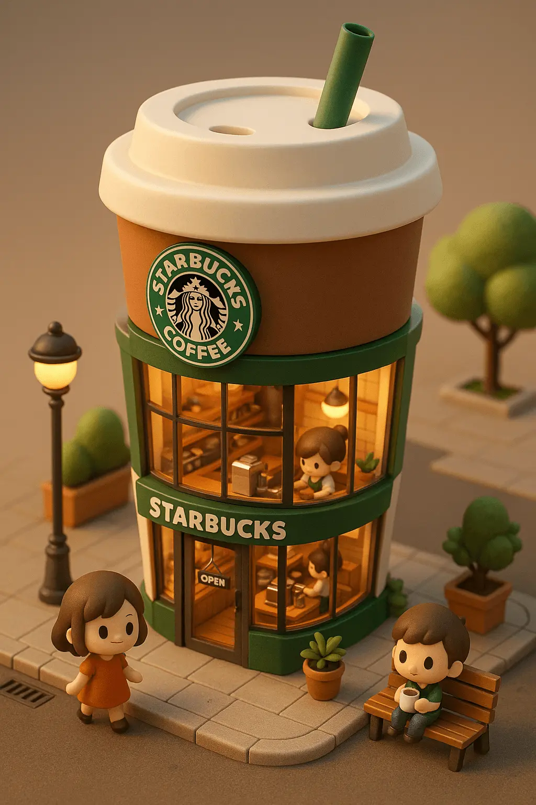

---

#### Miniature Cyberpunk Tilt-Shift Landscape

**Tags:** `realistic`, `cyberpunk`

A highly detailed miniature [Cyberpunk] landscape viewed from above, using a tilt-shift lens effect. The scene is filled with toy-like elements, all rendered in high-resolution CG. Dramatic lighting creates a cinematic atmosphere, with vivid colors and strong contrast, emphasizing depth of field and a realistic micro-perspective, making the viewer feel as if overlooking a toy world. The image contains many visual jokes and details worth repeated viewing.

## Notes
You can replace [Cyberpunk] in the prompt with other styles or scenes, such as "Futuristic City", "Steampunk", "Medieval Village", etc.

## Example Output


---

#### Miniature Three-dimensional Scene Presentation

**Tags:** `chibi`, `ai-art`

Miniature three-dimensional scene presentation using tilt-shift photography techniques, depicting a chibi-style version of the scene {Sun Wukong’s Three Battles with the White Bone Demon}

## Notes
The content in brackets can be replaced with Western scenes such as “Hercules Slaying the Hydra” or “King Arthur Pulls the Sword from the Stone.”

## Source
- [Original Post](https://x.com/dotey/status/1911609122547449886)

## Example Output
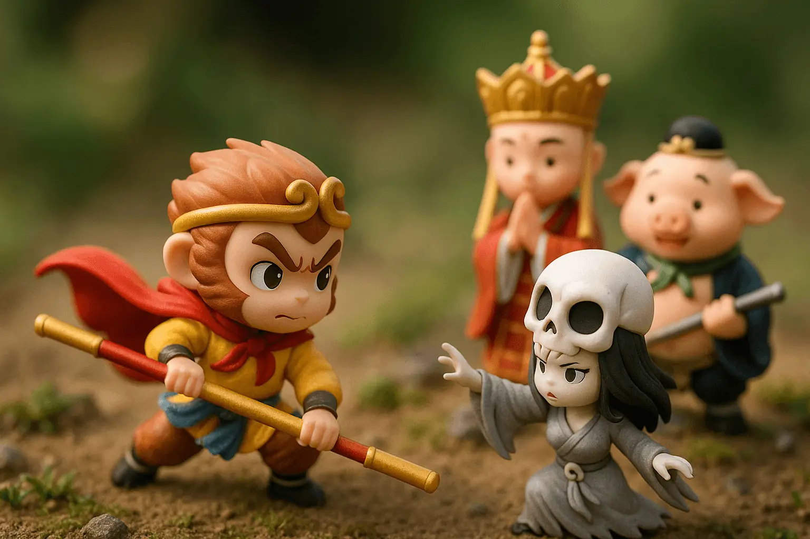

---

#### Minimalist 3D Illustration (Markdown Format)

**Tags:** `3d`, `minimalist`, `illustration`

Draw a Toilet

## 🎨 Art Style: Minimalist 3D Illustration

### 🟢 Shape Language
- Rounded edges and smooth, soft forms using simplified geometric shapes.

### 🎨 Colors
- **Primary palette:** soft beige, light gray, warm orange.  
- **Accent color:** warm orange for focal elements.  
- **Shading:** gentle gradients and smooth transitions, avoiding harsh shadows and highlights.

### 💡 Lighting
- **Type:** soft, diffuse lighting.  
- **Light source direction:** from above, slightly to the right.  
- **Shadow style:** subtle and diffused, without sharp or high-contrast shadows.

### 🧱 Materials
- **Surface texture:** matte and smooth with subtle light variation.  
- **Reflectivity:** low to none, avoiding noticeable gloss.

### 🖼️ Composition
- **Object presentation:** a single, centered object with generous negative space around it.  
- **Perspective:** slight tilt to suggest depth, but no strong depth-of-field effects.  
- **Background:** flat color, low saturation, harmonious with the subject and non-distracting.

### ✒️ Typography
- **Font style:** minimalist sans-serif.  
- **Text placement:** bottom left corner, small and unobtrusive.  
- **Font color:** gray, low contrast with the background.

### 🖥️ Rendering Style
- **Technique:** 3D rendering in a simplified low-poly style.  
- **Detail level:** medium — focus on shape and color, avoiding complex textures or fine details.

## 🎯 Style Goal
> Create a clean and aesthetically pleasing visual that emphasizes simplicity, approachability, and modernity.

## Source
- [Original Post](https://x.com/dotey/status/1907131027253772399)

## Example Output


---

#### Minimalist 3D Illustration

**Tags:** `3d`, `minimalist`, `illustration`

Generate a toilet with the following JSON profile:
{
  "art_style_profile": {
    "style_name": "Minimalist 3D Illustration",
    "visual_elements": {
      "shape_language": "Rounded edges, smooth and soft forms with simplified geometry",
      "colors": {
        "primary_palette": ["Soft beige, light gray, warm orange"],
        "accent_colors": ["Warm orange for focal elements"],
        "shading": "Soft gradients with smooth transitions, avoiding harsh shadows or highlights"
      },
      "lighting": {
        "type": "Soft, diffused lighting",
        "source_direction": "Above and slightly to the right",
        "shadow_style": "Subtle and diffused, no sharp or high-contrast shadows"
      },
      "materials": {
        "surface_texture": "Matte, smooth surfaces with subtle shading",
        "reflectivity": "Low to none, avoiding glossiness"
      },
      "composition": {
        "object_presentation": "Single, central object displayed in isolation with ample negative space",
        "perspective": "Slightly angled, giving a three-dimensional feel without extreme depth",
        "background": "Solid, muted color that complements the object without distraction"
      },
      "typography": {
        "font_style": "Minimalistic, sans-serif",
        "text_placement": "Bottom-left corner with small, subtle text",
        "color": "Gray, low-contrast against the background"
      },
      "rendering_style": {
        "technique": "3D render with simplified, low-poly aesthetics",
        "detail_level": "Medium detail, focusing on form and color over texture or intricacy"
      }
    },
    "purpose": "To create clean, aesthetically pleasing visuals that emphasize simplicity, approachability, and modernity."
  }
}

## Source
- [Original Post](https://x.com/0xdlk/status/1906843247432929642)

## Example Output


---

#### 3D Chibi-Style Miniature Brand Store

**Tags:** `3d`, `chibi`, `icon`, `glass`

*Create a miniature 3D store for a brand*

3D chibi-style miniature concept store of {Brand Name}, creatively designed with an exterior inspired by the brand's most iconic product or packaging (such as a giant {brand's core product, e.g., chicken bucket/hamburger/donut/roast duck}). The store features two floors with large glass windows clearly showcasing the cozy and finely decorated interior: {brand's primary color}-themed decor, warm lighting, and busy staff dressed in outfits matching the brand. Adorable tiny figures stroll or sit along the street, surrounded by benches, street lamps, and potted plants, creating a charming urban scene. Rendered in a miniature cityscape style using Cinema 4D, with a blind-box toy aesthetic, rich in details and realism, and bathed in soft lighting that evokes a relaxing afternoon atmosphere. --ar 2:3

## Example Output


---

#### 3D Isometric Home Office Illustration

**Tags:** `3d`, `illustration`

*Create a 3D isometric view of a home office*

Based on you know about me, generate a 3D isometric colored illustration of me working from home, filled with various interior details. The visual style should be rounded, polished, and playful. --ar 1:1

[Additional details: a bichon frise and 3 monitors]

## Example Output
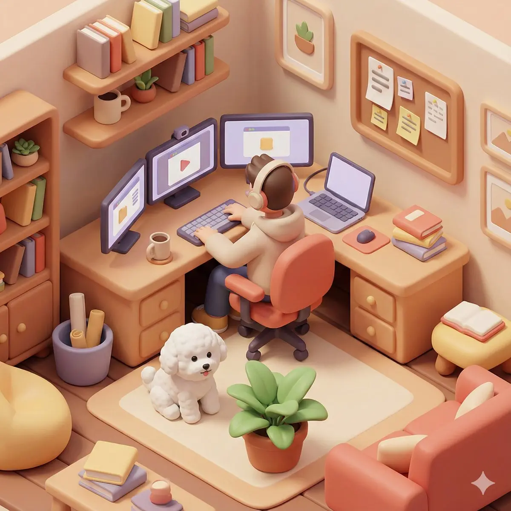

---

#### City's Tallest Buildings 3D Cartoon View

**Tags:** `3d`, `cartoon`, `minimalist`, `realistic`

*Create a miniature 3D view of city's tallest buildings*

Present a clear, side miniature 3D cartoon view of [YOUR CITY] tallest buildings. Use minimal textures with realistic materials and soft, lifelike lighting and shadows. Use a clean, minimalistic composition showing exactly the three tallest buildings in Sopot, arranged from LEFT to RIGHT in STRICT descending height order. The tallest must appear visibly tallest, the second must be clearly shorter than the first, and the third must be clearly shorter than the second.
All buildings must follow accurate relative proportions: if a building is taller in real life, it MUST be taller in the image by the same approximate ratio. No building may be visually stretched or compressed.
Each building should stand separately on a thin, simple ceramic base. Below each base, centered text should display:
Height in meters — semibold sans-serif, medium size
Year built — lighter-weight sans-serif, smaller size, directly beneath the height text
Provide consistent padding, spacing, leading, and kerning. Write "YOUR CITY NAME" centered above the buildings, using a medium-sized sans-serif font.
 No building top should overlap or touch the text above.Use accurate architectural proportions based on real-world references.Maintain consistent camera angle and identical scale for each building model.
No forced perspective. Use straight-on orthographic-style rendering. Do not exaggerate or stylize size differences beyond proportional accuracy.

Use a square 1080×1080 composition.Use a clean, neutral background. Ensure no extra objects are present.

## Example Output
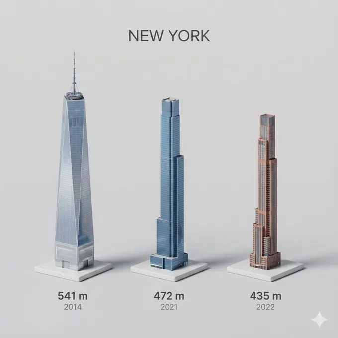

---

#### Split View 3D Render - iPhone 17 Pro

**Tags:** `3d`, `minimalist`, `realistic`

*Create a 3D render with realistic left half and wireframe right half*

Create a high-quality, realistic 3D render of exactly one instance of the object: [Orange iPhone 17 Pro].
The object must float freely in mid-air and be gently tilted and rotated in 3D space (not front-facing).
Use a soft, minimalist dark background in a clean 1080×1080 composition.
Left Half — Full Realism
The left half of the object should appear exactly as it looks in real life
— accurate materials, colors, textures, reflections, and proportions.
This half must be completely opaque with no transparency and no wireframe overlay.
No soft transition, no fading, no blending.
Right Half — Hard Cut Wireframe Interior
The right half must switch cleanly to a wireframe interior diagram.
The boundary between the two halves must be a perfectly vertical, perfectly sharp, crisp cut line, stretching straight from the top edge to the bottom edge of the object.
No diagonal edges, no curved slicing, no gradient.
The wireframe must use only two line colors:
Primary: white (≈80% of all lines)
Secondary: a color sampled from the dominant color of the realistic half (<20% of lines)
The wireframe lines must be thin, precise, aligned, and engineering-style.
Every wireframe component must perfectly match the geometry of the object.
Strict Single-Object Rule
Render only ONE object in the entire frame.  Render only one physical object.
Do NOT show a second object from any angle. Do NOT show a second object as a reflection, shadow, silhouette, outline, ghost image, or transparency. Do NOT show a second object for comparison or display purposes. Do NOT show both the front and the back separately.
Do NOT show an extra device behind, beside, underneath, or partially hidden.
Only one single object is allowed in the entire frame.
No duplicate objects, no mirrored back-and-front pairings, no reflections showing a second object.
The object must appear alone, floating.
Pose & Lighting:
Apply a natural, subtle tilt + rotation in 3D to make it look like a floating product visualization.
Use soft, neutral global illumination and no shadows under the object.
No extra props, no text, no labels unless explicitly requested.

## Example Output
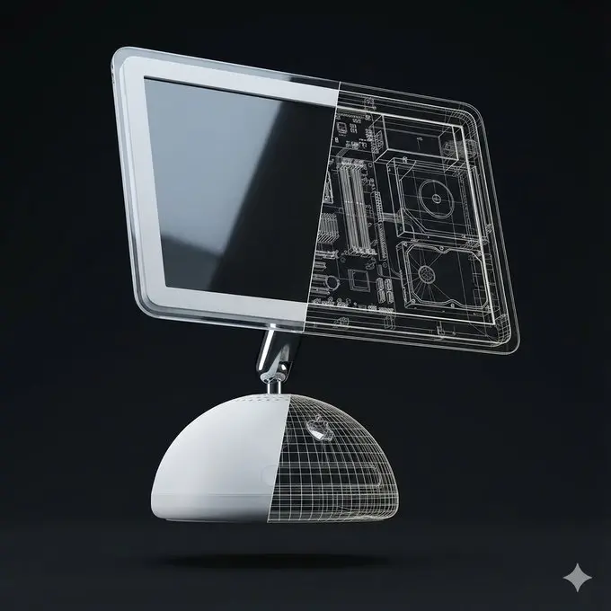

---

#### USA 3D Diorama with Landmarks

**Tags:** `3d`, `cute`, `icon`, `diorama`, `pastel`

*Create an isometric 3D diorama of US landmarks*

Create a high-detail 3D isometric diorama of the entire United States, where each state is represented as its own miniature platform. Inside each state, place a stylized, small-scale 3D model of that state's most iconic landmark. Use the same visual style as a cute, polished 3D city diorama: soft pastel colors, clean materials, smooth rounded forms, gentle shadows, and subtle reflections. Each landmark should look like a miniature model, charming, simplified, but clearly recognizable. Arrange the states in accurate geographical layout, with consistent lighting and perspective. Include state labels and landmark labels in a clean, modern font, floating above or near each model.

## Example Output
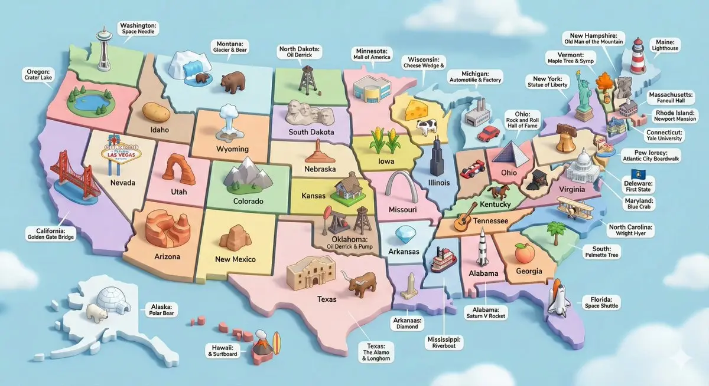

---

#### One Piece Themed Figure Creation

**Tags:** `anime`, `realistic`, `character`

Transform the person in the photo into a One Piece-themed anime-style action figure, presented inside a collectible figure box designed in the visual style of the One Piece universe. The box is shown in an isometric view.
Inside the box, display the character reimagined in the One Piece anime art style, posed dynamically and accompanied by essential everyday items such as a pistol, a wristwatch, a suit, and leather shoes — all miniaturized and arranged like collectible accessories.
Next to the box, include a realistic, fully rendered version of the actual figure itself, outside of the packaging. This figure should be rendered with high detail and realism, showcasing the material textures and craftsmanship, as if it were a professionally photographed product.

## Notes
The list of essential items was slightly modified here. Please refer to the original source.

## Reference Image
A half-body or full-body photo.

## Source
- [Original Post](https://x.com/dotey/status/1909047547563213145)

## Example Output


---

#### Pastel Power 3D ADS

**Tags:** `3d`, `cartoon`, `minimalist`, `logo`, `pastel`

a soft 3D cartoon-style sculpture of [brand product], made of smooth clay-like textures and vibrant pastel colors, placed in a minimalist isometric scene that complements the product’s nature, clean composition, gentle lighting, subtle shadows, with the product’s logo and a 3-word slogan displayed clearly below

## Notes
Replace [brand product] in the prompt with a specific product description.

## Source
- [Original Post](https://x.com/aziz4ai/status/1925301120252924356)

## Example Output
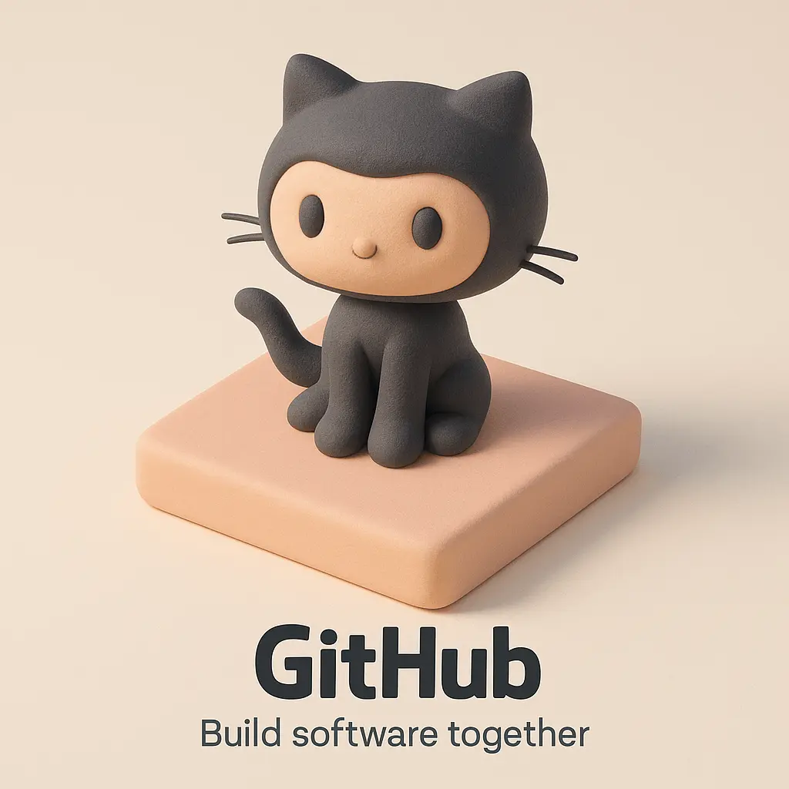

---

#### Perspective 3D Pop-Out Effect

**Tags:** `3d`, `realistic`, `surreal`, `cute`, `glass`

Hyperrealistic, top-down bird's-eye view shot, a beautiful Instagram model [Anne Hathaway / see reference image], with exquisite and beautiful makeup and fashionable styling, standing on the screen of a smartphone held up by someone. The image creates a strong perspective illusion. Emphasize the 3D effect of the girl standing out from the phone. She wears black-rimmed glasses, high-street fashion, and strikes a cute, playful pose. The phone screen is treated as a dark floor, like a small stage. The scene uses strong forced perspective to show the proportional difference between the hand, the phone, and the girl. The background is clean gray, using soft indoor light, shallow depth of field, and the overall style is surrealistic photorealistic compositing. Very strong perspective.

## Notes
You can replace [Anne Hathaway] in the prompt with other character names. Or use a photo of a person as a reference image.

## Reference Image
You can use a photo of a person as a reference image. This example image uses ["Girl with a Pearl Earring"](https://commons.wikimedia.org/w/index.php?curid=55017931) as a reference image.

## Source
- [Original Post](https://x.com/ZHO_ZHO_ZHO/status/1920355982703509588)

## Example Output


---

#### Photo to 3D Q-version Style

**Tags:** `3d`, `chibi`, `character`

Transform the characters in the scene into 3D chibi-style figures, while keeping the original scene layout and their clothing exactly the same.

## Reference Image
A photo.

## Source
- [Original Post](https://x.com/dotey/status/1908194518345678865)

## Example Output


---

#### Pixar 3D Style

**Tags:** `3d`, `pixar`

Redraw this photo in Pixar 3D style

## Reference Image
A photo of a person or other subject.

## Source
- [Original Post](https://animeai.online/#demo-gallery)

## Example Output
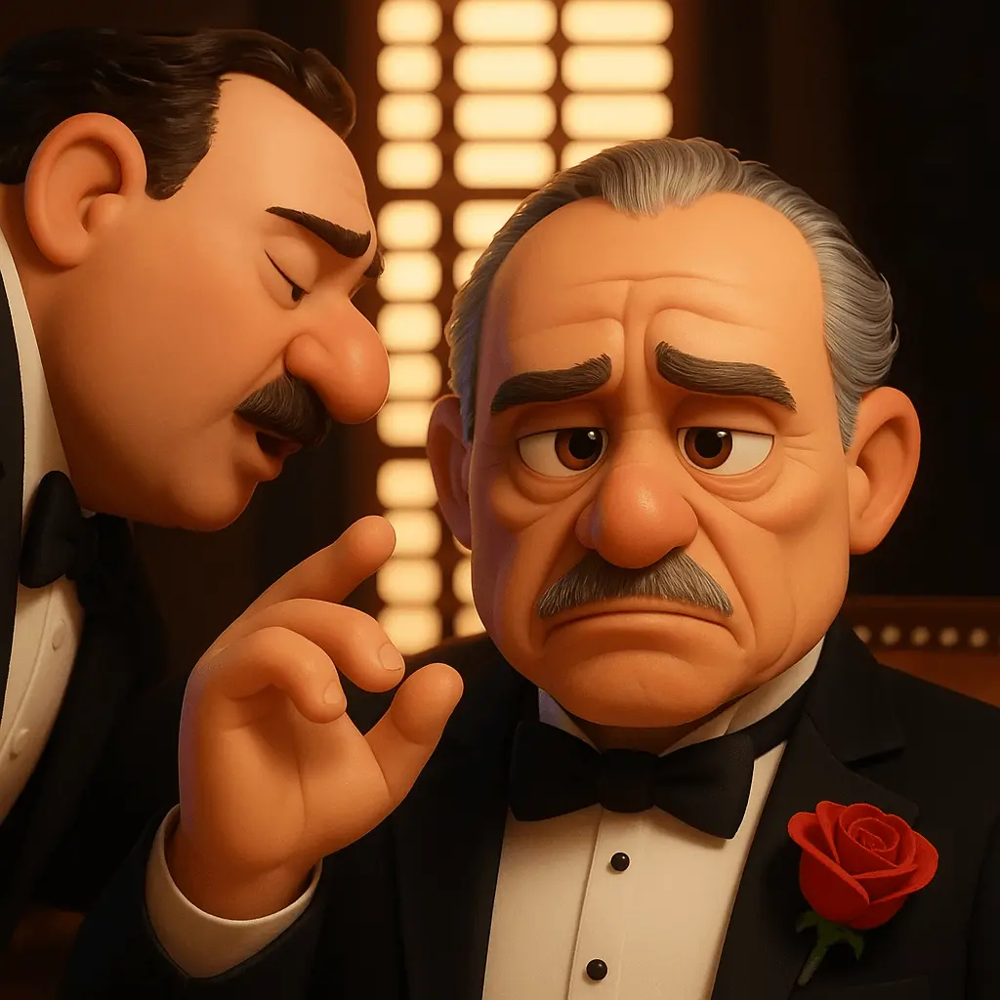

---

#### Story Scene in Crystal Ball

**Tags:** `3d`, `chibi`, `surreal`, `fantasy`, `character`

A delicate crystal ball rests quietly on a warm, softly lit tabletop by the window. The background is blurred and hazy, with warm-toned sunlight gently passing through the crystal ball, refracting specks of golden light that softly illuminate the dim surroundings.
Inside the crystal ball, a miniature three-dimensional world themed around {Chang’e Flying to the Moon} is naturally displayed — a finely detailed, dreamlike 3D scene. All characters and objects are rendered in adorable chibi style, exquisitely crafted and visually charming, with vivid emotional interactions between them.
The overall atmosphere is rich with East Asian fantasy elements, full of intricate details and a surreal magical realism texture. The entire scene feels poetic and dreamy, luxurious yet elegant, radiating a gentle, comforting glow — as if imbued with life through the warm play of light and shadow.

## Notes
Replace the text within the square brackets {} in the prompt with a description of a story scene (idioms, stories, short tales all work).

## Source
- [Original Post](https://x.com/dotey/status/1916530529324699858)

## Example Output
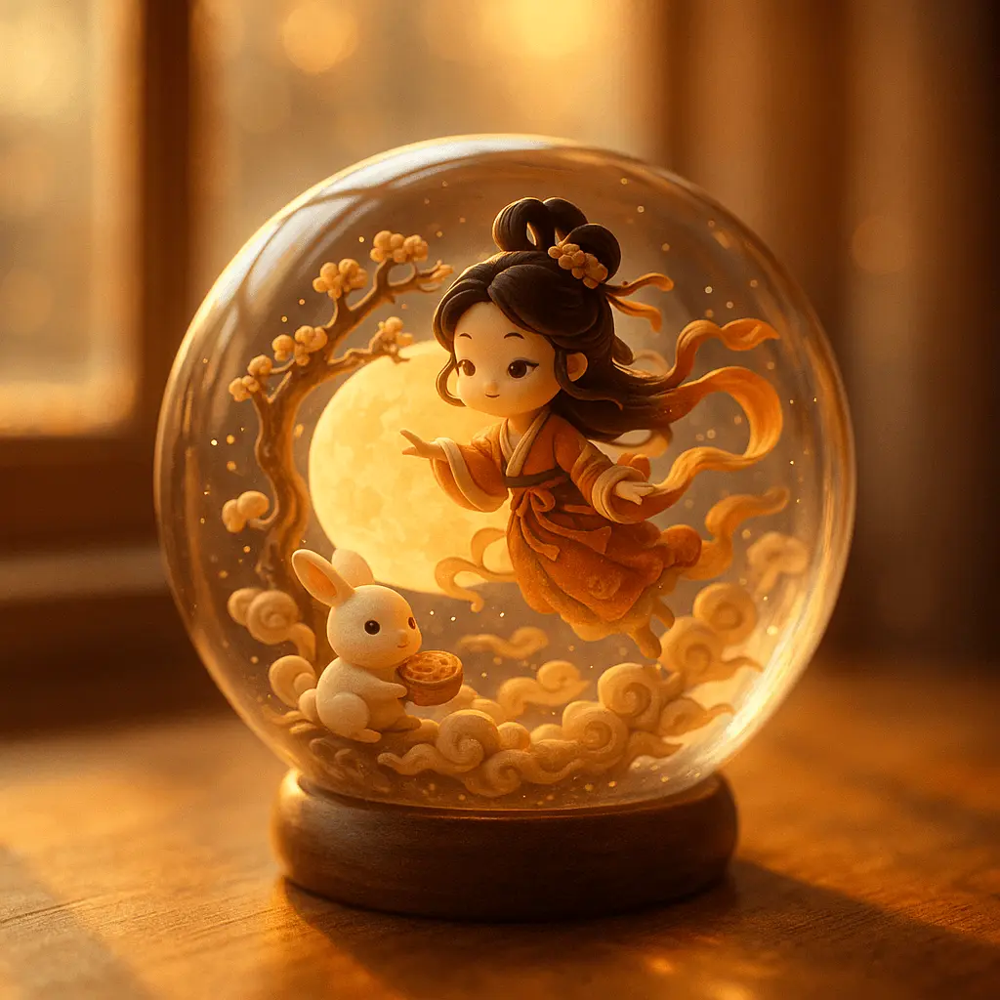

---

#### Ultra-realistic 3D Game

**Tags:** `3d`, `realistic`, `poster`, `icon`, `character`

Ultra-realistic 3D rendered image that replicates the character design of Natasha from Command & Conquer: Red Alert 3 in 2008, following the original model exactly. The scene is set in a dim and cluttered bedroom from the year 2008. The character is sitting on the carpet, facing an old-fashioned television that is playing Command & Conquer: Red Alert 3 and a game console controller.
The entire room is filled with a nostalgic atmosphere of the year 2008: snack packaging bags, soda cans, posters, and tangled wires are everywhere. Natasha Volkova is captured in the moment of turning her head, looking back at the camera over her shoulder. There is an innocent smile on her iconic ethereally beautiful face. Her upper body is slightly twisted, with a natural dynamic, as if she is reacting to being startled by the flash.
The flash slightly overexposes her face and clothes, making her silhouette stand out more prominently in the dimly lit room. The whole photo appears raw and natural. The strong contrast between light and dark casts deep shadows behind her. The image is full of tactile feel, with a simulated texture that resembles an authentic film snapshot from 2008.

## Source
- [Original Post](https://x.com/ZHO_ZHO_ZHO/status/1913648013144137840)

## Example Output


---

#### Voxel Style 3D Icon Conversion

**Tags:** `3d`, `icon`

Take the icon on the right and transform it into a voxel 3d icon like the icons in the left image. Octane render. 8k.

## Notes
The tweet author provides a reference image for best results, recommend downloading and using it. When uploading, upload the reference image first, then the icon to be converted.

## Reference Image
The reference image for voxel style icons is obtained from the original link 1; and an original icon to be transformed.

## Source
- [Original Post](https://x.com/BrettFromDJ/status/1910387413404234076)
- [Original Post](https://x.com/ZHO_ZHO_ZHO/status/1910671581962985788)

## Example Output


---

### 🎨 Creative

#### 35mm Film Style Flying Island

**Tags:** `creative`, `ai-art`

35 mm photo of Moscow floating in the sky on a flying islands.

## Source
- [Original Post](https://x.com/dotey/status/1905020833451348283)

## Example Output


---

#### Children's Coloring Page Illustration (with Color Reference)

**Tags:** `illustration`, `ai-art`

A black and white line drawing coloring illustration, suitable for direct printing on standard size (8.5x11 inch) paper, without paper borders. The overall illustration style is fresh and simple, using clear and smooth black outline lines, without shadows, grayscale, or color filling, with a pure white background for easy coloring.
[At the same time, for the convenience of users who are not good at coloring, please generate a complete colored version in the lower right corner as a small image for reference]
Suitable for: [6-9 year old children]
Scene description:
[A unicorn is walking on the grass in the forest, with bright sunshine, blue sky and white clouds]

## Notes
The content within the brackets [] in the prompt can be replaced, such as the target audience and scene description.

## Source
- [Original Post](https://x.com/dotey/status/1919522110395080838)

## Example Output


---

#### Cloud Art

**Tags:** `creative`, `ai-art`

Generate image: A photograph captures a daytime scene with a [SUBJECT/OBJECT] formed by scattered clouds in the sky, positioned above a [LOCATION]

## Notes
The `[SUBJECT/OBJECT]` (shape formed by clouds) and `[LOCATION]` placeholders in the prompt can be replaced. The example image uses 'chinese dragon' as the subject and 'The Great Wall' as the location.

## Source
- [Original Post](https://x.com/umesh_ai/status/1913628737872027805)

## Example Output


---

#### Creative Ad with Real Object and Hand-Drawn Doodle

**Tags:** `minimalist`, `logo`

A minimalist and creative advertisement set on a clean white background.
A real [Real Object] is integrated into a hand-drawn black ink doodle, using loose, playful lines. The [Doodle Concept] interacts with the object in a clever, imaginative way. Include bold black [Ad Copy] text at the top or center. Place the [Brand Logo] clearly at the bottom. The visual should be clean, fun, high-contrast, and conceptually smart.

## Notes
Replace [Real Object], [Doodle Concept], [Ad Copy], and [Brand Logo] in the prompt with specific details.
For example:
[Real Object]: coffee bean
[Doodle Concept]: The giant coffee bean becomes a space planet, with a small astronaut planting a flag on its surface
[Ad Copy]: "Explore Bold Flavor"
[Brand Logo]: Starbucks logo

## Source
- [Original Post](https://x.com/azed_ai/status/1923016036120658122)

## Example Output


---

#### Creative Logo Shaped Bookshelf

**Tags:** `minimalist`, `logo`, `futuristic`

Create a photograph of a modern bookshelf inspired by the shape of [LOGO]. The bookshelf features flowing, interconnected curves forming multiple sections of varying sizes. It is made of sleek matte black metal with wooden shelves inside the loops. Soft, warm LED lighting outlines the inner curves. The bookshelf is mounted on a neutral-toned wall and holds a mix of colorful books, small plants, and minimalistic art pieces. The overall vibe is creative, elegant, and slightly futuristic

## Notes
Replace the `[LOGO]` placeholder in the prompt with a specific brand logo description (e.g., "Apple logo", "McDonald's logo").

## Source
- [Original Post](https://x.com/umesh_ai/status/1916517976414495161)

## Example Output
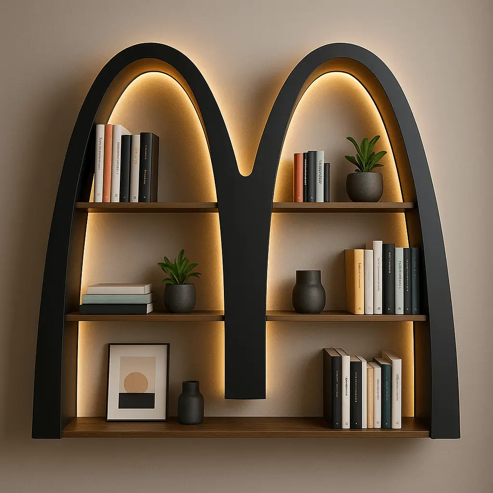

---

#### Creative Silk Universe

**Tags:** `3d`, `surreal`

Transform the {❄️} into a soft 3D object with a silk texture. The entire surface of the object is wrapped in smooth and flowing silk fabric, featuring surreal wrinkle details, soft highlights, and shadows. The object gently floats in the center of a clean light gray background, creating a light and elegant atmosphere. The overall style is surreal, tactile, and modern, conveying a sense of comfort and refined playfulness. Studio lighting, high-resolution rendering.

## Notes
You can replace the {❄️} in the prompt words with your target value

## Source
- [Original Post](https://x.com/ZHO_ZHO_ZHO/status/1914864217867608175)

## Example Output


---

#### Cute and Cozy Knitted Doll

**Tags:** `chibi`, `realistic`, `cute`, `character`

A close-up, professionally composed photograph showcasing a hand-crocheted yarn doll gently cradled by two hands. The doll has a rounded shape, featuring the cute chibi image of the [upload image] character, with vivid contrasting colors and rich details. The hands holding the doll are natural and gentle, with clearly visible finger postures, and natural skin texture and light/shadow transitions, conveying a warm and realistic touch. The background is slightly blurred, depicting an indoor environment with a warm wooden tabletop and natural light streaming in from a window, creating a comfortable and intimate atmosphere. The overall image conveys a sense of exquisite craftsmanship and cherished warmth.

## Reference Image
Upload a photo as a reference to generate its cute chibi knitted doll image.

## Source
- [Original Post](https://x.com/ZHO_ZHO_ZHO/status/1921148024861938077)

## Example Output


---

#### Cute Plant Planter

**Tags:** `minimalist`, `cute`, `animal`

A high-quality photo of a cute ceramic [object/animal]-shaped planter with a glossy finish, filled with a variety of vibrant succulents and greenery including a spiky Haworthia, a rosette-shaped Echeveria, and delicate white flowers. The planter has a friendly face and sits on a soft, neutral background with diffused natural lighting, showcasing fine textures and color contrast in a clean, minimalistic composition

## Notes
Replace [object/animal] in the prompt with a specific object, animal name, or emoji.

## Source
- [Original Post](https://x.com/azed_ai/status/1923739813414568075)

## Example Output
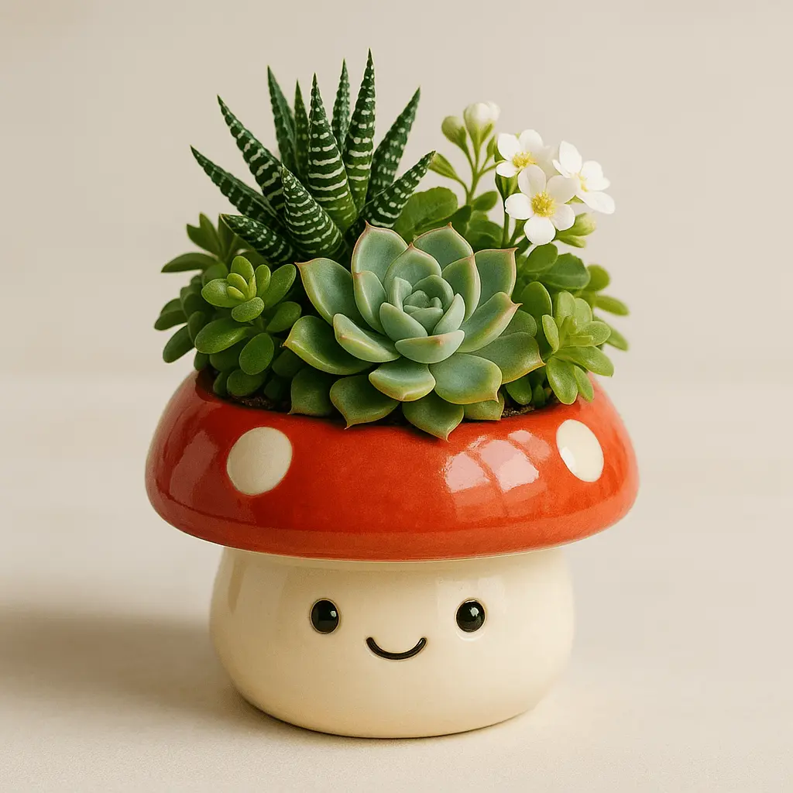

---

#### Abstract Digital Art - Cosmic Flow

**Tags:** `abstract`, `digital`, `cosmic`, `colorful`

Create an abstract digital artwork with a cosmic theme:

## Visual Concept
Flowing energy streams merging in space, creating a sense of infinite depth and movement.

## Color Palette
- Primary: Deep space blue (#0a0a1a)
- Secondary: Nebula purple (#6b2d5c)
- Accents: Electric cyan (#00fff7), Hot pink (#ff0066)

## Composition
- **Center focus**: Swirling vortex of light
- **Edges**: Fade to deep space black
- **Flow direction**: Spiral from outer edges to center

## Techniques
1. Particle effects for stars
2. Gradient blends for nebula clouds
3. Glow effects on energy streams
4. Noise texture for depth

## Reference


## Output Specs
- Resolution: 4K (3840x2160)
- Color space: sRGB
- Suitable for: Prints, wallpapers, NFTs

---

#### Flat Design App Icons - Finance Theme

**Tags:** `icons`, `flat-design`, `finance`, `ui`

Create a set of flat design icons for a finance mobile app:

## Icon Set (8 icons)
1. **Wallet** - Simple folded wallet with card
2. **Chart** - Upward trending line graph
3. **Transfer** - Two arrows in opposite directions
4. **Budget** - Pie chart divided into sections
5. **Savings** - Piggy bank silhouette
6. **Card** - Credit card with chip
7. **Receipt** - Paper receipt with lines
8. **Settings** - Gear cog

## Style Guidelines
- **Shape**: Rounded corners (8px on 64px canvas)
- **Colors**: 
  - Primary: #2563eb (blue)
  - Secondary: #10b981 (green)
  - Background: #f8fafc
- **Stroke**: 2px consistent weight
- **Fill**: Solid colors, no gradients

## Grid & Sizing
- Canvas: 64x64px
- Safe area: 56x56px (4px padding)
- Export: SVG + PNG @1x, 2x, 3x

## Reference Style


---

#### Famous Painting Character Cereal Ad

**Tags:** `3d`, `chibi`, `minimalist`, `cute`, `character`

“Master Oats”: Based on the visual features of the person in the uploaded photo, generate a custom oatmeal mix that reflects their personality traits — for example, using vegetables, fruits, yogurt, whole grains, etc.

Design a unique cereal box and package aesthetic that aligns with this tailored mix.

Then, create an advertising cover featuring the person as the mascot on the cereal box. The character should retain their recognizable features but be transformed into a cute chibi-style 3D figure with a C4D-quality rendering.

The oatmeal and packaging should be presented in a setting that matches the mood — such as a minimalist kitchen, a sleek supermarket display, or a clean design counter.

The process includes:
– Character analysis and oat mix pairing
– Cereal box concept and design
– Display environment selection
– Final image with mascot figure, packaging, and styled scene composition

All visuals should be balanced, modern, and appealing, reflecting a premium and fun oat brand identity.

## Reference Image
[Image of 'Girl with a Pearl Earring'](https://commons.wikimedia.org/w/index.php?curid=55017931).

## Source
- [Original Post](https://x.com/ZHO_ZHO_ZHO/status/1909542765857587310)

## Example Output


---

#### Famous Painting Character OOTD

**Tags:** `3d`, `chibi`, `cute`, `glass`, `character`

Generate a Q-style 3D C4D-rendered character based on the person in the photo, dressed in a fashion-forward “outfit of the day” (OOTD) inspired by a specific profession.
Profession: Fashion Designer
– Keep the original facial features and character pose
– Stylize the character with a cute, long-legged chibi proportion
– Outfit and accessories should reflect the profession, including trendy designer wear, glasses, sketchbook or tablet, and stylish shoes
– Match the outfit with fashion accessories to complete the look
– Use a solid background color that complements the character’s overall color palette (no gradients or textures)

Composition: Aspect ratio: 9:16
Top text: “OOTD”
Left side: the full-body chibi character wearing the complete outfit
Right side: individual clothing items and accessories laid out separately, as if in a style breakdown

## Reference Image
[Image of 'Girl with a Pearl Earring'](https://commons.wikimedia.org/w/index.php?curid=55017931).

## Source
- [Original Post](https://x.com/ZHO_ZHO_ZHO/status/1909892294217781714)

## Example Output


---

#### Fantasy Cartoon Illustration

**Tags:** `cartoon`, `illustration`, `fantasy`, `character`

A cartoon-style character with a smiling computer monitor as its head, wearing gloves and boots, happily jumping through a glowing, blue, circular portal in a lush, fantasy forest landscape. The forest is detailed with large trees, mushrooms, flowers, a serene river, floating islands, and an atmospheric starry night sky with multiple moons. Bright, vibrant colors with soft lighting, fantasy illustration style.

## Source
- [Original Post](https://x.com/dotey/status/1905103477879267823)

## Example Output


---

#### Fluffy Jack-o'-lantern

**Tags:** `3d`, `realistic`, `surreal`, `icon`

Transform a simple flat vector icon of [🎃] into a soft, 3D fluffy object. The shape is fully covered in fur, with hyperrealistic hair texture and soft shadows. The object is centered on a clean, light gray background and floats gently in space. The style is surreal, tactile, and modern, evoking a sense of comfort and playfulness. Studio lighting, high-resolution render.

## Source
- [Original Post](https://x.com/gizakdag/status/1911075302941622512)
- [Original Post](https://x.com/dotey/status/1912276883196039520)

## Example Output


---

#### Ghibli Style

**Tags:** `ghibli`, `ai-art`

Redraw this photo in Ghibli style

## Notes
If encountering content policy violations, add this sentence to the prompt: If there is inappropriate (sensitive) content in the background, it can be modified or deleted.

## Reference Image
A photo of a person or other subject.

## Source
- [Original Post](https://animeai.online/#demo-gallery)

## Example Output


---

#### Glass Retexturing

**Tags:** `3d`, `realistic`, `glass`

retexture the image attached based on the JSON aesthetic below
{
  "style": "photorealistic 3D render",
  "material": "glass with transparent and iridescent effects",
  "surface_texture": "smooth, polished with subtle reflections and refractive effects",
  "lighting": {
    "type": "studio HDRI",
    "intensity": "high",
    "direction": "angled top-left key light and ambient fill",
    "accent_colors": ["blue", "green", "purple"],
    "reflections": true,
    "refractions": true,
    "dispersion_effects": true,
    "bloom": true
  },
  "color_scheme": {
    "primary": "transparent with iridescent blue, green, and purple hues",
    "secondary": "crystal-clear with subtle chromatic shifts",
    "highlights": "soft, glowing accents reflecting rainbow-like effects",
    "rim_light": "soft reflective light around edges"
  },
  "background": {
    "color": "black",
    "vignette": true,
    "texture": "none"
  },
  "post_processing": {
    "chromatic_aberration": true,
    "glow": true,
    "high_contrast": true,
    "sharp_details": true
  }
}

## Notes
Please use GPT-4o to generate images with this prompt; using Sora may not produce the correct style.

## Reference Image
An image needs to be uploaded as the base for retexturing.

## Source
- [Original Post](https://x.com/egeberkina/status/1920448389960909085)

## Example Output


---

#### Glowing Lines Anatomy Diagram

**Tags:** `illustration`, `ai-art`

A digital illustration of a [SUBJECT], portrayed with a network of glowing clean pristine blue lines outlining its anatomy. The image is set against a dark background, highlighting the [SUBJECT] form and features. A specific area such as [PART] is emphasized with a red glow to indicate a point of interest or significance. The style is both educational and visually captivating, designed to resemble an advanced imaging technique

## Notes
Replace `[SUBJECT]` and `[PART]` in the prompt.

## Source
- [Original Post](https://x.com/umesh_ai/status/1914644426334314545)

## Example Output
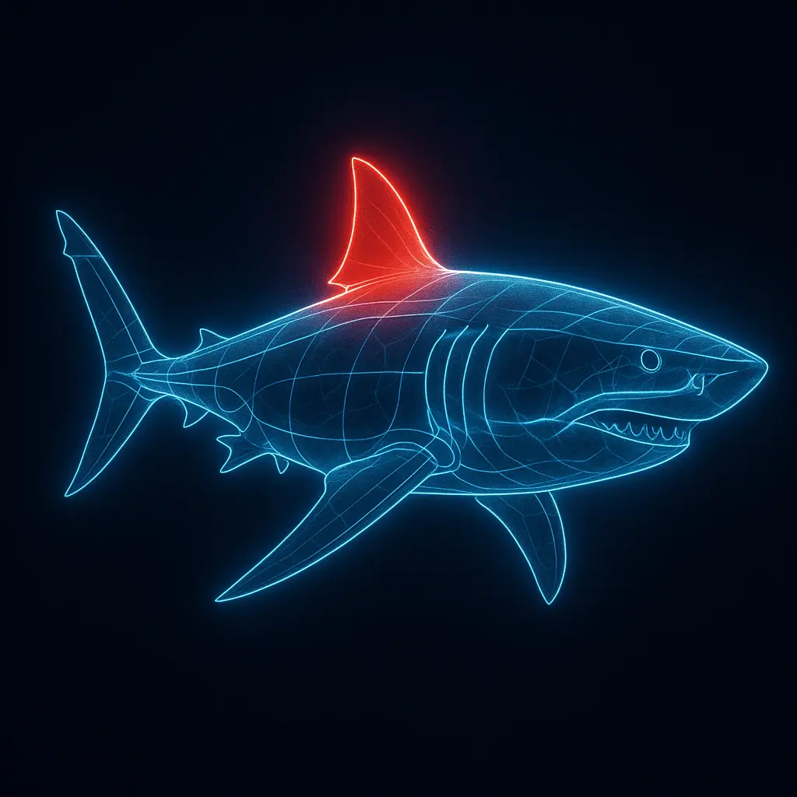

---

#### Hand-drawn Infographic Card (Cognition)

**Tags:** `illustration`, `icon`

Create a hand-drawn style infographic card in vertical 9:16 ratio. The card should have a clear theme, with a beige or off-white paper-textured background. The overall design should convey a rustic, friendly, and handmade aesthetic.

At the top of the card, feature a bold, eye-catching title in large Chinese cursive brush calligraphy using contrasting red and black colors. All text content should be in Chinese cursive script, and the layout should be divided into 2 to 4 clear sections. Each section expresses a core idea with brief and concise Chinese phrases. The cursive font should retain a smooth, rhythmic flow, remaining legible while carrying artistic appeal.

The card should include simple, playful hand-drawn illustrations or icons, such as figures or symbolic elements, to enhance visual interest and spark reader reflection or emotional resonance.

The overall layout should maintain visual balance, with ample white space reserved to ensure clarity, simplicity, and ease of reading and understanding.
<h1><span style="color:red">“Cognition”</span> defines your ceiling  
<span style="color:red">“Circle”</span> defines your opportunities</h1>  
– You can’t earn money beyond your level of cognition,  
– Nor encounter opportunities beyond your social circle.

## Source
- [Original Post](https://x.com/dotey/status/1907903480678985784)

## Example Output


---

#### Hand-drawn Infographic Card

**Tags:** `illustration`, `icon`

Create a hand-drawn style infographic card in a 9:16 vertical format. The card should have a clear theme, with a beige or off-white paper-textured background. The overall design should reflect a simple, warm, and handmade aesthetic.

At the top of the card, use large, eye-catching brush-style Chinese cursive calligraphy in red and black for the title, creating strong visual contrast. All text should be in Chinese cursive script. The layout should be divided into 2 to 4 clear sections, each conveying a core idea through concise and refined Chinese phrases. The calligraphy should maintain a fluid, rhythmic style that is both legible and artistically expressive. Leave appropriate blank space around the text.

The card should be accented with simple and fun hand-drawn illustrations or icons — such as figures or symbolic elements — to enhance visual appeal and spark thought or emotional resonance. The overall layout should emphasize visual balance and include ample whitespace, ensuring the design is clean, clear, and easy to read.

“Building a personal brand (IP) is long-term compounding.
Keep updating daily, and results will come — because 99% of people can’t keep it up!”

## Source
- [Original Post](https://x.com/dotey/status/1907870919852179850)

## Example Output


---

#### Integrating Word Meaning into Letters

**Tags:** `creative`, `ai-art`

Integrate the meaning of the word into the letters, cleverly blending graphics and letters.
Word: {beautify}
Add a brief explanation of the word below.

## Notes
Replace the word { beautify } with the word you want to integrate

## Source
- [Original Post](https://x.com/dotey/status/1918529055340576812)

## Example Output
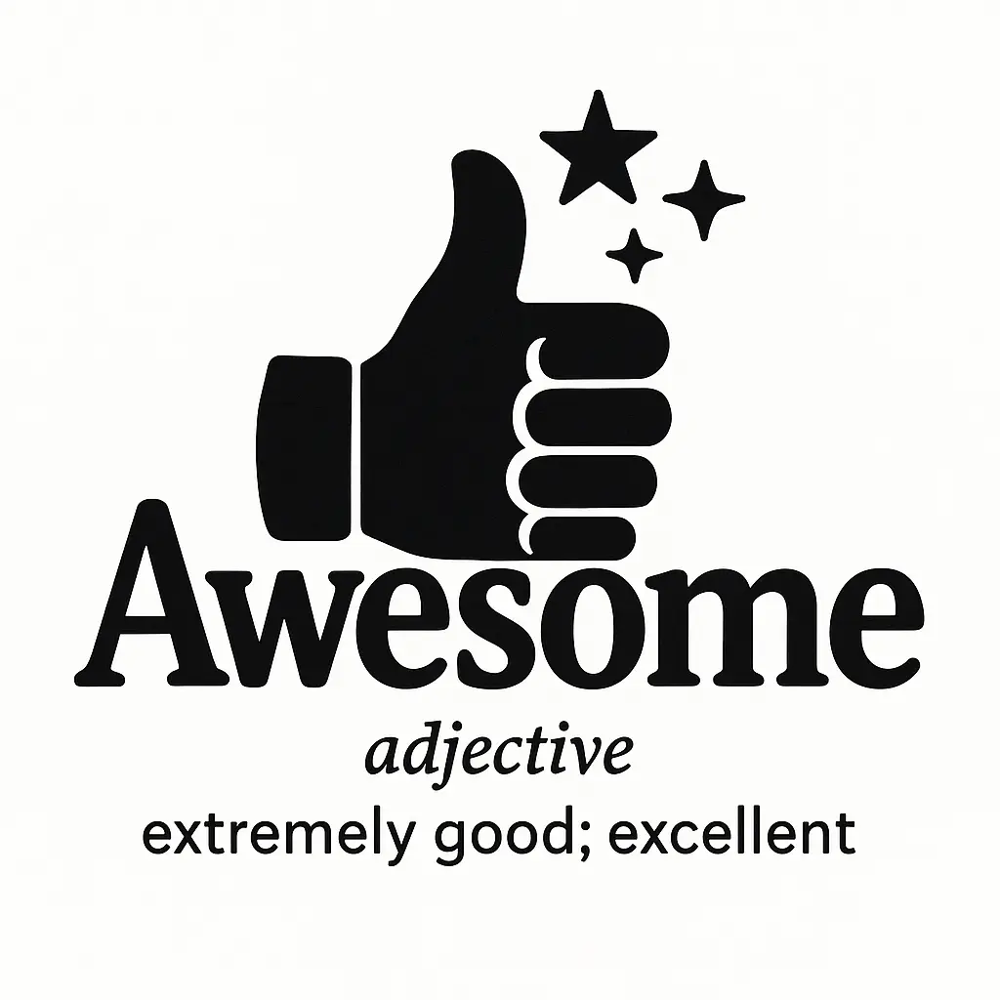

---

#### Japanese-style Two-Panel Manga (Angry Girl President)

**Tags:** `anime`, `cartoon`, `vintage`, `cute`, `manga`

Create a two-panel vertical manga in a cute Japanese anime style, theme: “The Daily Work Life of a Girl President.”

Character Design:
Transform the person in the uploaded image into a cute, moe-style anime girl while preserving all key details from the photo — including the outfit (a suit), hairstyle (bright golden-yellow), and facial features.

Panel 1:
- Expression: Pouting, disappointed, resting her cheek on one hand
- Text box: “What do I dooo?! He won’t take my call! (；´д｀)”
- Scene: Warm-toned office, with the U.S. flag in the background. On the desk: a pile of hamburgers and a vintage red rotary phone. The character is on the left side of the frame, the phone on the right.

Panel 2:
- Expression: Furious, face red with anger, gritting teeth
- Action: Slams the desk hard, making the hamburgers jump
- Speech bubble: “Hmph! Double the tariffs! Ignoring me is their loss! ( `д´ )”
- Scene: Same office, now a complete mess

Additional Notes:
- Use a cute, casual handwritten font for all text
- Keep the composition full and expressive, with adequate space for dialogue and intentional white space
- Aspect ratio: 2:3
- The overall visual tone should be colorful and energetic, with a distinctly cartoony style

## Reference Image
A photo of a person is needed for reference.

## Source
- [Original Post](https://x.com/hellokaton/status/1910900979194646959)

## Example Output


---

#### Aging Through the Years

**Tags:** `creative`, `ai-art`

*Demonstrates temporal consistency and aging effects on a single subject.*

"Generate the holiday photo of this person through the ages up to 80 years old"

## Source
- [Original](https://x.com/dr_cintas/status/1991888364099035581?s=20)

## Example Output
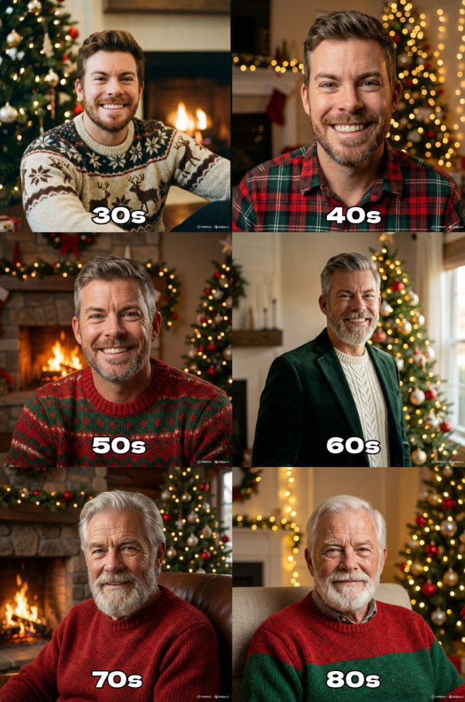

---

#### AI Skin Analysis and Skincare Routine

**Tags:** `professional`, `ai-art`

*Analyze skin and provide routine recommendations*

You are a professional skin analyst and skincare expert.
The user uploads a close-up photo of their face and may add short notes (age, allergies, current routine, pregnancy, etc.). Use ONLY what you see in the image plus the user text.
 1. Carefully inspect the skin: shine, pores, redness, blemishes, spots, texture, flaking, fine lines, dark circles, etc.
 2. Decide the main skin type: oily, dry, normal, combination, or sensitive.
 3. Identify visible issues: acne/breakouts, blackheads/whiteheads, post-acne marks, hyperpigmentation, redness, enlarged pores, uneven texture, dehydration, fine lines, dark circles, puffiness, etc.

RESPONSE FORMAT (very important)

Your answer must be plain text in this exact structure:
 1. First, write 3–6 short lines describing the skin and problems, for example:

 • overall skin type and how you know
 • where the main issues appear (forehead, cheeks, nose, chin, jawline, under-eyes)
 • how severe they look (mild / moderate / severe).

 2. On a new line, write the word in caps:
SKIN ROUTINE
 3. Under SKIN ROUTINE, give at least 5 numbered steps (1., 2., 3., …).
Each step must include:

 • what to do (e.g. "Cleanser", "Treatment serum", "Moisturizer", "Sunscreen", "Night treatment"),
 • product TYPE and key INGREDIENTS to look for (no brand names),
 • when to use it (AM, PM, or both) and how often,
 • 1 short practical instruction (how to apply, how much, any caution).

Focus on over-the-counter products only (no prescription or medical diagnosis).
If acne or irritation looks very severe or infected, clearly but kindly suggest visiting a dermatologist.
Keep the tone supportive, simple and clear.

## Example Output
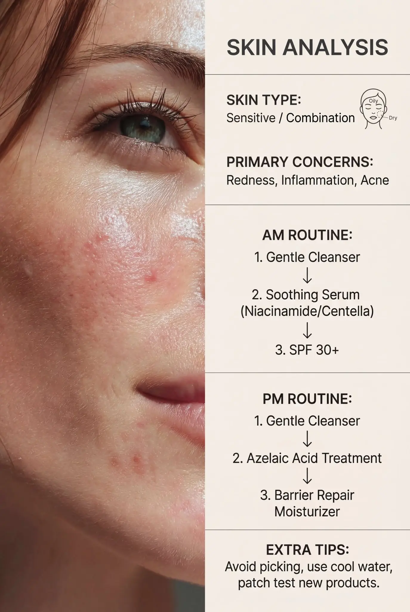

---

#### Chalkboard Anime Art Documentation

**Tags:** `anime`, `realistic`, `photorealistic`, `illustration`, `pastel`

*Photorealistic documentation of a chalkboard anime drawing*

{
  "intent": "Photorealistic documentation of a specific chalkboard art piece featuring a single anime character, capturing the ephemeral nature of the medium within a classroom context.",
  "frame": {
    "aspect_ratio": "4:3",
    "composition": "A centered medium shot focusing on the chalkboard mural. The composition includes the teacher's desk in the immediate foreground to provide scale, with the artwork of the single character dominating the background space.",
    "style_mode": "documentary_realism, texture-focused, ambient naturalism"
  },
  "subject": {
    "primary_subject": "A large-scale, intricate chalk drawing of Boa Hancock from 'One Piece' on a standard green classroom blackboard.",
    "visual_details": "The illustration depicts Boa Hancock in a commanding pose, positioned centrally on the board. She is drawn with her signature long, straight black hair with a hime cut, rendered using dense application of black chalk with white accents for sheen. Her expression is haughty and imperious, with detailed dark blue eyes. She is depicted forming a heart shape with her hands, referencing her 'Mero Mero Mellow' technique. She wears a revealing red blouse with purple geometric patterns and gold snake-shaped earrings, drawn with vibrant colored chalks.",
    "medium_texture": "The image preserves the dusty, matte quality of the chalk. Visible hatching and cross-hatching strokes create shading on her clothing and hair. Smudged areas on the green slate indicate where colors have been blended by hand.",
    "surrounding_elements": "To the right of the character, vertical Japanese text reading '海賊女帝' (Pirate Empress) is written in crisp white chalk."
  },
  "environment": {
    "location": "A standard Japanese school classroom.",
    "foreground_elements": "A wooden teacher's desk occupies the lower foreground. Scattered across the surface are a yellow box of colored chalks, loose sticks of red, white, and blue pastel chalk, and a dust-covered black felt eraser.",
    "background_elements": "The green chalkboard spans the width of the frame, bordered by a metallic chalk tray containing accumulated chalk dust. The wall above is a plain, off-white plaster, featuring a small mounted speaker box.",
    "atmosphere": "Quiet and academic, with a sense of stillness suggesting the room is currently unoccupied."
  },
  "lighting": {
    "type": "Diffuse ambient classroom lighting.",
    "quality": "Soft, nondirectional illumination provided by overhead fluorescent fixtures mixed with daylight from windows on the left. The light is even, preventing glare on the chalkboard surface while highlighting the texture of the chalk.",
    "color_temperature": "Neutral white, approximately 5000K, ensuring accurate color rendition of the red and purple chalks against the dark green board.",
    "direction": "Overhead and slightly frontal."
  },
  "camera": {
    "sensor_format": "35mm full-frame digital sensor.",
    "lens": "35mm prime lens.",
    "aperture": "f/5.6",
    "depth_of_field": "Moderate depth of field, keeping the chalkboard drawing in sharp focus while allowing the foreground desk elements to soften slightly.",
    "shutter_speed": "1/60s",
    "iso": "400",
    "camera_position": "Eye-level standing position, set back enough to frame the entire drawing and the desk."
  },
  "negative": {
    "content": "Multiple characters, Midoriya, Shigaraki, male characters, digital art overlay, vector graphics, paper texture, oil painting, messy composition, extreme low angle, fisheye lens.",
    "style": "No hyper-saturation, no soft focus filters, no heavy vignetting."
  }
}

## Example Output
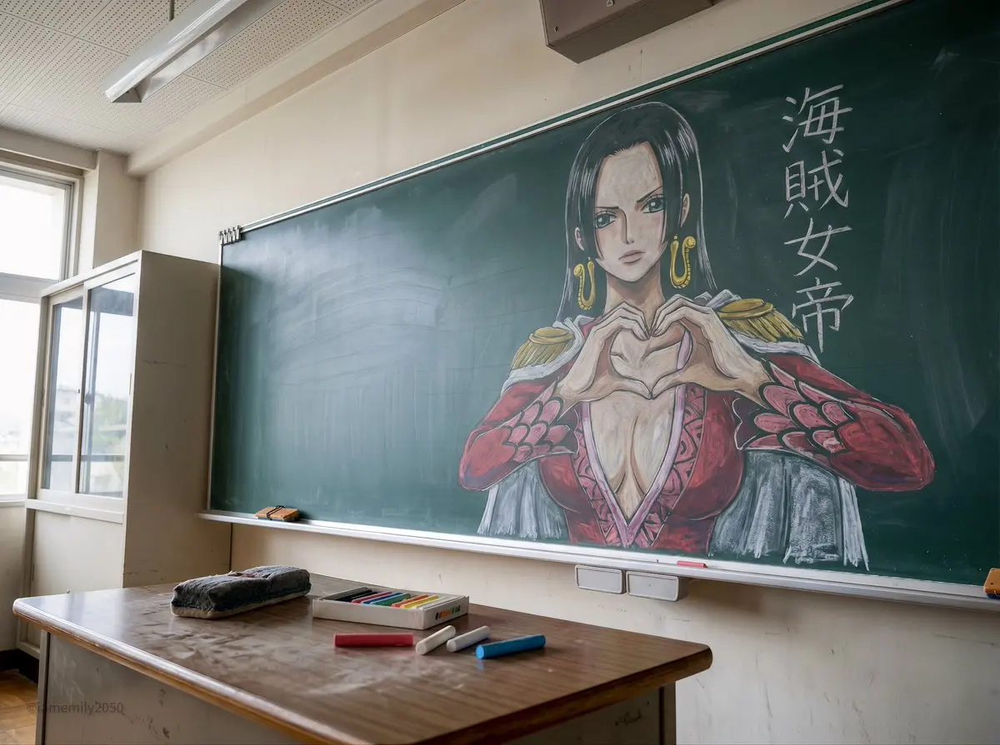

---

#### Cinematic Keyframe Generator

**Tags:** `realistic`, `film`, `character`, `animal`, `cinematic`

*Generates cinematic keyframes and storyboards from a reference image*

<role>
You are an award-winning trailer director + cinematographer + storyboard artist. Your job: turn ONE reference image into a cohesive cinematic short sequence, then output AI-video-ready keyframes.
</role>

<input>
User provides: one reference image (image).
</input>

<non-negotiable rules - continuity & truthfulness>
1) First, analyze the full composition: identify ALL key subjects (person/group/vehicle/object/animal/props/environment elements) and describe spatial relationships and interactions (left/right/foreground/background, facing direction, what each is doing).
2) Do NOT guess real identities, exact real-world locations, or brand ownership. Stick to visible facts. Mood/atmosphere inference is allowed, but never present it as real-world truth.
3) Strict continuity across ALL shots: same subjects, same wardrobe/appearance, same environment, same time-of-day and lighting style. Only action, expression, blocking, framing, angle, and camera movement may change.
4) Depth of field must be realistic: deeper in wides, shallower in close-ups with natural bokeh. Keep ONE consistent cinematic color grade across the entire sequence.
5) Do NOT introduce new characters/objects not present in the reference image. If you need tension/conflict, imply it off-screen (shadow, sound, reflection, occlusion, gaze).
</non-negotiable rules - continuity & truthfulness>

<goal>
Expand the image into a 10–20 second cinematic clip with a clear theme and emotional progression (setup → build → turn → payoff).
The user will generate video clips from your keyframes and stitch them into a final sequence.
</goal>

<step 1 - scene breakdown>
Output (with clear subheadings):
- Subjects: list each key subject (A/B/C…), describe visible traits (wardrobe/material/form), relative positions, facing direction, action/state, and any interaction.
- Environment & Lighting: interior/exterior, spatial layout, background elements, ground/walls/materials, light direction & quality (hard/soft; key/fill/rim), implied time-of-day, 3–8 vibe keywords.
- Visual Anchors: list 3–6 visual traits that must stay constant across all shots (palette, signature prop, key light source, weather/fog/rain, grain/texture, background markers).
</step 1 - scene breakdown>

<step 2 - theme & story>
From the image, propose:
- Theme: one sentence.
- Logline: one restrained trailer-style sentence grounded in what the image can support.
- Emotional Arc: 4 beats (setup/build/turn/payoff), one line each.
</step 2 - theme & story>

<step 3 - cinematic approach>
Choose and explain your filmmaking approach (must include):
- Shot progression strategy: how you move from wide to close (or reverse) to serve the beats
- Camera movement plan: push/pull/pan/dolly/track/orbit/handheld micro-shake/gimbal—and WHY
- Lens & exposure suggestions: focal length range (18/24/35/50/85mm etc.), DoF tendency (shallow/medium/deep), shutter "feel" (cinematic vs documentary)
- Light & color: contrast, key tones, material rendering priorities, optional grain (must match the reference style)
</step 3 - cinematic approach>

<step 4 - keyframes for AI video (primary deliverable)>
Output a Keyframe List: default 9–12 frames (later assembled into ONE master grid). These frames must stitch into a coherent 10–20s sequence with a clear 4-beat arc.
Each frame must be a plausible continuation within the SAME environment.

Use this exact format per frame:

[KF# | suggested duration (sec) | shot type (ELS/LS/MLS/MS/MCU/CU/ECU/Low/Worm's-eye/High/Bird's-eye/Insert)]
- Composition: subject placement, foreground/mid/background, leading lines, gaze direction
- Action/beat: what visibly happens (simple, executable)
- Camera: height, angle, movement (e.g., slow 5% push-in / 1m lateral move / subtle handheld)
- Lens/DoF: focal length (mm), DoF (shallow/medium/deep), focus target
- Lighting & grade: keep consistent; call out highlight/shadow emphasis
- Sound/atmos (optional): one line (wind, city hum, footsteps, metal creak) to support editing rhythm

Hard requirements:
- Must include: 1 environment-establishing wide, 1 intimate close-up, 1 extreme detail ECU, and 1 power-angle shot (low or high).
- Ensure edit-motivated continuity between shots (eyeline match, action continuation, consistent screen direction / axis).
</step 4 - keyframes for AI video>

<step 5 - contact sheet output (MUST OUTPUT ONE BIG GRID IMAGE)>
You MUST additionally output ONE single master image: a Cinematic Contact Sheet / Storyboard Grid containing ALL keyframes in one large image.
- Default grid: 3x3. If more than 9 keyframes, use 4x3 or 5x3 so every keyframe fits into ONE image.
Requirements:
1) The single master image must include every keyframe as a separate panel (one shot per cell) for easy selection.
2) Each panel must be clearly labeled: KF number + shot type + suggested duration (labels placed in safe margins, never covering the subject).
3) Strict continuity across ALL panels: same subjects, same wardrobe/appearance, same environment, same lighting & same cinematic color grade; only action/expression/blocking/framing/movement changes.
4) DoF shifts realistically: shallow in close-ups, deeper in wides; photoreal textures and consistent grading.
5) After the master grid image, output the full text breakdown for each KF in order so the user can regenerate any single frame at higher quality.
</step 5 - contact sheet output>

<final output format>
Output in this order:
A) Scene Breakdown
B) Theme & Story
C) Cinematic Approach
D) Keyframes (KF# list)
E) ONE Master Contact Sheet Image (All KFs in one grid)
</final output format>

## Source
- [Original](https://x.com/underwoodxie96/status/1995109628825489647)

## Example Output
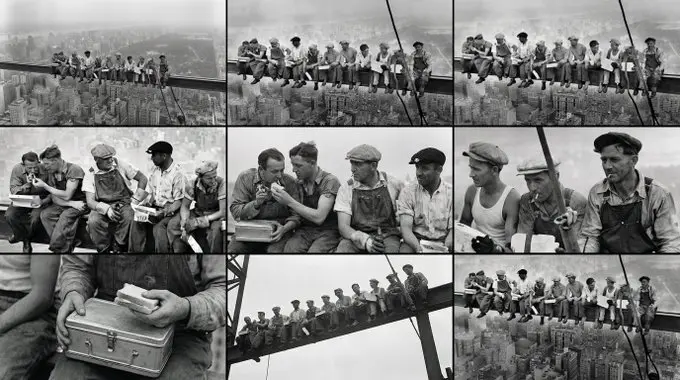

---

#### Compact Camera Screen Display

**Tags:** `logo`, `nostalgic`

*A photo displayed on a compact digital camera screen*

Use facial feature of attached photo. A close-up shot of a young woman displayed on the screen of a compact Canon digital camera. The camera body surrounds the image with its buttons, dials, and textured surface visible, including the FUNC/SET wheel, DISP button, and the "IMAGE STABILIZER" label along the side. The photo on the screen shows the woman indoors at night, illuminated by a bright built-in flash that creates sharp highlights on her face and hair. She has long dark hair falling across part of her face in loose strands, with a soft, slightly open-lip expression. The flash accentuates her features against a dim, cluttered kitchen background with appliances, shelves, and metallic surfaces softly blurred. The mood is candid, raw, nostalgic, and reminiscent of early 2000s digital camera snapshots. Colors are slightly muted with cool undertones, strong flash contrast, and natural grain from the display. No text, no logos inside the photo preview itself.

Scale ratio: 4:5 vertical

Camera: compact digital camera simulation
Lens: equivalent to 28–35mm
Aperture: f/2.8
ISO: 400
Shutter speed: 1/60 with flash
White balance: auto flash
Lighting: harsh direct flash on subject, ambient low light in the background
Color grading: nostalgic digital-camera tones, high contrast flash, subtle display grain, authentic screen glow.

## Example Output


---

#### Composition Rescue (Smart Outpainting)

**Tags:** `creative`, `ai-art`

*Expands image ratios (e.g., to 16:9) by intelligently generating matching scenery.*

Zoom out and expand this image to a 16:9 aspect ratio (computer wallpaper size). Context Awareness : Seamlessly extend the scenery on both left and right sides. Match the original lighting, weather, and texture perfectly. Logical Completion : If there are cut-off objects (like a shoulder, a tree branch, or a building edge) on the borders, complete them naturally based on logical inference. Do not distort the original center image.

## Source
- [Original](https://mp.weixin.qq.com/s/lrYNbs4rGs3KOqewoZ6aNQ)

## Example Output
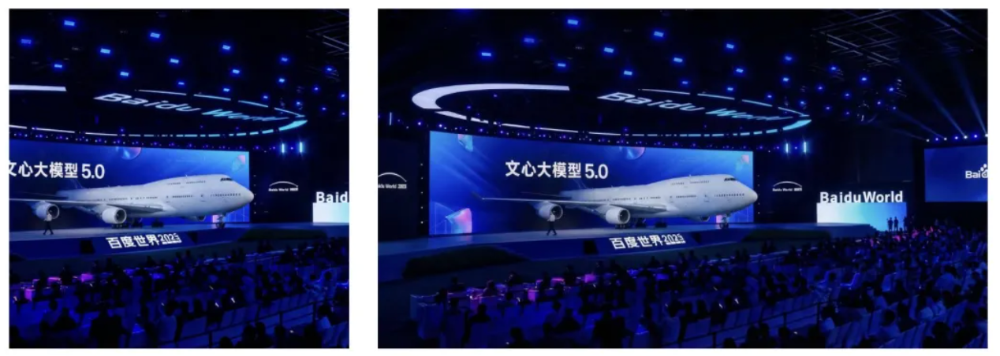

---

#### Concept Visualization (Text to Infographic)

**Tags:** `illustration`, `ai-art`

*Converts textual concepts into clear, educational vector illustrations.*

Create an educational infographic explaining [Photosynthesis] . Visual Elements : Illustrate the key components: The Sun, a green Plant, Water (H2O) entering roots, Carbon Dioxide (CO2) entering leaves, and Oxygen (O2) being released. Style : Clean, flat vector illustration suitable for a high school science textbook. Use arrows to show the flow of energy and matter. Labels : Label each element clearly in English .

## Source
- [Original](https://mp.weixin.qq.com/s/lrYNbs4rGs3KOqewoZ6aNQ)

## Example Output
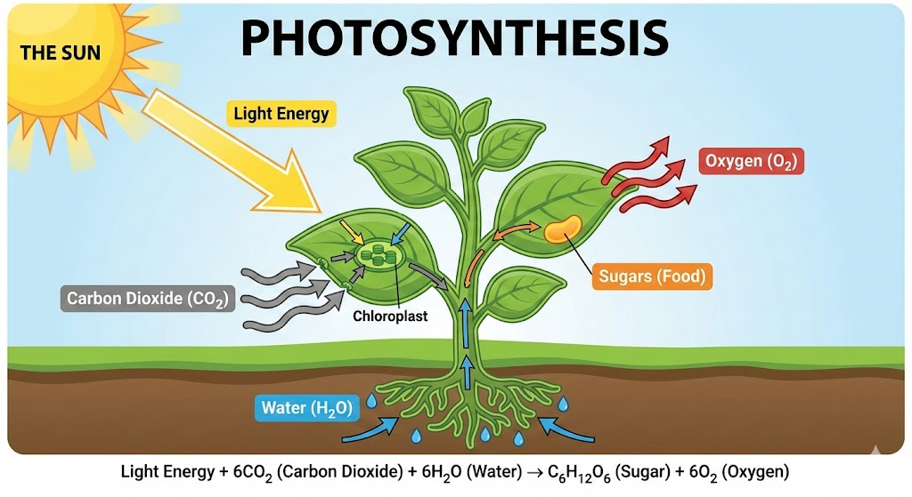

---

#### Conceptual Visualization

**Tags:** `creative`, `ai-art`

*Interpretative rendering of how a specific group (engineers) visualizes a landmark.*

How engineers see the San Francisco Bridge

## Source
- [Original](https://replicate.com/)

## Example Output


---

#### Coordinate Visualization

**Tags:** `creative`, `ai-art`

*Generates a specific location and time based purely on latitude/longitude coordinates.*

35.6586° N, 139.7454° E at 19:00

## Source
- [Original](https://replicate.com/)

## Example Output


---

#### Digital Content Localization (Comics/Memes)

**Tags:** `creative`, `ai-art`

*Translates comics or memes by scrubbing text bubbles and replacing content with matching fonts.*

Translate the text in the speech bubbles/captions from [Japanese/English] to [Chinese]. Seamless Cleaning : Erase the original text and perfectly fill the background (e.g., the white speech bubble or the colored image background). Style Matching : Render the translated Chinese text using a casual, handwritten-style font (or bold impact font for memes) that matches the aesthetic of the original image. Fit : Ensure the text fits naturally within the bubbles without overcrowding.

## Source
- [Original](https://mp.weixin.qq.com/s/lrYNbs4rGs3KOqewoZ6aNQ)

## Example Output
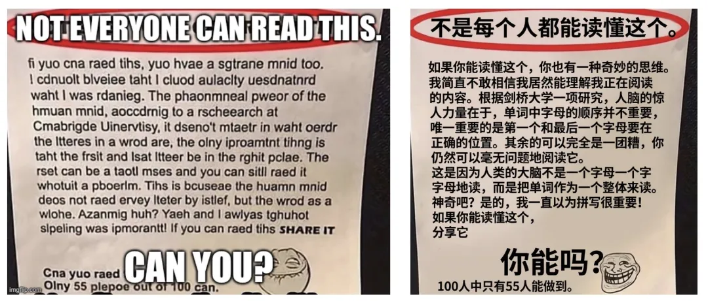

---

#### Face Detection CCTV Simulation

**Tags:** `creative`, `ai-art`

*Create a high angle CCTV surveillance shot with face detection*

Create a high angle CCTV surveillance shot using the uploaded image as the source. Detect every visible person in the image and automatically draw a white rectangular bounding box around each face. For the most prominent person, add a large zoom in inset: a sharp, enhanced close-up of their face displayed in a floating rectangular frame connected with a thin white line.Keep the main image slightly noisy and security camera like (soft grain, slight distortion, muted colors), while the zoom in face box should be clearer, brighter, and more detailed. No text, no timestamps, no overlays except the boxes and connecting line. Maintain the original scene layout, angle, and environment of the uploaded image.

## Source
- [Original](https://x.com/egeberkina/status/1994804061024010628)

## Example Output
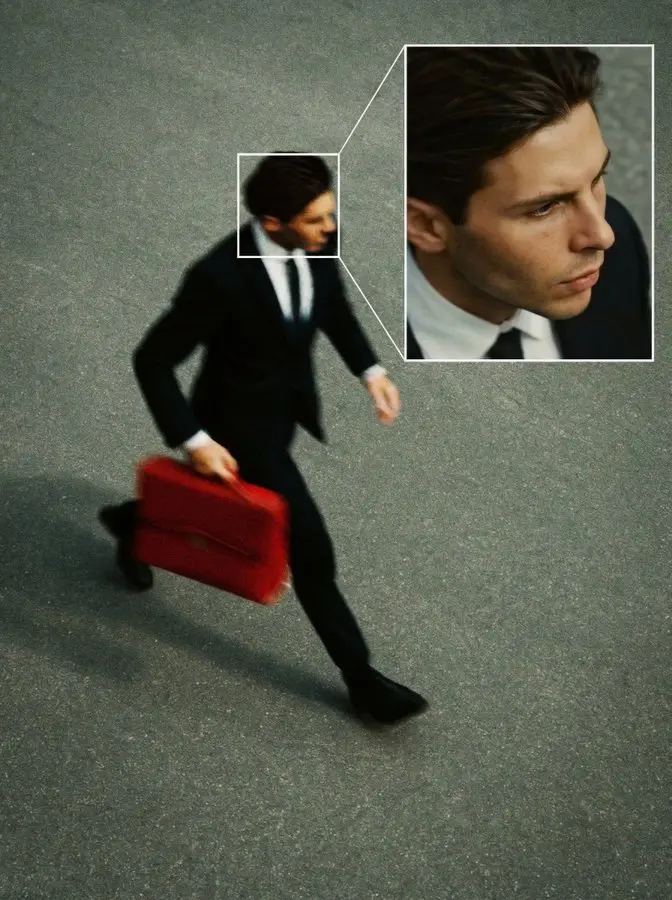

---

#### Financial Sankey Diagram Visualization

**Tags:** `minimalist`, `icon`, `logo`, `neon`, `professional`

*Create a professional financial Sankey diagram*

[Subject]: A professional financial Sankey diagram visualizing the Income Statement of a major corporation, in the style of "App Economy Insights" and US corporate financial reports.[Visual Style]: High-fidelity vector infographic, clean minimalist aesthetic, flat design. The background is a clean, very light grey or off-white.[Color Strategy - CRITICAL]:
Analyze the [Insert Brand Name Here] logo. Extract its primary brand color (e.g., if Nvidia use neon green, if Meta use blue, if Tesla use red).
Use this primary color as the dominant theme for the main revenue flows and profit blocks.
Create a harmonious color palette based on this primary color: use saturated shades for the vertical nodes (bars) and semi-transparent, lighter opacity gradients for the flowing paths to ensure a cohesive and professional look. Avoid clashing colors.[Composition & Structure]:
Flow: A horizontal flow from Left (Revenue Sources) to Right (Net Profit).
Texture: The connecting paths (flows) must appear "silky smooth" with elegant Bezier curves, looking like liquid ribbons, not jagged lines.
Iconography: On the left side (Revenue sources), include specific, minimalist flat vector icons representing the business segments (e.g., a car icon for automotive, a cloud icon for services, a chip icon for hardware).
Branding: Place the official [Insert Brand Name Here] logo clearly at the top center or near the central revenue bar.[Details]: High resolution, 4k, sharp typography (sans-serif), professional data visualization layout. The chart clearly distinguishes between Revenue, Gross Profit, Operating Expenses, and Net Profit.

## Example Output
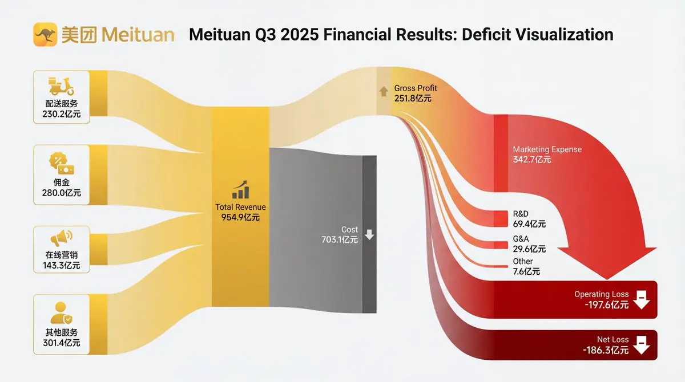

---

#### Hand-drawn Flowchart to Corporate Charts

**Tags:** `minimalist`, `professional`, `business`

*Converts whiteboard sketches into clear, "McKinsey-style" vector presentations.*

Convert this hand-drawn whiteboard sketch into a professional corporate flowchart suitable for a business presentation. Style Guide : Use a minimalist 'McKinsey-style' aesthetic : clean lines, ample whitespace, and a sophisticated blue-and-gray color palette. Structure : Automatically align all boxes and diamonds to a strict grid . Connect them with straight, orthogonal arrows (90-degree angles only, no curvy lines). Text : Transcribe the handwritten labels into a clear, bold Sans-Serif font (like Arial or Roboto). Output : High-resolution vector-style image on a pure white background.

## Source
- [Original](https://mp.weixin.qq.com/s/lrYNbs4rGs3KOqewoZ6aNQ)

## Example Output
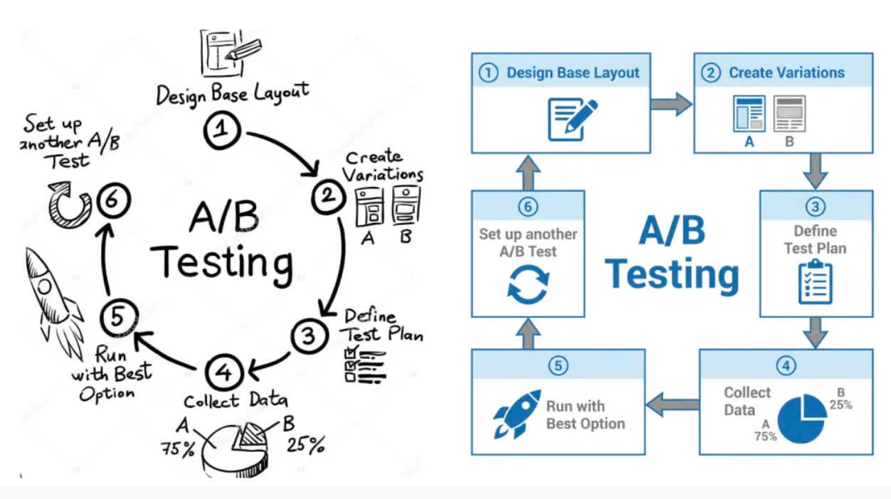

---

#### Hard Furnishing Preview (Floor Plan to Design)

**Tags:** `3d`, `minimalist`, `realistic`, `photorealistic`, `professional`

*Generates a complete design presentation board including perspective views and 3D floor plans from a simple 2D map.*

Based on the uploaded 2D floor plan, generate a professional interior design presentation board in a single image. Layout : The final image should be a collage with one large main image at the top, and several smaller images below it. Content of Each Panel :
1. Main Image (Top) : A wide-angle perspective view of the main living area , showing the connection between the living room and dining area.
2. Small Image (Bottom Left) : A view of the Master Bedroom , focusing on the bed and window.
3. Small Image (Bottom Middle) : A view of the Home Office / Study room .
4. Small Image (Bottom Right) : A 3D top-down floor plan view showing the furniture layout. Overall Style : Apply a consistent Modern Minimalist style with warm oak wood flooring and off-white walls across ALL images. Quality : Photorealistic rendering, soft natural lighting.

## Source
- [Original](https://mp.weixin.qq.com/s/lrYNbs4rGs3KOqewoZ6aNQ)

## Example Output
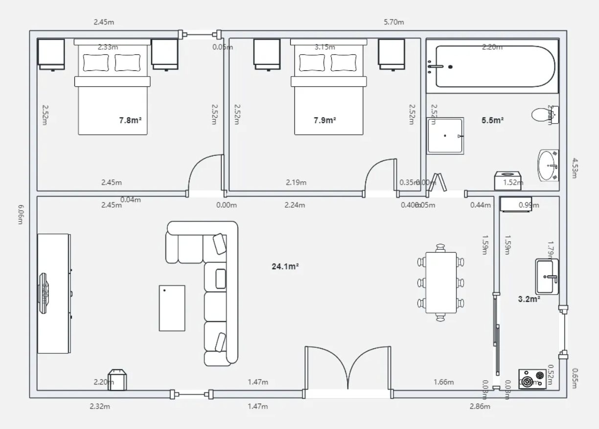

---

#### Hyper-Realistic Crowd Composition

**Tags:** `realistic`, `photorealistic`, `cinematic`

*Handling complex compositions with multiple famous faces and specific lighting.*

Create a hyper-realistic, ultra-sharp, full-color large-format image featuring a massive group of celebrities from different eras, all standing together in a single wide cinematic frame. The image must look like a perfectly photographed editorial cover with impeccable lighting, lifelike skin texture, micro-details of hair, pores, reflections, and fabric fibers.

GENERAL STYLE & MOOD: Photorealistic, 8k, shallow depth of field, soft natural fill light + strong golden rim light. High dynamic range, calibrated color grading. Skin tones perfectly accurate. Crisp fabric detail with individual threads visible. Balanced composition, slightly wide-angle lens (35mm), center-weighted. All celebrities interacting naturally, smiling, posing, or conversing. Minimal background noise, but with enough world-building to feel real.

THE ENVIRONMENT: A luxurious open-air rooftop terrace at sunset overlooking a modern city skyline. Elements include: Warm golden light wrapping around silhouettes. Polished marble.

## Source
- [Original](https://x.com/SebJefferies/status/1991531687147360728)

## Example Output


---

#### Kids' Crayon Travel Journal Illustrator

**Tags:** `cute`, `illustration`, `sticker`, `icon`, `character`

*Generate a childlike travel journal illustration for a city*

--- Prompt ---

Please create a vibrant, child-like crayon-style vertical (9:16) illustration titled "{City Name} Travel Journal."  
The artwork should look as if it were drawn by a curious child using colorful crayons, featuring a soft, warm light-toned background (such as pale yellow), combined with bright reds, blues, greens, and other cheerful colors to create a cozy, playful travel atmosphere.

I. Main Scene: Travel-Journal Style Route Map

In the center of the illustration, draw a "winding, zigzagging travel route" with arrows and dotted lines connecting multiple locations.  
The route should automatically generate recommended attractions based on {Number of Days}:

Example structure (auto-filled with {City Name}-related content):

- "Stop 1: {Attraction 1 + short fun description}"
- "Stop 2: {Attraction 2 + short fun description}"
- "Stop 3: {Attraction 3 + short fun description}"
- …
- "Final Stop: {Local signature food or souvenir + warm closing remark}"

Rules:
- If no number of days is provided, default to a 1-day highlight itinerary.

II. Surrounding Playful Elements (Auto-adapt to the City)

Add many cute doodles and child-like decorative elements around the route, such as:

1. Adorable travel characters
   - A child holding a local snack  
   - A little adventurer with a backpack

2. Q-style hand-drawn iconic landmarks
   - "{City Landmark 1}"
   - "{City Landmark 2}"
   - "{City Landmark 3}"

3. Funny signboards
   - "Don't get lost!"
   - "Crowds ahead!"
   - "Yummy food this way!"  
   (Auto-adjust contextually for the city)

4. Sticker-style short phrases
   - "{City Name} travel memories unlocked!"
   - "{City Name} food adventure!"
   - "Where to next?"

5. Cute icons of local foods
   - "{Local Food 1}"
   - "{Local Food 2}"
   - "{Local Food 3}"

6. Childlike exclamations
   - "I didn't know {City Name} was so fun!"
   - "I want to come again!"

III. Overall Art Style Requirements

- Crayon / children's hand-drawn travel diary style  
- Bright, warm, colorful palette  
- Cozy but full and lively composition  
- Emphasize the joy of exploring  
- All text should be in a cute handwritten font  
- Make the entire page feel like a young child's fun travel-journal entry

## Source
- [Original](https://x.com/dotey/status/1994908289813880915)

## Example Output


---

#### Literal Interpretation

**Tags:** `creative`, `ai-art`

*Interprets a filename as a visual subject.*

rare.webp

## Source
- [Original](https://replicate.com/)

## Example Output


---

#### Multi-Subject Compositing

**Tags:** `creative`, `ai-art`

*Combines multiple input portraits into a single cohesive group photo with a specific expression.*

an office team photo, everyone making a silly face

## Source
- [Original](https://replicate.com/)

## Example Output


---

#### Pet Meme Creation

**Tags:** `minimalist`, `cute`, `sticker`, `animal`

*Turns pet photos into minimalist, hand-drawn funny stickers.*

Turn this photo of my [cat/dog] into a funny hand-drawn WeChat sticker . Style : Minimalist ugly-cute line drawing (doodle style). White background. Expression : Exaggerate the animal's expression to look extremely shocked/judgemental/lazy (based on photo). Accessories : Add cute little doodles like sweat drops, question marks, or sparkles around the head. Text : Add handwritten text at the bottom: 'So Dumb'. Ensure the text style is messy and funny.

## Source
- [Original](https://mp.weixin.qq.com/s/lrYNbs4rGs3KOqewoZ6aNQ)

## Example Output
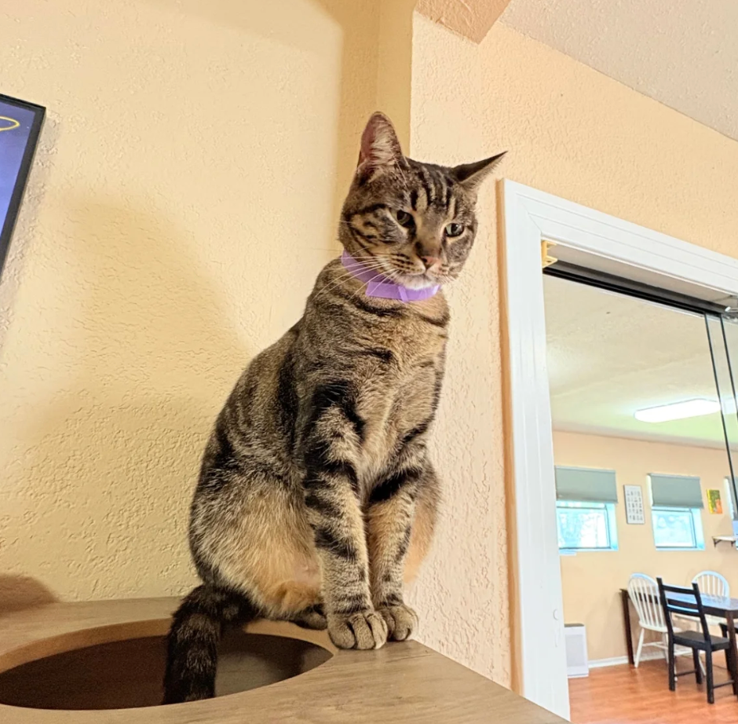

---

#### Physical Store/Travel Translation

**Tags:** `character`, `ai-art`

*Translates menus or signs while preserving the original surface texture (wall, paper, grease).*

Translate the Chinese dish names on the wall menu into English for foreign tourists. Texture Preservation : Crucial! Maintain the original aged, greasy, and textured look of the wall/paper. The new English text should look like it was written/printed on the same surface, with slight fading or wear to match. Currency : Keep the '¥' symbol and price numbers exactly as they are ; do not convert currency. Layout : align the English translations next to or replacing the Chinese characters naturally.

## Source
- [Original](https://mp.weixin.qq.com/s/lrYNbs4rGs3KOqewoZ6aNQ)

## Example Output


---

#### Recursive Visuals

**Tags:** `creative`, `ai-art`

*Demonstrates the model's ability to handle infinite loop logic (Droste effect).*

recursive image of an orange cat sitting in an office chair holding up an iPad. On the iPad is the same cat in the same scene holding up the same iPad. Repeated on each iPad.

## Source
- [Original](https://x.com/venturetwins/status/1993174445515772086)

## Example Output
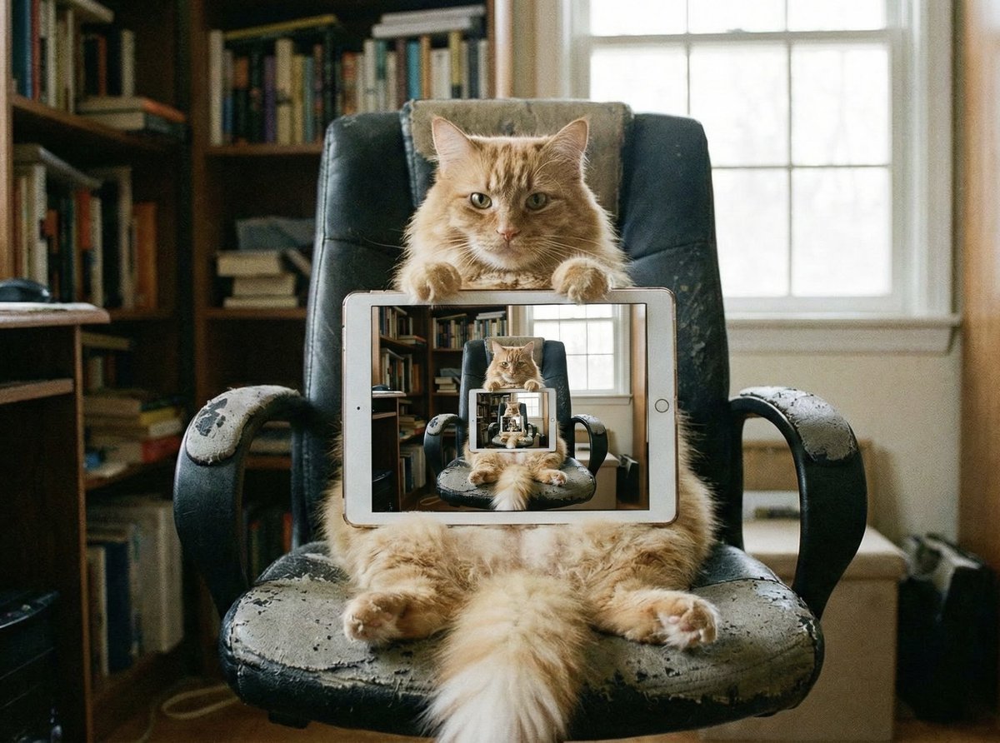

---

#### Room Furnishing Visualization

**Tags:** `creative`, `ai-art`

*Visualize how furniture would look in an empty room*

Show me how this room would look with furniture in it

## Source
- [Original](https://x.com/NanoBanana/status/1994483569625022487)

## Example Output


---

#### Smart Crowd Removal

**Tags:** `realistic`, `ai-art`

*Removes unwanted people from backgrounds and fills the space with logical textures.*

Remove all the tourists/people in the background behind the main subject. Intelligent Fill : Replace them with realistic background elements that logically fit the scene (e.g., extend the cobblestone pavement, empty park benches, or grass textures). Consistency : Ensure no blurry artifacts or 'smudges' remain. The filled area must have the same grain, focus depth, and lighting as the rest of the photo.

## Source
- [Original](https://mp.weixin.qq.com/s/lrYNbs4rGs3KOqewoZ6aNQ)

## Example Output
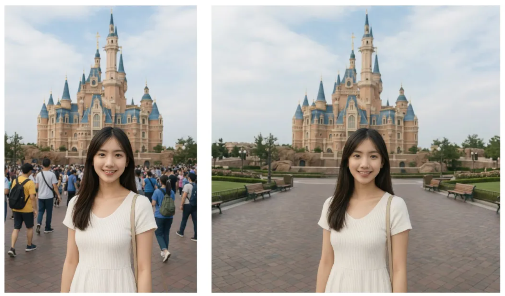

---

#### Star Wars \"Where's Waldo\

**Tags:** `character`, `ai-art`

*A complex prompt testing the model's ability to handle dense crowds and specific character recognition.*

A where is waldo image showing all Star Wars characters on Tatooine

First one to pull this off. First take. Even Waldo is there.

## Source
- [Original](https://x.com/creacas/status/1991585587548348513?s=20)

## Example Output


---

#### Torn Paper Art Effect

**Tags:** `realistic`, `chrome`, `character`

*Add torn paper effect to specific areas of an image*

task: "edit-image: add widened torn-paper layered effect"

base_image:
  use_reference_image: true
  preserve_everything:
    - character identity
    - facial features and expression
    - hairstyle and anatomy
    - outfit design and colors
    - background, lighting, composition
    - overall art style

rules:
  - Only modify the torn-paper interior areas.
  - Do not change pose, anatomy, proportions, clothing details, shading, or scene elements.

effects:
  - effect: "torn-paper-reveal"
    placement: "across chest height"
    description:
      - Add a wide, natural horizontal tear across the chest area.
      - The torn interior uses the style defined in `interior_style`.

  - effect: "torn-paper-reveal"
    placement: "lower abdomen height"
    description:
      - Add a wide horizontal tear across the lower abdomen.
      - The torn interior uses the style defined in `interior_style`.

interior_style:
  mode: "line-art"

  style_settings:
    line-art:
      palette: "monochrome"
      line_quality: "clean, crisp"
      paper: "notebook paper with subtle ruled lines"

    sumi-e:
      palette: "black ink tones"
      brush_texture: "soft bleeding edges"
      paper: "plain textured paper"

    figure-render:
      material: "PVC-like"
      shading: "semi-realistic highlights"
      paper: "plain smooth surface"

    colored-pencil:
      stroke_texture: "visible pencil grain"
      palette: "soft layered hues"
      paper: "rough sketchbook paper"

    watercolor:
      palette: "soft transparent pigments"
      blending: "smooth bleeding"
      edges: "soft contours"
      paper: "watercolor paper texture"

    pencil-drawing:
      graphite_texture: "visible pencil grain"
      shading: "smooth gradients"
      line_quality: "mixed sharp and soft"
      tone: "gray-scale"
      paper: "notebook paper with faint ruled lines"

## Example Output


---

#### UI Hand-drawn Sketch to High-Fidelity Prototype

**Tags:** `realistic`, `ai-art`

*Transforms wireframe scribbles into realistic mobile app mockups.*

Transform this rough wireframe sketch into a high-fidelity UI design mockups for a mobile app. Design System : Apply a modern, clean aesthetics similar to iOS 18 or Material Design 3 . Use rounded corners, soft drop shadows, and a vibrant primary color. Components : Intelligently interpret the sketch: turn scribbles into high-quality placeholder images , convert rough rectangles into proper buttons with gradients , and turn lines into realistic text blocks . Layout : Ensure perfect padding and consistent spacing between elements. Context : Place the design inside a realistic iPhone 16 frame mockups.

## Source
- [Original](https://mp.weixin.qq.com/s/lrYNbs4rGs3KOqewoZ6aNQ)

## Example Output
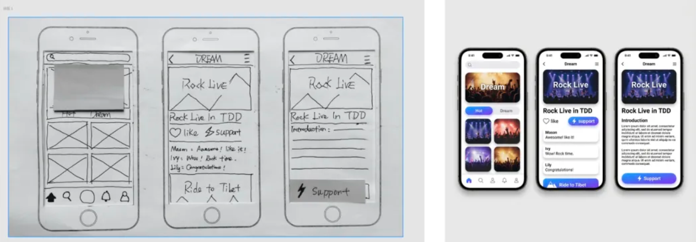

---

#### US Map Made of Famous Foods

**Tags:** `creative`, `ai-art`

*Create a map of US states made of famous foods*

create a map of the US where every state is made out of its most famous food (the states should actually look like they are made of the food, not a picture of the food). Check carefully to make sure each state is right.

## Example Output


---

#### Virtual Model Try-On

**Tags:** `realistic`, `logo`, `professional`, `fashion`

*Dresses a model in a specific garment while preserving fabric texture and lighting integration.*

Using Image 1 (the garment) and Image 2 (the model), create a hyper-realistic full-body fashion photo where the model is wearing the garment. Crucial Fit Details : The [T-shirt/Jacket] must drape naturally on the model's body, conforming to their posture and creating realistic folds and wrinkles . High-Fidelity Preservation : Preserve the original fabric texture, color, and any logos from Image 1 with extreme accuracy. Seamless Integration : Blend the garment into Image 2 by perfectly matching the ambient lighting, color temperature, and shadow direction . Photography Style : Clean e-commerce lookbook, shot on a Canon EOS R5 with a 50mm f/1.8 lens for a natural, professional look.

## Source
- [Original](https://mp.weixin.qq.com/s/lrYNbs4rGs3KOqewoZ6aNQ)

## Example Output
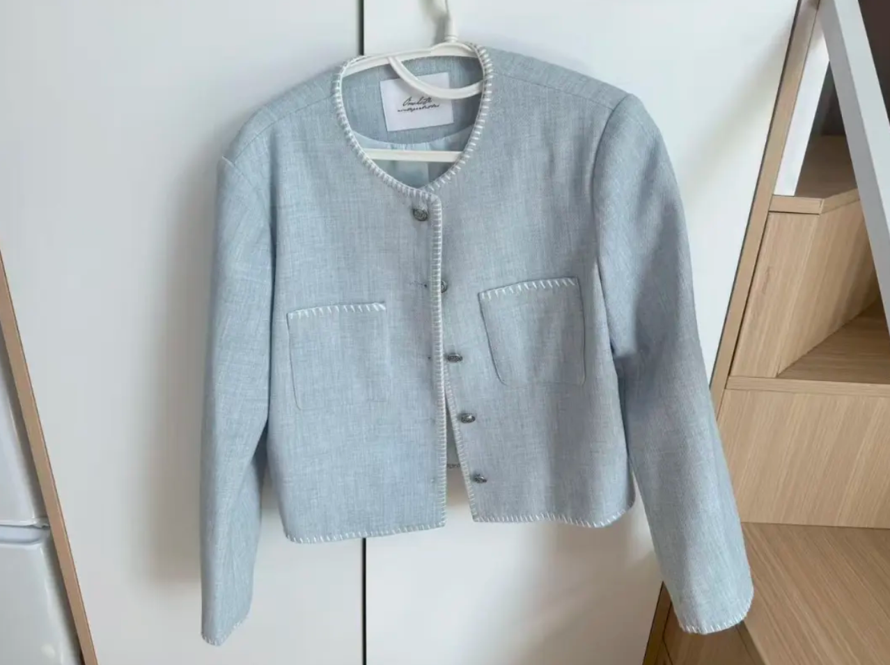

---

#### Whiteboard Marker Art

**Tags:** `glass`, `ai-art`

*Simulating specific drawing media (faded marker) on glass textures.*

Create a photo of vagabonds musashi praying drawn on a glass whiteboard in a slightly faded green marker

## Source
- [Original](https://x.com/nicdunz/status/1991556910106177849)

## Example Output


---

#### Original Pokemon Creation

**Tags:** `retro`, `cute`, `illustration`, `fantasy`, `character`

Create an original creature inspired by this object (photo provided). The creature should look like it belongs in a fantasy monster-catching universe, with a cute or cool design influenced by retro Japanese RPG monster art. The image must include:
– A full-body view of the creature, inspired by the shape, materials or purpose of the object.
– A small orb or capsule (similar an a pokeball) at its feet, designed with patterns and colors matching the object’s look — not a standard Pokéball, but a custom design.
– An invented name for the creature, displayed next to or below it. – Its elemental type (e.g., Fire, Water, Metal, Nature, Electric…), based on the object’s core properties. The illustration should look like it comes from a fantasy creature encyclopedia, with clean lines, soft shadows, and an expressive, character-driven design.

## Notes
If the prompt doesn't work the first time, try a new conversation or ask him to work around the problem.

## Reference Image
Needs a photo of an object, food, etc., as inspiration.

## Source
- [Original Post](https://x.com/Anima_Labs/status/1915044265895379166)

## Example Output


---

#### Personalized Room Design

**Tags:** `3d`, `cute`

Design a cozy bedroom in a cute 3D style with C4D-quality rendering, presented in an isometric view. The room includes a bed, bookshelf, sofa, green plants, a computer desk, and a computer setup. A framed painting hangs on the wall. Outside the window, a nighttime cityscape is visible with glowing buildings and a dark sky. All furniture and objects should have a soft, rounded, stylized design to match the cute 3D aesthetic. Lighting should be warm and inviting, creating a comfortable nighttime indoor atmosphere.

## Notes
The original prompt generated the room based on ChatGPT's memory of the user. This version is slightly modified. Please refer to the original source.

## Source
- [Original Post](https://x.com/ZHO_ZHO_ZHO/status/1910698005193515370)

## Example Output
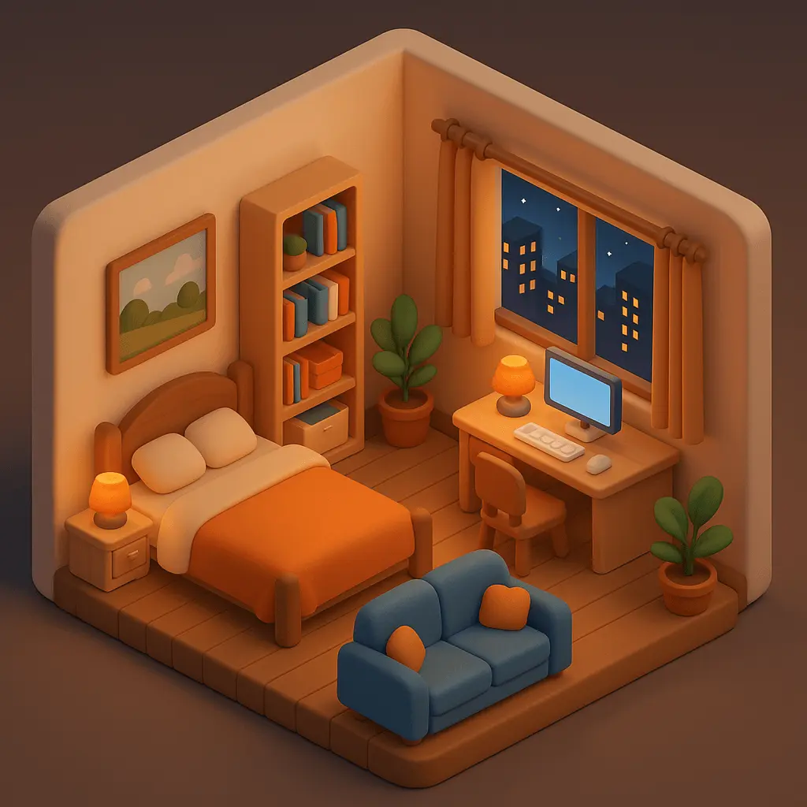

---

#### Physical Destruction Effect Card (Lara Croft)

**Tags:** `realistic`, `illustration`, `icon`

An ultra-photorealistic, cinematic-style illustration depicting Lara Croft dynamically bursting through the frame of an “Archaeological Adventure” trading card. She is caught mid-jump or swinging on a rope, wearing her iconic adventurer outfit and possibly firing dual pistols. The muzzle flashes help shatter the card’s ancient stone-carved border, creating a visible dimensional rupture with energy cracks and spatial distortions, scattering dust and debris outward.

Her body lunges forward with powerful momentum, breaking through the card’s flat plane, emphasizing strong motion depth. Inside the card (the background) is a depiction of dense jungle ruins or a trap-filled ancient tomb. The shattered card fragments mix with crumbling stone, flying vines, broken ancient coins, and spent shell casings.

The title “Archaeological Adventure” and the name “Lara Croft” (accompanied by a stylized artifact icon) remain visible on the remaining cracked and weathered parts of the card. The scene is lit with adventurous, dynamic lighting that emphasizes her agility and the perilous environment.

## Notes
The original tweet mentioned key terms are "dimensional break effects" and "motion depth". The prompt above is a reconstruction based on the description.

## Source
- [Original Post](https://x.com/op7418/status/1912782048160542886)
- [Original Post](https://x.com/hc_dsn/status/1912367201476309396)

## Example Output
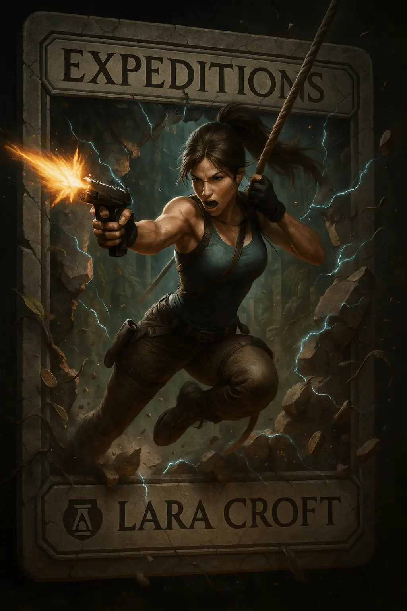

---

#### Retro CRT Computer Boot Screen

**Tags:** `retro`, `logo`

Retro CRT computer boot screen that resolves into ASCII-art of [shape or logo]

## Notes
Replace [shape or logo] in the prompt with a specific shape or logo description, such as Shanghai skyline.

## Source
- [Original Post](https://x.com/Gdgtify/status/1925176250626159053)

## Example Output


---

#### Satirical Cartoon Generation

**Tags:** `cartoon`, `retro`, `vintage`, `comic`, `illustration`

An illustration in satirical comic style, rendered in a vintage American comic aesthetic. The background features a multi-tiered shelf stocked entirely with identical red baseball caps. The caps have a bold slogan on the front: “MAKE AMERICA GREAT AGAIN,” while a white side tag on each reads “MADE IN CHINA.” The composition uses a close-up perspective focusing on one specific red cap.
At the bottom of the image, a price label is shown: the original price “$50.00” is crossed out with a thick black X and replaced with “$77.00.” The overall color palette uses nostalgic ochre and deep red tones, with shading that mimics the textured print style of 1990s retro comics.
The composition is exaggerated and satirical, carrying a strong critique of political consumerism.

## Source
- [Original Post](https://x.com/dotey/status/1910514811756065159)

## Example Output
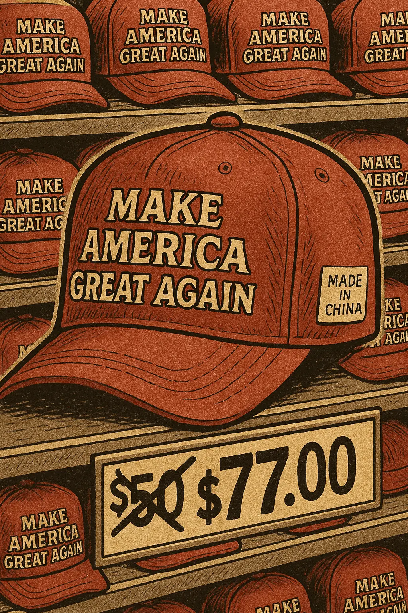

---

#### Steampunk Mechanical Fish

**Tags:** `glass`, `steampunk`

A steampunk-style mechanical fish with a brass body and clearly visible gear mechanisms when in motion.
Its mechanical teeth can be slightly seen, neatly arranged and closed, with both upper and lower teeth visible. Each tooth is triangular in shape and made of diamond material.
The tail fin has a metal wire mesh structure, while other fins are made of semi-transparent amber-colored glass with some subtle bubbles inside.
The eyes are multi-faceted rubies, with clearly visible reflective shine.
The fish has "f-is-h" text clearly visible on its body, with all lowercase letters and careful attention to the hyphen placement.
The image is square, showing the entire fish in the center of the frame, with its head pointing to the right. There is adequate white space around the fish, with more space on the left and right sides. The background has subtle steampunk-style gear patterns.
The entire fish looks very cool. This is a high-definition image with extremely rich details and unique texture and aesthetics. The image should not be too dark.

## Notes
This image showcases an excellent combination of steampunk style and metallic textures, presenting intricate mechanical details and a retro-futuristic aesthetic.

## Source
- [Original Post](https://github.com/f-is-h/f-is-h/blob/main/images/streampank-fish-4.webp)

## Example Output


---

#### Surreal Interaction Scene

**Tags:** `realistic`, `surreal`

A pencil sketch of [Subject 1] interacting with [Subject 2], where [Subject 2] is rendered as a realistic, full-color object, creating a surreal contrast against the hand-drawn style of [Subject 1] and the background

## Notes
Replace [Subject 1] and [Subject 2] in the prompt with specific subject descriptions, such as "a hand" and "a rose".

## Source
- [Original Post](https://x.com/umesh_ai/status/1917444534239191544)

## Example Output


---

#### Surreal Underwater Scene Popsicle

**Tags:** `surreal`, `ai-art`

Tilt POV shot of a hand holding a surreal popsicle with a transparent blue exterior, revealing an underwater scene inside: a tiny scuba diver with tiny fish floating with bubbles, ocean waves crashing, and a green popsicle stick running through the center. The popsicle is melting slightly, with a wooden stick at the bottom, hand is holding it by the wooden stick, soft focus new york street background, premium product photography

## Source
- [Original Post](https://x.com/madpencil_/status/1920037538372128998)

## Example Output
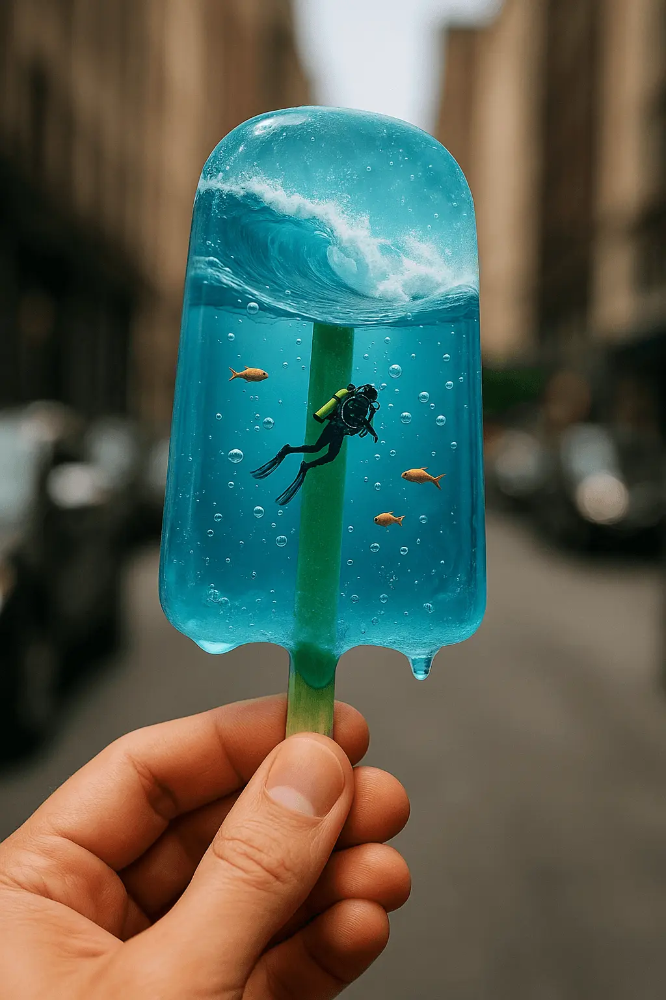

---

#### \"Titanic\" Pose Parody

**Tags:** `3d`, `chibi`, `realistic`, `cute`, `icon`

Transform the person in the attached image into a cute chibi-style 3D character.
Scene: On the pointed bow of a luxurious cruise ship.
The man stands behind the woman at the bow, holding her waist with both hands. The woman is wearing a dress, arms spread wide, facing the wind, with a joyful and liberated expression on her face—just like the iconic scene from Titanic.
The sky is painted in warm sunset tones, and the vast ocean stretches beneath the ship.
Only the characters should be in chibi 3D style; the rest of the environment should be realistic.

## Reference Image
A couple's photo.

## Source
- [Original Post](https://x.com/balconychy/status/1909916265067557299)

## Example Output


---

### ✨ Icons

#### 8-Bit Pixel Icon

**Tags:** `pixel`, `retro`, `minimalist`, `icon`, `logo`

Create a minimalist 8-bit pixel logo of [🍔], centered on a pure white background. Use a limited retro color palette with pixelated detailing, sharp edges, and clean blocky forms. The logo should be simple, iconic, and clearly recognizable in pixel art style — inspired by classic arcade game aesthetics.

## Notes
The `[🍔]` emoji in the prompt can be replaced with other emojis or subjects.

## Source
- [Original Post](https://x.com/egeberkina/status/1913654508330058064)

## Example Output
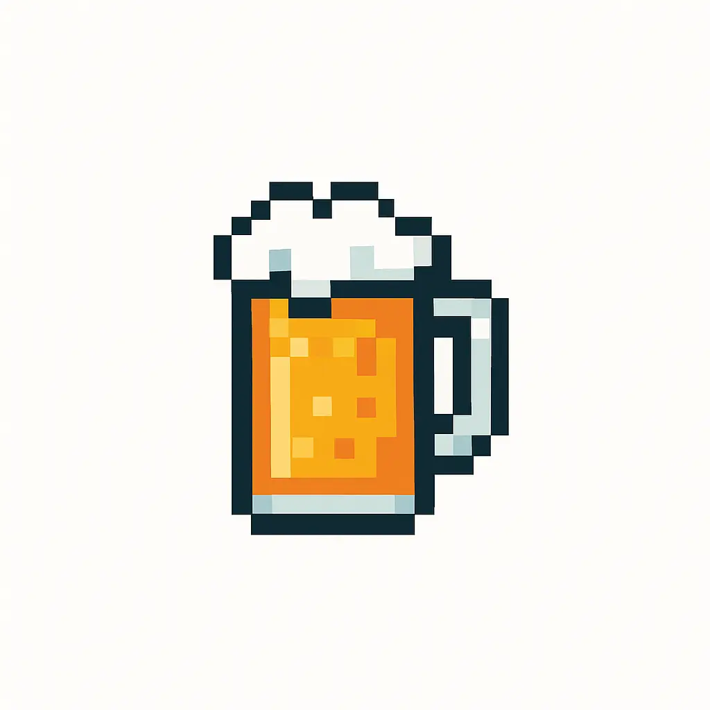

---

#### Animal Silicone Wrist Rest

**Tags:** `chibi`, `cartoon`, `cute`, `emoji`, `icon`

Create an image of a cute chibi-style silicone wrist rest based on the {🐼} emoji. The wrist rest is made of soft, food-grade silicone with a skin-friendly matte surface. The interior is filled with slow-rebound foam. Designed in a personified cartoon style, the expression is lively, with both arms stretched out as if hugging the user’s wrist while lying on a desk. The overall shape is round, soft, and adorable, featuring the classic {🐼} color scheme. The design is comforting and cute, suitable for office use. The background is a solid white color with soft lighting. Rendered in a product photography style, the angle is either front-facing or at a 45-degree top-down view, showcasing high-definition details and emphasizing the silicone texture and comfort functionality.

## Notes
Replace the {🐼} emoji in the prompt with other animal emojis.

## Source
- [Original Post](https://x.com/ZHO_ZHO_ZHO/status/1918525296577327574)

## Example Output
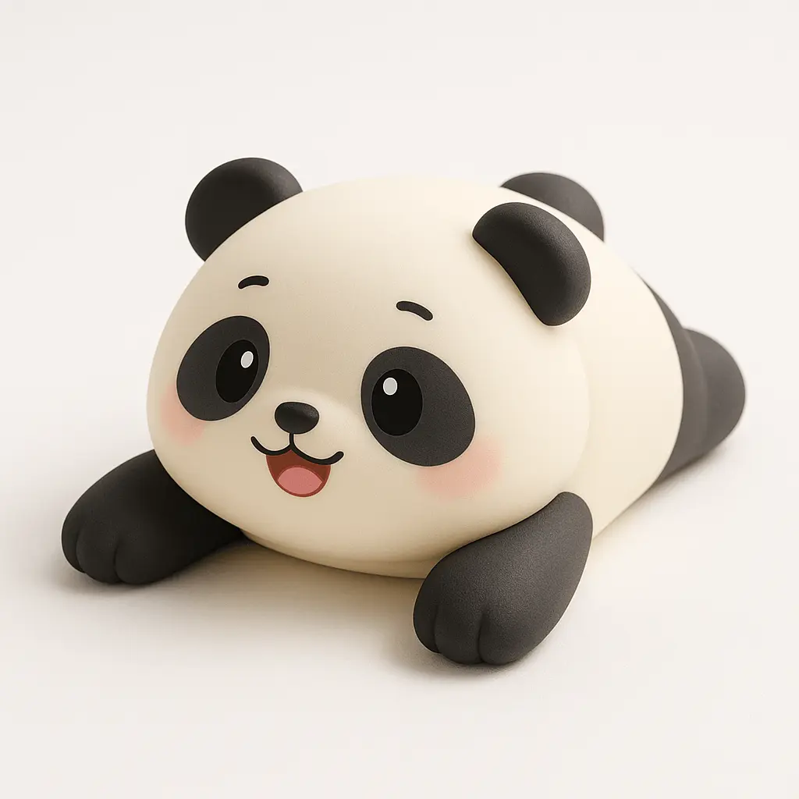

---

#### Anime Sticker Collection

**Tags:** `anime`, `sticker`

Naruto stickers

## Source
- [Original Post](https://x.com/richardchang/status/1909086122959139312)

## Example Output
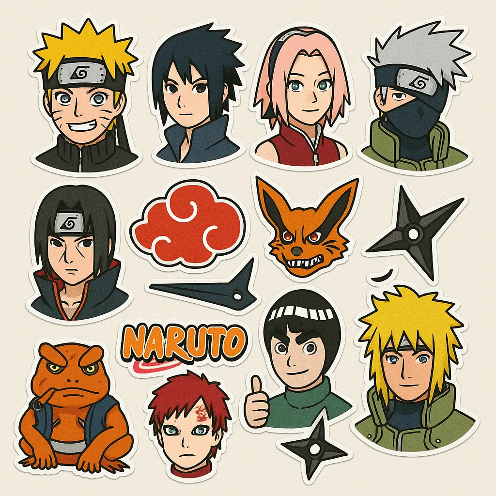

---

#### Anime-style Badge

**Tags:** `anime`, `ai-art`

Based on the person in the attachment, generate a photo of an anime-style badge. Requirements:
Material: Tassel
Shape: Circular
Main subject: A hand holding the badge

## Reference Image
A photo of a person needs to be uploaded as a reference for the badge design.

## Source
- [Original Post](https://x.com/Alittlefatwhale/status/1922512847030124905)

## Example Output
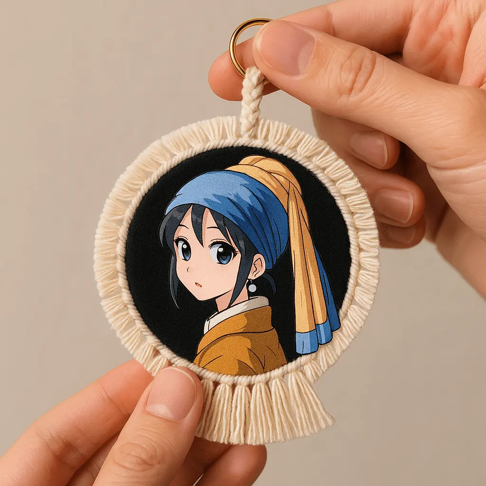

---

#### Branded Mechanical Keycaps

**Tags:** `3d`, `realistic`, `logo`

ultra-realistic 3D render of four mechanical keyboard keycaps in a tight 2x2 grid, all keys touching. View from an isometric angle. One key is transparent with the word “{just}” printed in {white}. The other three colors are: {black, purple, and white}. One key features the {Github} logo. The other two say "{fork}" and "{it}". Realistic plastic texture, rounded sculpted keycaps, soft shadows, clean light-gray background.

## Notes
Replace brand name, slogan, keycap colors

## Source
- [Original Post](https://x.com/egeberkina/status/1918291652210311278)

## Example Output
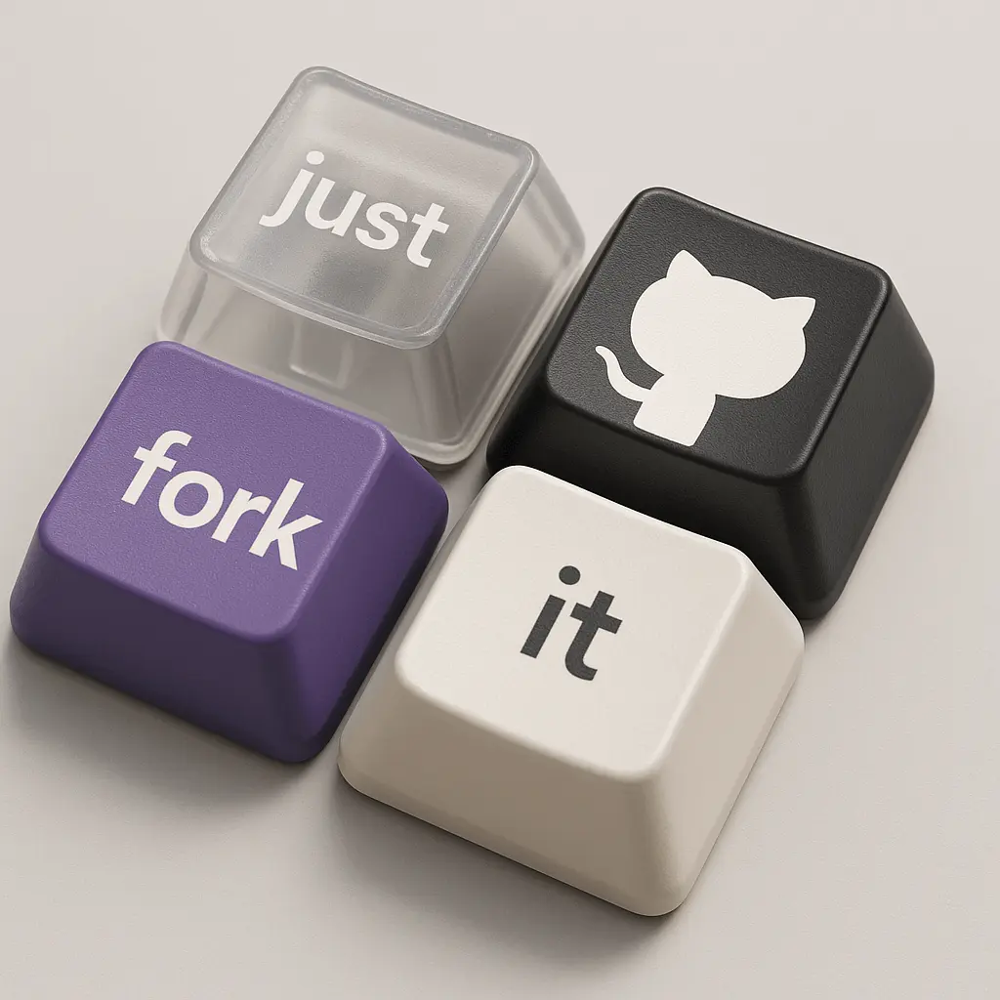

---

#### Character Stepping Through Portal

**Tags:** `3d`, `chibi`, `realistic`, `character`

A 3D chibi-style version of the person in the photo is stepping through a glowing portal, reaching out and holding the viewer’s hand. As the character pulls the viewer forward, they turn back with a dynamic glance, inviting the viewer into their world.
Behind the portal is the viewer’s real-life environment: a typical programmer’s study with a desk, monitor, and laptop, rendered in realistic detail. Inside the portal lies the character’s 3D chibi world, inspired by the photo, with a cool blue color scheme that sharply contrasts with the real-world surroundings.
The portal itself is a perfectly elliptical frame glowing with mysterious blue and purple light, positioned at the center of the image as a gateway between the two worlds.
The scene is captured from a third-person perspective, clearly showing the viewer’s hand being pulled into the character’s world. Use a 2:3 aspect ratio.

## Reference Image
A clear half-body or full-body single person photo.

## Source
- [Original Post](https://x.com/dotey/status/1908910838636765204)

## Example Output


---

#### Chrome Emoji Pin

**Tags:** `3d`, `emoji`, `icon`, `chrome`, `futuristic`

highly detailed 3D render of a single metallic {👍} emoji pin attached to a vertical product card, ultra-glossy chrome finish, smooth rounded 3D icon, stylized futuristic design, soft reflections, clean shadows, paper card has a die-cut euro hole at the top center, bold title “{Awesome}” above the pin, fun tagline “{Smash that ⭐ if you like it!}” below, soft gray background, soft studio lighting, minimal aesthetic

## Notes
Replace {👍} emoji with your emoji icon; Replace title and tagline.

## Source
- [Original Post](https://x.com/egeberkina/status/1919398870867440124)

## Example Output


---

#### Emoji Cream Popsicle

**Tags:** `3d`, `chibi`, `cute`, `emoji`

Generate an image: Transform the [🍓] into a creamy ice cream bar, with cream flowing in curved swirls on top, making it look delicious and tempting. The ice cream is floating at a 45-degree angle in mid-air, rendered in a cute chibi-style 3D aesthetic, set against a solid color background with a unified color palette.

## Notes
The 【🍓】 emoji in the prompt can be replaced with other emojis.

## Source
- [Original Post](https://x.com/ZHO_ZHO_ZHO/status/1914574278911000967)

## Example Output


---

#### Emoji Inflatable Cushion

**Tags:** `3d`, `emoji`

Create a high-resolution 3D render of [🥹] designed as an inflatable, puffy object. The shape should appear soft, rounded, and air-filled — like a plush balloon or blow-up toy. Use a smooth, matte texture with subtle fabric creases and stitching to emphasize the inflatable look. The form should be slightly irregular and squishy, with gentle shadows and soft lighting that highlight volume and realism. Place it on a clean, minimal background (light gray or pale blue), and maintain a playful, sculptural aesthetic.

## Notes
The [🥹] emoji in the prompt can be replaced with other emojis.

## Source
- [Original Post](https://x.com/gizakdag/status/1912858535643197927)

## Example Output


---

#### Emoji Tufted Rug

**Tags:** `cartoon`, `emoji`

Create an image of a colorful, hand-tufted rug in the shape of 🦖 emoji, placed on a simple floor background. The rug has a bold, playful design with soft, fluffy texture and thick yarn details. Shot from above, in natural daylight, with a slightly quirky, DIY aesthetic. Vibrant colors, cartoonish outlines, and tactile, cozy material—similar to handmade tufted art rugs.

## Notes
The 🦖 emoji in the prompt can be replaced with other emojis.

## Source
- [Original Post](https://x.com/gizakdag/status/1913925062568144924)

## Example Output


---

#### Flat Sticker Design

**Tags:** `3d`, `chibi`, `minimalist`, `cute`, `illustration`

Turn this photo into a chibi-style sticker illustration in a minimalist flat design.
– Keep the character’s recognizable features
– Use a cute, simplified aesthetic
– The sticker should have a thick white border
– The character should break out of the circular frame, adding a playful touch
– The circular base should be a solid flat color (no 3D or gradients)
– Background should be transparent
The overall style should be clean, modern, and visually appealing for use as a fun Q-version sticker.

## Reference Image
A clear profile photo.

## Source
- [Original Post](https://x.com/ZHO_ZHO_ZHO/status/1908044836953108490)

## Example Output


---

#### Kawaii Enamel Pin

**Tags:** `kawaii`, `ai-art`

Turn the subject in the attached image into a kawaii enamel pin. Use glossy metal outlines and vibrant enamel fill. No extra added features. Square mockup format. White background.

## Reference Image
Needs a photo of a person or object as the subject for transformation.

## Source
- [Original Post](https://x.com/gnrlyxyz/status/1914303110853583302)

## Example Output


---

#### Emoji Combination - Banana with Sunglasses

**Tags:** `emoji`, `glass`

*Combine emojis in a Google-style design*

combine these emojis: 🍌 + 😎, on a white background as a google emoji design

## Example Output
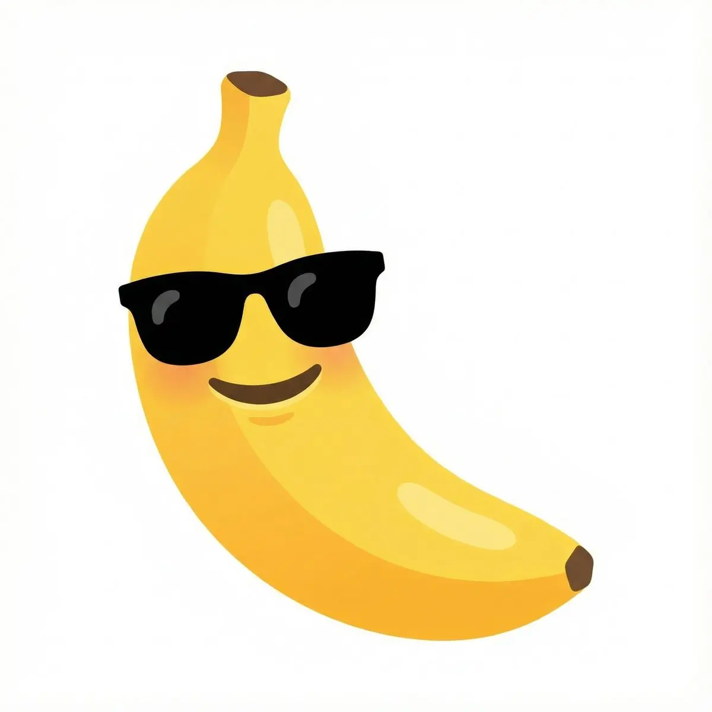

---

#### Paper Craft Style Emoji Icon

**Tags:** `emoji`, `icon`

A paper craft-style "🔥" floating on a pure white background. The emoji is handcrafted from colorful cut paper with visible textures, creases, and layered shapes. It casts a soft drop shadow beneath, giving a sense of lightness and depth. The design is minimal, playful, and clean — centered in the frame with lots of negative space. Use soft studio lighting to highlight the paper texture and edges.

## Notes
The "🔥" emoji in the prompt can be replaced with other emojis.

## Source
- [Original Post](https://x.com/egeberkina/status/1912521263085482464)

## Example Output


---

#### Passport Entry Stamp

**Tags:** `realistic`, `ai-art`

Create a realistic passport page with an entry stamp for [{City}, {Country}]. The stamp should say "Welcome to {City}" in bold English, designed in a round or oval shape with decorative borders. Include the word "ARRIVAL" and a fictional date like "15 APR 2025" Incorporate a subtle silhouette of {Main Landmark} as a background detail within the stamp. Use deep blue or red ink with light smudges for added realism. The stamp should appear slightly angled, as if hand-pressed. The passport page should show visible paper texture and security patterns.

## Notes
You can replace the city, country, landmark, and date placeholders. The example image uses "Rome", "Italy", "Colosseum", and "13 APR 2025" (date differs slightly from the base prompt structure). Prompt by [@M_w14_](https://x.com/M_w14_)

## Source
- [Original Post](https://x.com/M_w14_/status/1912146666410459618)
- [Original Post](https://x.com/ZHO_ZHO_ZHO/status/1912188562944250035)

## Example Output
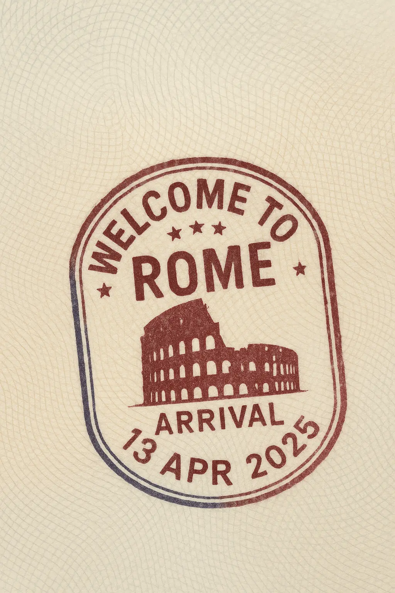

---

#### Q-version Emoji Sticker Pack Creation

**Tags:** `chibi`, `cute`, `sticker`, `emoji`, `character`

Create a brand-new set of chibi-style stickers featuring the user as the main character, with six unique poses:
  1.	Making a playful peace sign with both hands and winking.
  2.	Tearful eyes and slightly trembling lips, showing a cute crying expression.
  3.	Arms wide open in a warm, enthusiastic hug pose.
  4.	Lying on their side asleep, resting on a tiny pillow with a sweet smile.
  5.	Pointing forward with confidence, surrounded by shining visual effects.
  6.	Blowing a kiss, with heart symbols floating around.
Maintain the chibi aesthetic:
– Exaggerated, expressive big eyes
– Soft facial lines
– Playful, short black hairstyle
– A white outfit with a bold neckline design
Background: Vibrant red with star or colorful confetti elements for decoration. Leave some clean white space around each sticker.
Aspect ratio: 9:16

## Reference Image
A clear profile photo.

## Source
- [Original Post](https://x.com/dotey/status/1909800530739679488)

## Example Output


---

### 👤 Portraits

#### Black and White Portrait Art

**Tags:** `portrait`, `logo`

A high-resolution black and white portrait artwork, in an editorial and fine art photography style. The background features a soft gradient, transitioning from mid-gray to almost pure white, creating a sense of depth and tranquility. Fine film grain adds a tactile, analog-like softness to the image, reminiscent of classic black and white photography.

On the right side of the frame, a blurred yet striking face of Harry Potter subtly emerges from the shadows, not in a traditional pose, but as if caught in a moment of thought or breath. Only a part of his face is visible: perhaps an eye, a cheekbone, the contour of his lips, evoking a sense of mystery, intimacy, and elegance. His features are delicate yet profound, exuding a melancholic and poetic beauty without being overly dramatic.

A gentle, directional light, softly diffused, caresses the curve of his cheek or glints in his eye—this is the emotional core of the image. The rest of the composition is dominated by ample negative space, intentionally kept simple, allowing the image to breathe. There are no texts, no logos in the image—only an interplay of light, shadow, and emotion.

The overall atmosphere is abstract yet deeply human, like a fleeting glance or a half-remembered dream: intimate, timeless, and poignantly beautiful.

## Source
- [Original Post](https://x.com/ZHO_ZHO_ZHO/status/1922150692145283299)

## Example Output


---

#### Blurred Silhouette Behind Frosted Glass

**Tags:** `glass`, `ai-art`

A black and white photograph shows the blurred silhouette of a [SUBJECT] behind a frosted or translucent surface. The [PART] is sharply defined and pressed against the surface, creating a stark contrast with the rest of the hazy, indistinct figure. The background is a soft gradient of gray tones, enhancing the mysterious and artistic atmosphere.

## Notes
Replace [SUBJECT] and [PART] with vivid, visually striking details that emphasize the “blurred subject + sharply defined part” contrast.
For example, set [SUBJECT] to “a Sith Lord wielding a red lightsaber in one hand” and [PART] to “the other hand channeling the dark side of the Force.”

## Source
- [Original Post](https://x.com/umesh_ai/status/1921487841634156999)

## Example Output


---

#### Double Exposure

**Tags:** `chrome`, `character`

Double exposure, Midjourney style, merging, blending, overlay double exposure image, Double Exposure style, An exceptional masterpiece by Yukisakura revealing a fantastic double exposure composition of Aragorn son of Arathorn's silhouette harmoniously intertwined with the visually striking, rugged landscapes of Middle Earth during a lively spring season. Sun-bathed pine forests, mountain peaks, and a lone horse cutting through the trail echo outward through the fabric of his figure, adding layers of narrative and solitude. Beautiful tension builds as the stark monochrome background maintains razor-sharp contrast, drawing all focus to the richly layered double exposure. Characterized by its vibrant full-color scheme within Aragorn's silhouette and crisp, deliberate lines that trace every contour with emotional precision. (Detailed:1.45). (Detailed background:1.4).

## Source
- [Original Post](https://sora.com/g/gen_01jtc9btfzef080z31v8w9rtbw)

## Example Output


---

#### Professional Headshot - LinkedIn Style

**Tags:** `headshot`, `professional`, `portrait`, `linkedin`

Create a professional headshot suitable for LinkedIn and corporate use:

## Subject Guidelines
- **Expression**: Warm, approachable smile
- **Eye contact**: Direct, confident gaze at camera
- **Posture**: Slight angle (15-30°) to camera
- **Attire**: Business professional (blazer, button-up)

## Lighting Setup
- **Key light**: 45° from camera, slightly elevated
- **Fill light**: Opposite side, 1-2 stops lower
- **Background**: Soft gradient or clean solid color

## Technical Specs
- Aspect ratio: 1:1 (square) for social media
- Resolution: Minimum 400x400px
- Color: Neutral, professional tones
- Background: Neutral gray (#e5e5e5) or soft blue (#d1e3f8)

## Reference Image


## Variations to Generate
1. With glasses / without glasses
2. Smiling / neutral expression
3. Indoor office / outdoor garden background

## Post-Processing
- Light skin retouching (natural look)
- Color correction for skin tones
- Subtle vignette to draw focus

---

#### Extremely Ordinary iPhone Selfie

**Tags:** `creative`, `ai-art`

Please draw an extremely ordinary and unremarkable iPhone selfie, with no clear subject or sense of composition — just like a random snapshot taken casually. The photo should include slight motion blur, with uneven lighting caused by sunlight or indoor lights resulting in mild overexposure. The angle is awkward, the composition is messy, and the overall aesthetic is deliberately plain — as if it was accidentally taken while pulling the phone out of a pocket.
The subjects are Eason Chan and Nicholas Tse, taken at night, next to the Hong Kong Convention and Exhibition Centre, by Victoria Harbour in Hong Kong.

## Notes
This prompt aims to generate a photo that looks very casual, even slightly like an accidental snapshot.

## Source
- [Original Post](https://x.com/jiamimaodashu/status/1912653073190879410)

## Example Output


---

#### Family Wedding Photo (Q-version)

**Tags:** `3d`, `chibi`, `realistic`, `wedding`, `character`

Transform the people in the photo into chibi-style 3D characters. The parents are dressed in Western wedding attire — the father in a formal suit, the mother in a wedding gown. The child is a beautiful flower girl holding a bouquet.

The background features a colorful floral arch.
The characters are in 3D chibi style, while the environment is photorealistic.
The entire scene is placed inside a photo frame.

## Reference Image
A family photo.

## Source
- [Original Post](https://x.com/balconychy/status/1909426314643222595)

## Example Output


---

#### 1990s Camera Style Portrait

**Tags:** `portrait`, `poster`, `sticker`, `nostalgic`

*Test the model's ability to replicate specific film textures, flash photography, and era-specific atmosphere.*

Without changing her original face, create a portrait of a beautiful young woman with porcelain-white skin, captured with a 1990s-style camera using a direct front flash. Her messy dark brown hair is tied up, posing with a calm yet playful smile. She wears a modern oversized cream sweater. The background is a dark white wall covered with aesthetic magazine posters and stickers, evoking a cozy bedroom or personal room atmosphere under dim lighting. The 35mm lens flash creates a nostalgic glow.

## Source
- [Original](https://x.com/kingofdairyque/status/1991780760030961768?s=20)

## Example Output
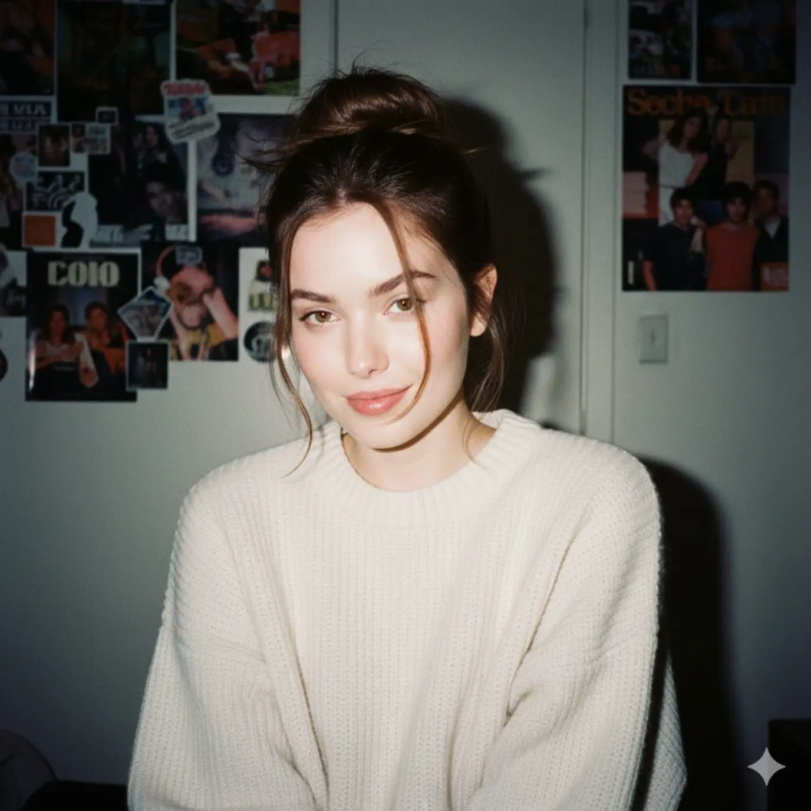

---

#### 2000s Mirror Selfie

**Tags:** `anime`, `retro`, `cute`, `poster`, `icon`

*A structured JSON prompt to generate an authentic early-2000s aesthetic with flash photography and nostalgic elements.*

Create a 2000s Mirror Selfie of yourself using Gemini Nano Banana.

{
  "subject": {
    "description": "A young woman taking a mirror selfie with very long voluminous dark waves and soft wispy bangs",
    "age": "young adult",
    "expression": "confident and slightly playful",
    "hair": {
      "color": "dark",
      "style": "very long, voluminous waves with soft wispy bangs"
    },
    "clothing": {
      "top": {
        "type": "fitted cropped t-shirt",
        "color": "cream white",
        "details": "features a large cute anime-style cat face graphic with big blue eyes, whiskers, and a small pink mouth"
      }
    },
    "face": {
      "preserve_original": true,
      "makeup": "natural glam makeup with soft pink dewy blush and glossy red pouty lips"
    }
  },
  "accessories": {
    "earrings": {
      "type": "gold geometric hoop earrings"
    },
    "jewelry": {
      "waistchain": "silver waistchain"
    },
    "device": {
      "type": "smartphone",
      "details": "patterned case"
    }
  },
  "photography": {
    "camera_style": "early-2000s digital camera aesthetic",
    "lighting": "harsh super-flash with bright blown-out highlights but subject still visible",
    "angle": "mirror selfie",
    "shot_type": "tight selfie composition",
    "texture": "subtle grain, retro highlights, V6 realism, crisp details, soft shadows"
  },
  "background": {
    "setting": "nostalgic early-2000s bedroom",
    "wall_color": "pastel tones",
    "elements": [
      "chunky wooden dresser",
      "CD player",
      "posters of 2000s pop icons",
      "hanging beaded door curtain",
      "cluttered vanity with lip glosses"
    ],
    "atmosphere": "authentic 2000s nostalgic vibe",
    "lighting": "retro"
  }
}

## Source
- [Original](https://x.com/ZaraIrahh/status/1991681614368436468?s=20)

## Example Output
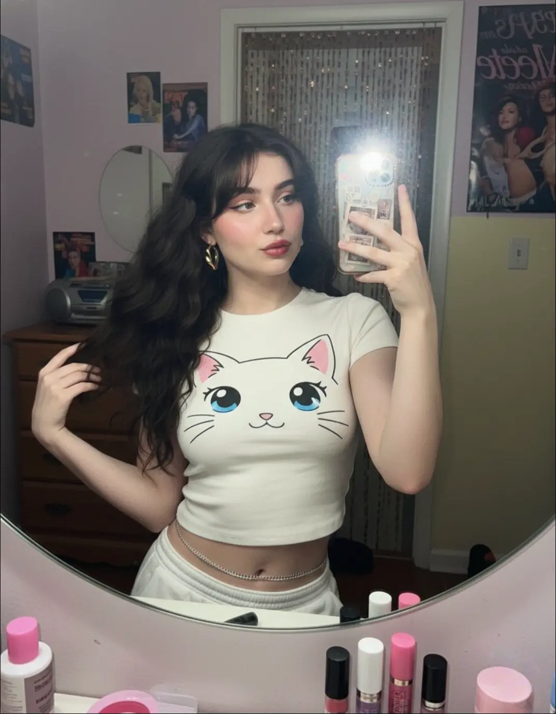

---

#### Bathroom Mirror Selfie

**Tags:** `realistic`, `logo`, `animal`, `professional`

*Create a candid mirror selfie with specific styling and composition*

{
  "subject": {
    "description": "Young woman taking bathroom mirror selfie, innocent doe eyes but the outfit tells another story",
    "mirror_rules": "facing mirror, hips slightly angled, close to mirror filling frame",
    "age": "early 20s",
    
    "expression": {
      "eyes": "big innocent doe eyes looking up through lashes, 'who me?' energy",
      "mouth": "soft pout, lips slightly parted, maybe tiny tongue touching corner",
      "brows": "soft, slightly raised, faux innocent",
      "overall": "angel face but devil body, the contrast is the whole point"
    },
    
    "hair": {
      "color": "platinum blonde",
      "style": "messy bun or claw clip, loose strands framing face, effortless"
    },
    
    "body": {
      "waist": "tiny",
      "ass": "round, full, fabric of shorts riding up and clinging between cheeks, every curve visible through thin athletic material",
      "thighs": "thick, soft, shorts barely containing"
    },
    
    "clothing": {
      "top": {
        "type": "ULTRA mini crop tee",
        "color": "yellow",
        "graphic": "single BANANA logo/graphic",
        "fit": "barely containing chest, fabric stretched tight, ends just below, shows full stomach"
      },
      "bottom": {
        "type": "tight tennis skort or athletic booty shorts",
        "color": "white",
        "material": "thin stretchy athletic fabric",
        "fit": "vacuum tight, riding up, clinging between cheeks, fabric creases visible, leaving nothing to imagination"
      }
    },
    
    "face": {
      "features": "pretty - big eyes, small nose, full lips",
      "makeup": "minimal, natural, lip gloss, no-makeup makeup"
    }
  },

  "accessories": {
    "headwear": {
      "type": "Goorin Bros cap",
      "details": "black with animal patch, worn backwards or tilted"
    },
    "headphones": {
      "type": "over-ear white headphones",
      "position": "around neck"
    },
    "device": {
      "type": "iPhone",
      "details": "visible in mirror, held at chest level"
    }
  },

  "photography": {
    "camera_style": "casual iPhone mirror selfie, NOT professional",
    "quality": "iPhone camera - good but not studio, realistic social media quality",
    "angle": "eye-level, straight on mirror",
    "shot_type": "3/4 body, close to mirror",
    "aspect_ratio": "9:16 vertical",
    "texture": "natural, slightly grainy iPhone look, not over-processed"
  },

  "background": {
    "setting": "regular apartment bathroom",
    "style": "normal NYC apartment bathroom, not luxury",
    "elements": [
      "white subway tile walls",
      "basic bathroom mirror with good lighting above",
      "simple white sink vanity",
      "toiletries visible - skincare bottles, toothbrush holder",
      "towel hanging on hook",
      "maybe shower curtain edge visible",
      "small plant on counter"
    ],
    "atmosphere": "real bathroom, lived-in, normal home",
    "lighting": "good vanity lighting above mirror - bright, even, flattering but not studio"
  },

  "vibe": {
    "energy": "innocent face + sinful body = the whole game",
    "mood": "just got ready for tennis but making content first, 'what?' expression while wearing basically nothing",
    "contrast": "doe eyes + ass eating the shorts = lethal",
    "caption_energy": "'tennis anyone? 🍌' or 'running late oops'"
  }
}

## Example Output
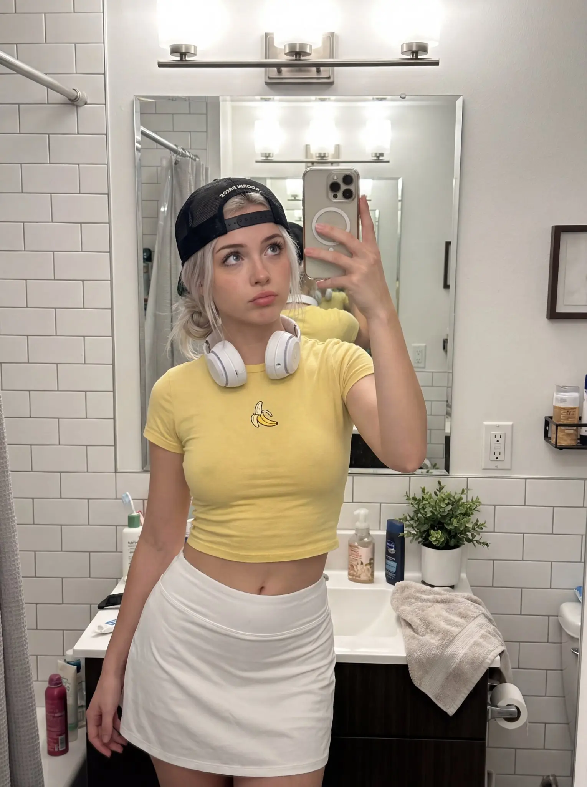

---

#### Character Consistency Selfie with Movie Character

**Tags:** `character`, `ai-art`

*Take a selfie with a movie character while preserving your features*

"I'm taking a selfie with [movie character] on the set of [movie name].

Keep the person exactly as shown in the reference image with 100% identical facial features, bone structure, skin tone, facial expression, pose, and appearance. 1:1 aspect ratio, 4K detail."

## Example Output


---

#### Fisheye Movie Character Selfie

**Tags:** `vintage`, `realistic`, `film`, `character`

*A 360-degree selfie with movie characters*

A film-like fisheye wide-angle 360-degree selfie without any camera or phone visible in the subject's hands. A real and exaggerated selfie of [person from uploaded image] with [CHARACTERS]. They are making faces at the camera.

(more detailed version)
A hyper-realistic fisheye wide-angle selfie, captured with a vintage 35mm fisheye lens creating heavy barrel distortion. without any camera or phone visible in the subject's hands.
Subject & Action: A close-up, distorted group photo featuring [Person From Uploaded Image] taking selfie with [CHARACTERS]. Everyone is making wild, exaggerated faces, squinting slightly from the flash.
Lighting & Texture: Harsh, direct on-camera flash lighting that creates hard shadows behind the subjects. Authentic film grain, slight motion blur on the edges, and chromatic aberration. It looks like a candid, amateur snapshot as if captured during a chaotic behind-the-scenes moment, not a studio photo.

## Example Output


---

#### Hyperrealistic Anime Portrait in Spotlight

**Tags:** `anime`, `realistic`, `portrait`, `character`

*A hyperrealistic anime-style portrait with dramatic lighting*

Generate a hyperrealistic realistic-anime portrait of a female character standing in a completely black background.
Lighting: use a **narrow beam spotlight** focused only on the center of the face. 
The edges of the light must be sharp and dramatic. 
All areas outside the spotlight should fall quickly into deep darkness 
(high falloff shadow), almost blending into the black background. 
Not soft lighting.
Hair: long dark hair with some strands falling over the face. The lower parts of the hair should fade into the shadows.
Pose: one hand raised gently to the lips in a shy, hesitant gesture. 
Eyes looking directly at the camera with a mysterious mood.
Clothing: black long-sleeve knit sweater; 
the sweater and body should mostly disappear into the darkness with minimal detail.
Overall tone: dark, moody, dramatic, mysterious. 
High-contrast only in the lit portion of the face. 
Everything outside the spotlight should be nearly invisible.

## Example Output
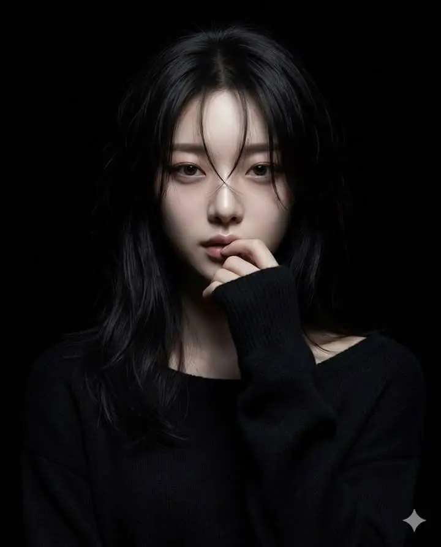

---

#### Japanese High School Student Snap Photo

**Tags:** `creative`, `ai-art`

*Create a snapshot in the style of a Japanese high school student*

A daily snapshot taken with a low-quality disposable camera. A clumsy photo taken by a Japanese high school student. (Aspect ratio 3:2 is recommended)

## Example Output
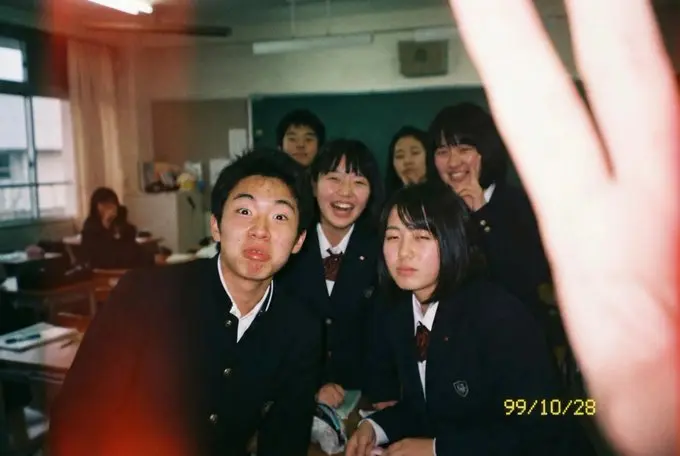

---

#### Museum Art Exhibition Selfie

**Tags:** `character`, `professional`, `cinematic`

*A commercial-grade photo with a classical oil painting*

A commercial grade photograph of [uploaed reference image] posing inside a high-end museum exhibition space.
[the character Source: Based strictly on the uploaded reference image.
Behind them hangs a large, ornate framed classical oil painting.

The painting depicts the same person but rendered in a rich,
traditional oil painting style with thick, visible impasto brushstrokes, deep textures, and rich color palettes on canvas.
Gallery spotlights hit the textured paint surface.
Masterpiece, ultra-detailed, cinematic lighting, strong contrast, dramatic shadows, 8K UHD, highly detailed textures
, professional photography.

## Example Output
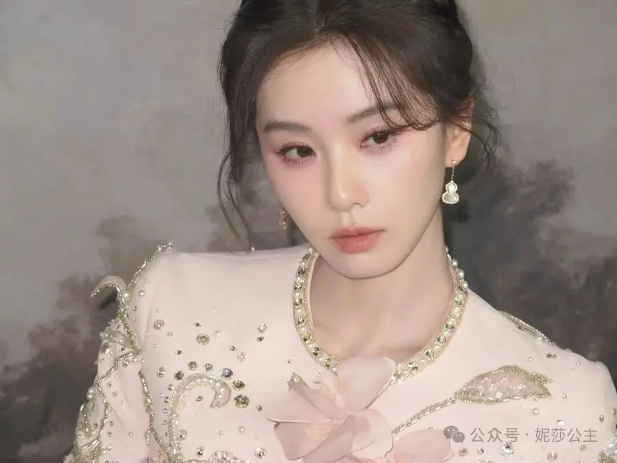

---

#### Portrait with Puppy in Snow

**Tags:** `cute`, `portrait`

*Create a winter portrait with a puppy*

{
  "image_description": {
    "subject": {
      "face": {
        "preserve_original": true,
        "reference_match": true,
        "description": "The girl's facial features, expression, and identity must remain exactly the same as the reference image."
      },
      "girl": {
        "age": "young",
        "hair": "long, wavy brown hair",
        "expression": "puckering her lips toward the camera",
        "clothing": "black hooded sweatshirt"
      },
      "puppy": {
        "type": "small white puppy",
        "eyes": "light blue",
        "expression": "calm, looking forward"
      }
    },
    "environment": {
      "setting": "outdoors in a winter scene",
      "elements": [
        "snow covering the ground",
        "bare trees in the background",
        "blurred silver car behind the girl"
      ],
      "sky": "clear light blue sky"
    },
    "mood": "cute, natural, winter outdoor moment",
    "camera_style": "soft depth of field, natural daylight, subtle winter tones"
  }
}

## Example Output


---

#### Professional Headshot Creator

**Tags:** `realistic`, `professional`, `cinematic`

*Create a professional profile photo from a selfie*

"A professional, high-resolution profile photo, maintaining the exact facial structure, identity, and key features of the person in the input image. The subject is framed from the chest up, with ample headroom. The person looks directly at the camera. They are styled for a professional photo studio shoot, wearing a premium smart casual blazer in a subtle charcoal gray. The background is a solid '#562226' neutral studio color. Shot from a high angle with bright and airy soft, diffused studio lighting, gently illuminating the face and creating a subtle catchlight in the eyes, conveying a sense of clarity. Captured on an 85mm f/1.8 lens with a shallow depth of field, exquisite focus on the eyes, and beautiful, soft bokeh. Observe crisp detail on the fabric texture of the blazer, individual strands of hair, and natural, realistic skin texture. The atmosphere exudes confidence, professionalism, and approachability. Clean and bright cinematic color grading with subtle warmth and balanced tones, ensuring a polished and contemporary feel."

## Source
- [Original](https://x.com/PavolRusnak/status/1994097306526994558)

## Example Output


---

#### Professional Product Photography

**Tags:** `professional`, `ai-art`

*Isolates products from messy backgrounds and places them in a high-end commercial studio setting.*

Identify the main product in the uploaded photo (automatically removing any hands holding it or messy background details). Recreate it as a premium e-commerce product shot . Subject Isolation : Cleanly extract the product, completely removing any fingers, hands, or clutter . Background : Place the product on a pure white studio background (RGB 255, 255, 255) with a subtle, natural contact shadow at the base to ground it. Lighting : Use soft, commercial studio lighting to highlight the product's texture and material. Ensure even illumination with no harsh glare. Retouching : Automatically fix any lens distortion, improve sharpness, and color-correct to make the product look brand new and professional .

## Source
- [Original](https://mp.weixin.qq.com/s/lrYNbs4rGs3KOqewoZ6aNQ)

## Example Output
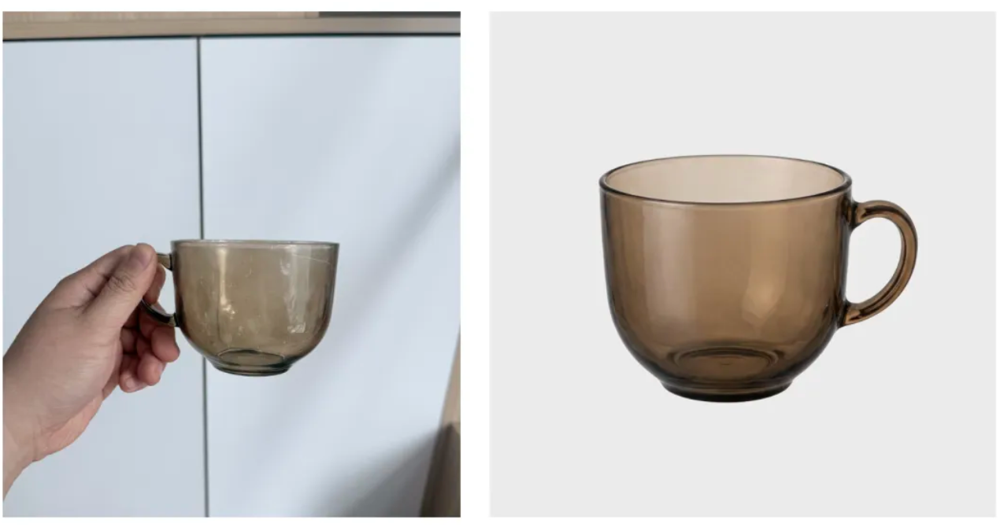

---

#### Victoria's Secret Style Photoshoot

**Tags:** `glamour`, `ai-art`

*Great for creating high-glamour, backstage-style fashion photography with intricate details.*

Create a glamorous photoshoot in the style of Victoria's Secret. A young woman attached in the uploaded reference image ( Keep the face of the person 100% accurate from the reference image ) stands almost sideways, slightly bent forward, during the final preparation for the show. Makeup artists apply lipstick to her (only her hands are visible in the frame). She is wearing a corset decorated with beaded embroidery and crystals with a short fluffy skirt, as well as large feather wings. The image has a "backstage" effect.

The background is a darkly lit room, probably under the podium. The main emphasis is on the girl's face and the details of her costume. Emphasize the expressiveness of the gaze and the luxurious look of the outfit. The photo is lit by a flash from the camera, which emphasizes the shine of the beads and crystals on the corset, as well as the girl's shiny skin. Victoria's Secret style: sensuality, luxury, glamour. Very detailed. Important: do not change the face.

## Source
- [Original](https://x.com/NanoBanana_labs/status/1991947916479762788?s=20)

## Example Output
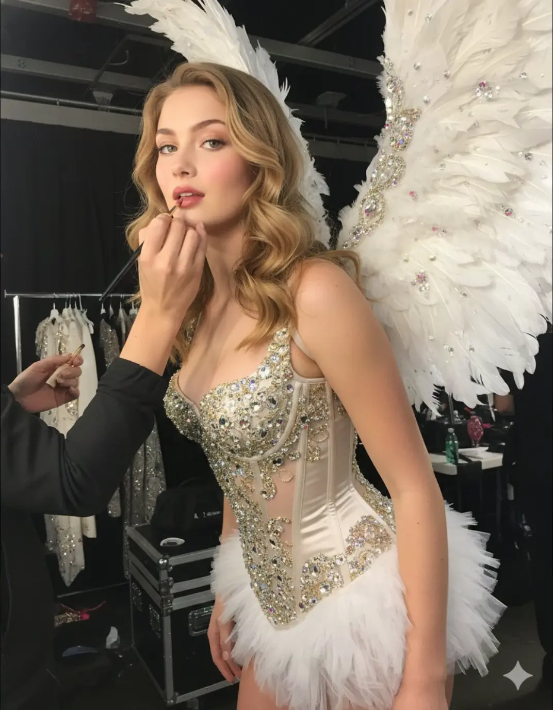

---

#### RPG-Style Character Card Creation

**Tags:** `3d`, `cartoon`, `character`

Create a digital character card in RPG collectible style.
The subject is a {Programmer}, standing confidently with tools or symbols relevant to their job.
Render it in 3D cartoon style, soft lighting, vivid personality.
Include skill bars or stats like [Skill1 +x], [Skill2 +x, e.g., Creativity +10, UI/UX +8].
Add a title banner on top and a nameplate on the bottom.
Frame the card with clean edges like a real figure box.
Make the background fit the profession's theme.
Colors: warm highlights, profession-matching hues.

## Notes
Replace the {Programmer} placeholder in the prompt with specifics like "Designer", "Doctor", etc.

## Reference Image
Optional. Can be generated based on profession/role description or use an uploaded photo as reference.

## Source
- [Original Post](https://x.com/berryxia_ai/status/1911334046724165905)

## Example Output


---

#### Silhouette Art

**Tags:** `creative`, `ai-art`

The silhouette of a basic outline of a [PROMPT]. The background is bright yellow, and the silhouette is solid black.

## Notes
Replace `[PROMPT]` with the specific subject, e.g., "dragon on a castle", "woman's profile", etc.

## Source
- [Original Post](https://x.com/umesh_ai/status/1915417277953962048)

## Example Output
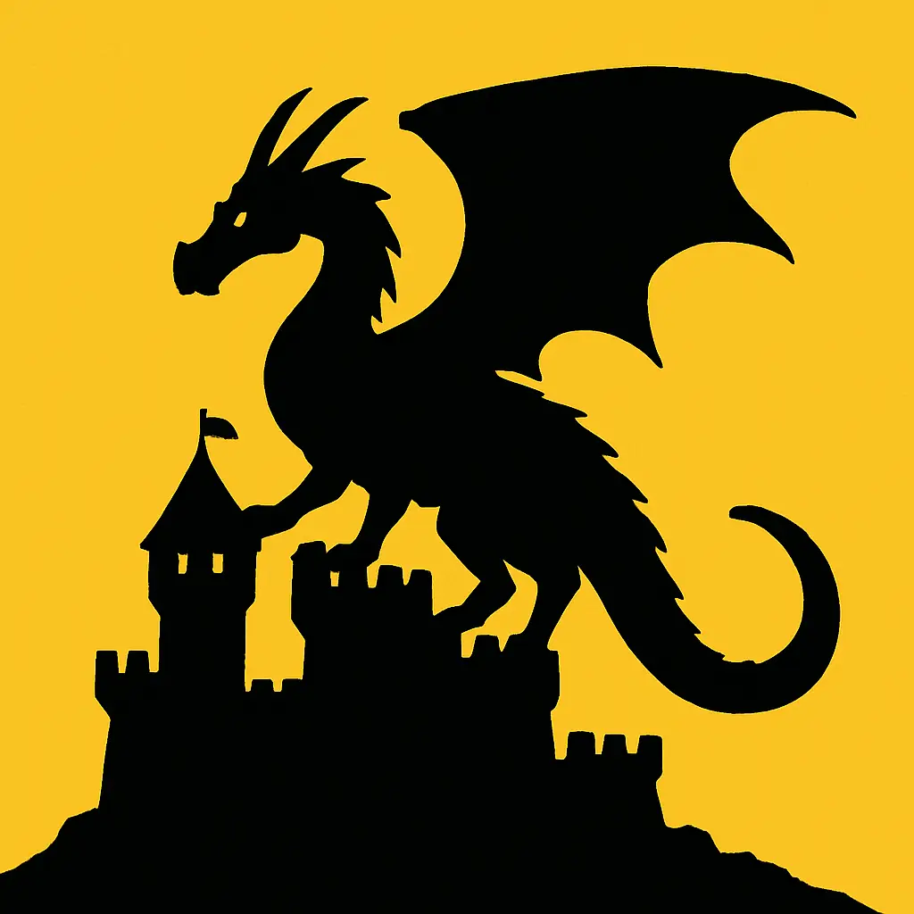

---

#### Three Animals Selfie at Landmark

**Tags:** `cartoon`, `realistic`, `icon`, `animal`

A close-up selfie of three [animal type] with different expressions in front of the iconic [landmark], taken at golden hour with cinematic lighting. The animals are positioned close to the camera with their heads touching, mimicking a selfie pose, showing joyful, surprised, and calm expressions. The background features the full architectural detail of [landmark], softly illuminated, with a warm ambient atmosphere. Shot in a photographic, realistic cartoon style, high detail, 1:1 aspect ratio.

## Notes
Replace [animal type] and [landmark] in the prompt with specific descriptions.

## Source
- [Original Post](https://x.com/berryxia_ai/status/1920795648946782583)

## Example Output


---

### 🖼️ Posters

#### Code Style Business Card

**Tags:** `realistic`, `icon`

A close-up shot of a hand holding a business card designed to look like a JSON file opened in VS Code. The card shows code formatted in realistic syntax-highlighted JSON code. The window includes typical toolbar icons and a title bar labeled Business Card.json, styled exactly like the interface of VS Code. Background is slightly blurred, keeping the focus on the card.
The card displays the following code formatted in JSON:
{
  "name": "Jamez Bondos",
  "title": "Your Title",
  "email": "your@email.com",
  "link": "yourwebsite"
}

## Notes
Replace the values of name, title, email, and link in the final JSON code. The prompt is a simplified version derived from the original source link.

## Source
- [Original Post](https://x.com/umesh_ai/status/1915696926596415492)
- [Original Post](https://x.com/fr0gger_/status/1916743281339498760)
- [Original Post](https://x.com/dotey/status/1917412535130563006)

## Example Output


---

#### Colorful Vector Art Poster

**Tags:** `poster`, `ai-art`

Barcelona Spain colourful summer vector art poster with big "BARCELONA" title at the top and smaller "SPAIN" title under

## Notes
Replace the city and country names in the prompt (e.g., replace "Barcelona Spain" and the titles with "London United Kingdom" to generate the example image). This style prompt also works for food, movies, music, etc.

## Source
- [Original Post](https://x.com/michaelrabone/status/1913865394139316291)

## Example Output


---

#### YouTube Thumbnail - Tech Review Style

**Tags:** `youtube`, `tech`, `review`, `thumbnail`

Create a professional YouTube thumbnail for a tech review video:

## Subject
A person holding a smartphone, looking excited or surprised

## Style
- **Background**: Gradient from deep blue (#1a1a2e) to purple (#4a1942)
- **Text**: Bold, white text with slight 3D effect
- **Layout**: Subject on left (60%), text on right (40%)

## Key Elements
1. Product clearly visible and well-lit
2. Expressive facial reaction
3. Large, readable title text (max 4 words)
4. Brand colors as accent

## Reference Image


## Tips for AI Generation
- Use dramatic lighting on the product
- Ensure face shows genuine emotion
- Keep text area clean and uncluttered
- Resolution: 1280x720 minimum

---

#### Fake Tweet Screenshot (Einstein)

**Tags:** `realistic`, `ai-art`

a hyper realistic twitter post by Albert Einstein right after finishing the theory of relativity. include a selfie where you can clearly see scribbled equations and a chalkboard in the background. have it visible that the post was liked by Nikola Tesla

## Source
- [Original Post](https://x.com/egeberkina/status/1914299716394778713)

## Example Output


---

#### Fashion Magazine Cover Style

**Tags:** `minimalist`, `ai-art`

A beautiful woman wearing a pink qipao, adorned with delicate floral accessories on her head and colorful blossoms woven into her hair. Around her neck is an elegant white lace collar. One of her hands gently holds several large butterflies. The overall photography style features high-definition detail and texture, resembling a fashion magazine cover. The word “FASHION DESIGN” is placed at the top center of the image. The background is a minimalist light gray, designed to highlight the subject.

## Source
- [Original Post](https://x.com/dotey/status/1912536019905233194)

## Example Output


---

#### Futuristic Logo Trading Card

**Tags:** `3d`, `realistic`, `logo`, `glass`, `neon`

{
    "prompt": "A futuristic trading card with a dark, moody neon aesthetic and soft sci-fi lighting. The card features a semi-transparent, rounded rectangle with slightly muted glowing edges, appearing as if made of holographic glass. At the center is a large glowing logo of {{logo}}, with no additional text or label, illuminated with a smooth gradient of {{colors}}, but not overly bright. The reflections on the card surface should be subtle, with a slight glossy finish catching ambient light. The background is a dark carbon fiber texture or deep gradient with soft ambient glows bleeding into the edges. Add subtle light rays streaming down diagonally from the top, giving the scene a soft cinematic glow. Apply light motion blur to the edges and reflections to give the scene a sense of depth and energy, as if it's part of a high-end tech animation still. Below the card, include realistic floor reflections that mirror the neon edges and logo—slightly diffused for a grounded, futuristic look. Text elements are minimal and softly lit: top-left shows '{{ticker}}', top-right has a stylized signature, and the bottom displays '{{company_name}}' with a serial number '{{card_number}}', a revenue badge reading '{{revenue}}', and the year '{{year}}'. Typography should have a faint glow with slight blurring, and all elements should feel premium, elegant, and softly illuminated—like a high-end cyberpunk collectible card.",
    "style": {
        "lighting": "Neon glow, soft reflections",
        "font": "Modern sans-serif, clean and minimal",
        "layout": "Centered, structured like a digital collectible card",
        "materials": "Glass, holographic plastic, glowing metal edges"
    },
    "parameters": {
        "logo": "Tesla logo",
        "ticker": "TSLA",
        "company_name": "Tesla Inc.",
        "card_number": "#0006",
        "revenue": "$96.8B",
        "year": "2025",
        "colors": [
            "red",
            "white",
            "dark gray"
        ]
    },
    "medium": "3D render, high-resolution digital art",
    "size": "1080px by 1080px"
}

## Notes
The prompt uses a JSON-like structure to describe card elements. Modify values in the `parameters` object (like logo, ticker, company_name, colors, etc.) to customize the card. For custom logos, specify in `parameters.logo` (e.g., "Framer logo (attached image)") and upload the image.

## Reference Image
(Optional) Upload a custom logo image.

## Source
- [Original Post](https://x.com/hewarsaber/status/1912933875166171515)

## Example Output
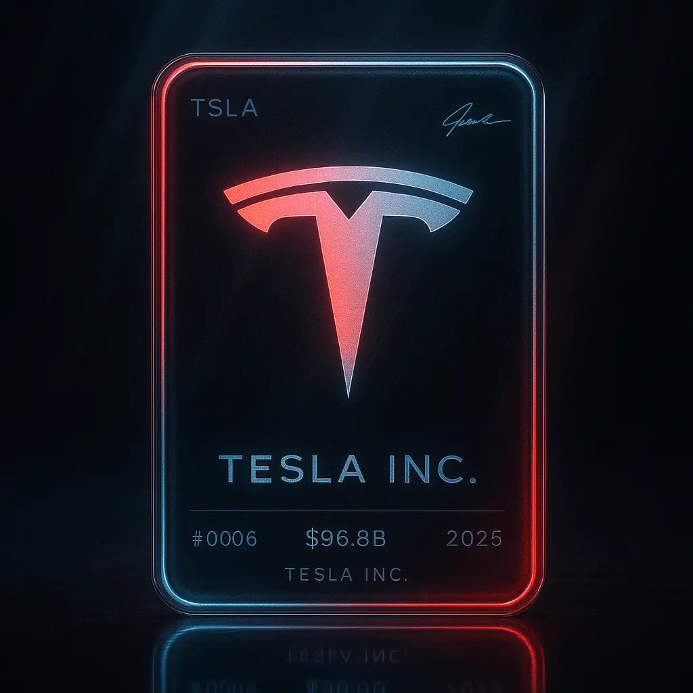

---

#### Google Maps to Ancient Treasure Map

**Tags:** `creative`, `ai-art`

Transform the image to an ancient treasure map drawn on aged parchment. The map includes detailed elements like sailing ships on the ocean, old ports or castles on the coastline, a dotted path leading to a large 'X' marking the treasure spot, mountains, palm trees, and a decorative compass rose. The overall style is reminiscent of old pirate adventure films.

## Reference Image
A Google Maps screenshot or other map image needs to be uploaded as the basis for the transformation.

## Source
- [Original Post](https://x.com/umesh_ai/status/1919701229363466328)

## Example Output
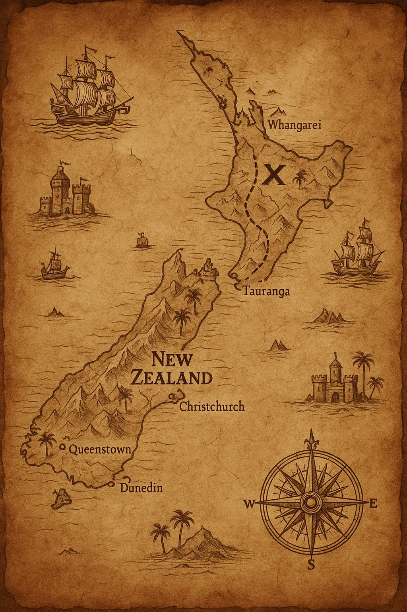

---

#### Minimalist Futurist Poster

**Tags:** `3d`, `minimalist`, `poster`, `logo`, `glass`

A vertical (3:4) 4K-resolution minimalist futurist exhibition poster with an ultra-light cool gray background (#f4f4f4).

At the center of the poster is a fluid 3D metaball shaped like a classic Coca-Cola bottle in full form, rendered in frosted glass with delicate grainy noise.
The fluid gradient transitions from Coca-Cola Red (#E41C23) to Pearl White (#FFFFFF), giving it a silky glass-like appearance.

High-position softbox lighting casts long, soft colored shadows and a subtle halo.

The fluid overlaps with the text: letters obscured by the frosted glass appear with a gentle Gaussian blur.
•The main title, the classic red “Coca-Cola” logo, is centered and partially obscured by the fluid. The covered letters are slightly blurred through the frosted glass.
•The subtitle, in bold all-caps modern sans-serif pure black font, reads: “TASTE THE FEELING”, placed below the main title. It is also partially overlapped by the fluid and blurred in those areas, while the rest remains sharp.

The overall layout is clean with generous whitespace, balanced composition, sharp focus, and HDR high dynamic range.

## Notes
The [Classic 3D Coca-Cola Bottle] in the prompt can be replaced with descriptions of other items to generate posters with different themes.

## Source
- [Original Post](https://x.com/ZHO_ZHO_ZHO/status/1921906728763105394)

## Example Output


---

#### Commercial Promotional Poster

**Tags:** `poster`, `sticker`, `professional`, `cinematic`

*Designs professional sales posters with integrated text and high-quality product photography.*

Design a professional promotional poster for a [Coffee Shop]. Composition : A cinematic close-up of a steaming cup of cappuccino on a rustic wooden table, autumn leaves in the background (cozy atmosphere). Text Integration :
1. Main Title : 'Autumn Special' written in elegant, gold serif typography at the top.
2. Offer : 'Buy One Get One Free' clearly displayed in a modern badge or sticker style on the side.
3. Footer : 'Limited Time Only' in small, clean text at the bottom. Quality : Ensure all text is perfectly spelled, centered, and integrated into the image's depth of field.

## Source
- [Original](https://mp.weixin.qq.com/s/lrYNbs4rGs3KOqewoZ6aNQ)

## Example Output


---

#### Magazine Cover Portrait

**Tags:** `portrait`, `fashion`

*Create a glossy magazine cover*

A photo of a glossy magazine cover, the cover has the large bold words "Nano Banana Pro". The text is in a serif font, black on white, and fills the view. No other text.

In front of the text there is a dynamic portrait of a person in green and banana yellow colored high-end fashion.

Put the issue number and today's date in the corner along with a barcode and a price. The magazine is on a white shelf against a wall.

## Example Output
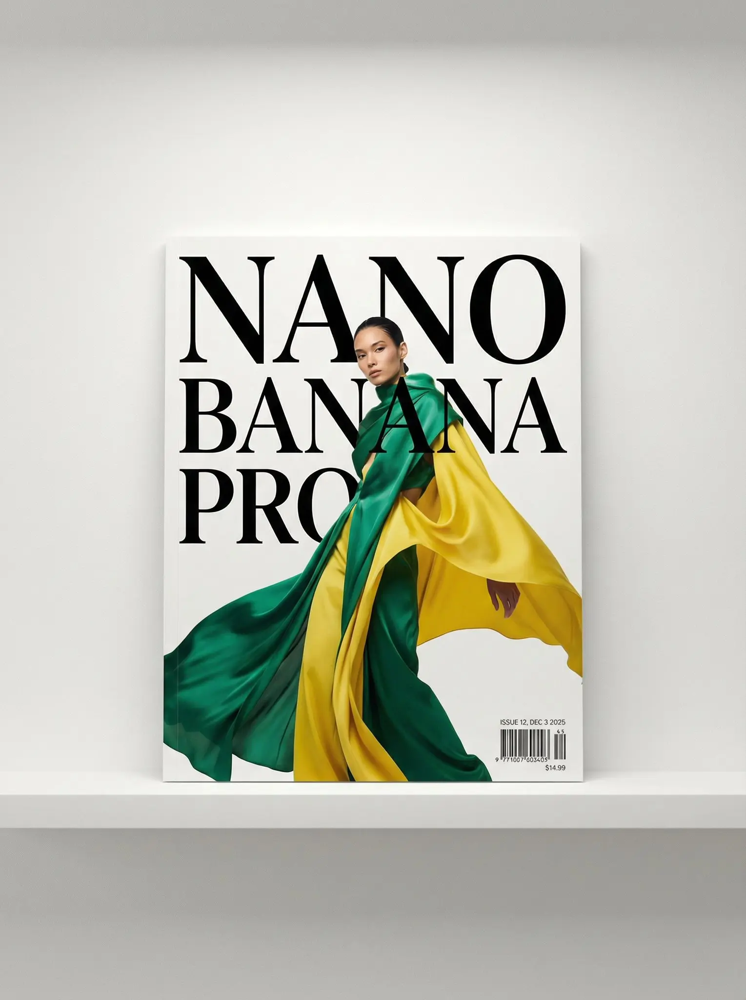

---

#### Magazine Layout Generator

**Tags:** `creative`, `ai-art`

*Perfect for visualizing articles in print format with complex typography.*

Put this whole text, verbatim, into a photo of a glossy magazine article on a desk, with photos, beautiful typography design, pull quotes and brave formatting. The text: [...the unformatted article]

## Source
- [Original](https://x.com/fofrAI/status/1991530971800182929)

## Example Output
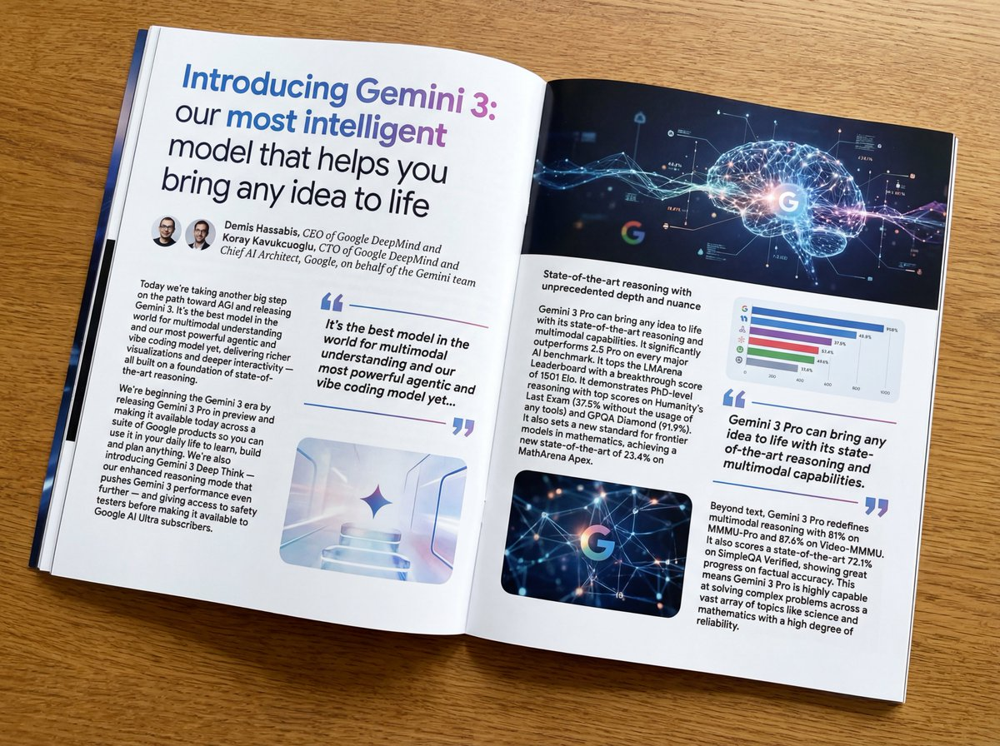

---

#### Y2K Scrapbook Poster with Multiple Poses

**Tags:** `retro`, `realistic`, `cute`, `poster`, `sticker`

*Create a Y2K-style scrapbook poster with multiple poses*

facelock_identity": "true",
"accuracy": "100%",
scene"Colorful Y2K scrapbook poster aesthetic, vibrant stickers, multiple subjects wearing the same outfit and hairstyle with different poses and cutouts, colorful strokes and lines, frameless collage style. Includes: close-up shot with heart-shape fingers, full-body squatting pose supporting chin while holding a white polaroid camera, mid-shot touching cheek while blowing pink bubblegum, mid-shot smiling elegantly while holding a cat ,seated elegantly with one eye winking and peace sign, and mid-shot holding daisy flowers. Holographic textures, pastel gradients, glitter accents, playful doodles, magazine cut-out graphics, chaotic yet balanced layout, extremely artistic and visually engaging",
main_subject": {
"description": "A young Y2K-styled woman as the main focus in the center of the scrapbook collage.",
"style_pose": "Playful and confident Y2K pose — slight side hip pop, one hand holding a lens-flare keychain, face toward the camera with a cute-cool expression, slight pout, candid early-2000s photo vibe."
outfit": {
"top": "Cropped oversized sweater in pastel color with embroidered patches",
"bottom": "pastel skirt with a white belt",
"socks": "White ankle socks with colorful pastel stripes",
"shoes": "white sneakers",
"accessories": [
"Colorful plastic bracelets",
"Chunky colorful rings",
"Sparkling belly chain",
"hairstyle": 
"type": "Y2K half-up half-down",
"details": "Pastel flowers clips,thin front tendrils, wavy dark brown hair with bubblegum-pink tint on the lower strands, iconic early-2000s look."
additional_visuals": 
"Heart, star, and butterfly stickers",
"Retro sparkles",
"Polaroid frames",
"Neon outlines",
"Doodle borders",
"Magazine cutout texts: 'SO CUTE!', '199X!', 'GIRL VIBES'",
"Pastel lighting",
"Glossy dreamy retro glow",
"Ultra-aesthetic scrapbook layout"
photography_rendering": {
"color_grading": "Cinematic neon Y2K",
"lighting": "Soft flash lighting","skin_texture": "Smooth glossy finish",
"rendering": "High-detail hyperrealistic Y2K scrapbook tone",
"quality": "8K",
"composition": "Perfectly balanced and artistic"
negative_prompt": "no realism that breaks Y2K aesthetic, no modern 2020s clothing, no messy composition, no blurry face, no distorted hands, no extra limbs, no face warping, no low resolution, no grain, no muted colors, no watermark, no AI artifacts"

## Example Output
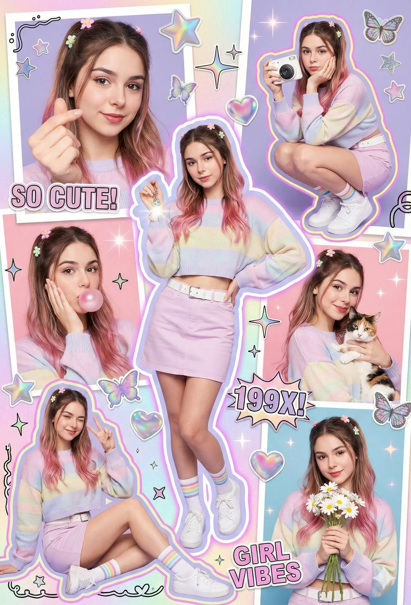

---

#### Nostalgic Anime Film Poster

**Tags:** `anime`, `poster`

{The Lord of the Rings} anime film poster, the anime is in the style of High School DXD. Visible even folds are seen across the poster as it’s been folded over time, and due to some creases over damaging the poster has caused some physical damage scuffing along the creases and the color has partially faded. Indiscriminate flaps and folds and scratches all around simply from moving back and forth causing subtle yet incremental damage with the ever expanding of entropy we cannot escape, but the loving memories in our hearts will forever be whole. Making the objects we collect along the way priceless is the essence you feel when looking at this nostalgic poster.

## Notes
You can replace the movie title "{The Lord of the Rings}" in the prompt with others. Be aware that some movie titles may trigger content moderation. The referenced anime style can also be modified.

## Source
- [Original Post](https://sora.com/g/gen_01jsfxrdpjfpebnyed8yaz42nf)

## Example Output


---

#### PS2 Game Cover (GTA x Shrek)

**Tags:** `creative`, `ai-art`

Can you create a PS2 video game case of "Grand Theft Auto: Far Far Away" a GTA based in the Shrek Universe.

## Source
- [Original Post](https://x.com/dotey/status/1904978767090524372)

## Example Output


---

#### Retro Style Promotional Poster

**Tags:** `retro`, `vintage`, `poster`, `logo`

A retro-style promotional poster emphasizing bold Chinese text. The background features a red-and-yellow radial burst pattern. In the center of the composition is a beautiful young woman illustrated in a refined vintage art style—she smiles warmly with a graceful, approachable presence. The poster advertises GPT’s latest AI image generation service with key slogans in Chinese, such as: “Shocking price: 9.9 per image”, “Supports all scenes, image blending, partial redrawing”, “3 revisions per image”, and “Direct AI output with no need for manual edits”. At the bottom, prominently display the call-to-action: “If you’re interested, click ‘I want this’ in the bottom-right corner”. Illustrate a hand pressing a button in the bottom-right, and place the OpenAI logo in the bottom-left.

## Source
- [Original Post](https://x.com/dotey/status/1905251524248248650)

## Example Output


---

#### Satirical Poster Generation

**Tags:** `poster`, `ai-art`

Satirical Poster Text (English):
GPT-4o is taking over.
Forget working in image AI
maybe it’s time to deliver takeout instead.

## Source
- [Original Post](https://x.com/ZHO_ZHO_ZHO/status/1905287637084274742)

## Example Output


---

#### Signature City Weather Forecast

**Tags:** `3d`, `realistic`, `icon`

Show a clear 45-degree bird’s-eye view of an isometric miniature city scene featuring Shanghai’s iconic buildings, such as the Oriental Pearl Tower and the Bund. The weather effect—cloudy—blends softly into the city, interacting gently with the architecture. Use physically based rendering (PBR) and realistic lighting. Solid color background, crisp and clean. Centered composition to highlight the precision and detail of the 3D model. Display “Shanghai Cloudy 20°C” and a cloudy weather icon at the top of the image.

## Notes
The city, weather, temperature, and building names can be replaced with the content in []. Generated with sora.

## Source
- [Original Post](https://x.com/dotey/status/1917988595228438771)

## Example Output


---

#### Social Media Frame Integration

**Tags:** `3d`, `chibi`, `icon`, `character`

Create a stylized 3D chibi character based on the attached photo, accurately preserving the subject’s facial features and clothing details. The character is making a finger heart with the left hand (with a red heart element above the fingers) and playfully sitting on the edge of a giant Instagram frame, with both legs hanging outside the frame. The top of the frame displays the username “Beauty,” and various social media icons (like, comment, share) float around the scene.

## Notes
The username "Beauty" and icons in the prompt can be replaced. Original image generated by Sora.

## Reference Image
Yes, needs an image to be uploaded as reference.

## Source
- [Original Post](https://x.com/dotey/status/1917042797506662560)

## Example Output
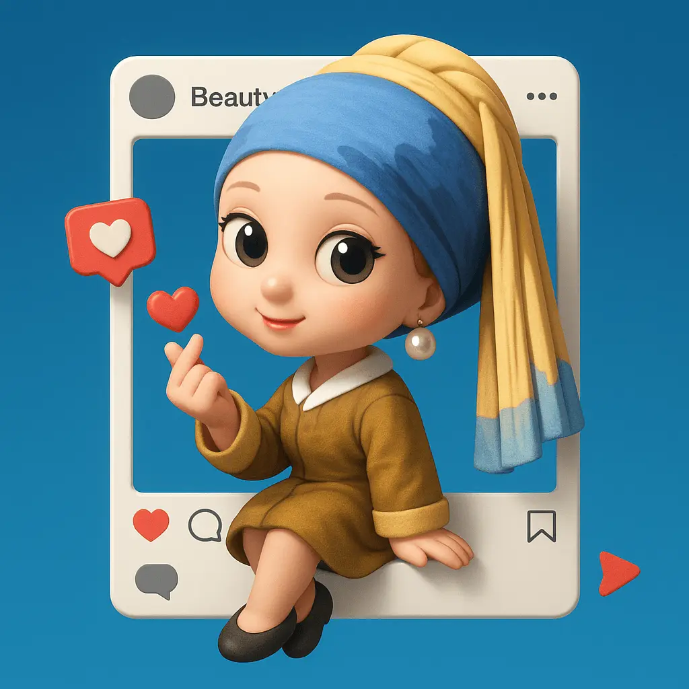

---

#### Xiaohongshu Cover Image

**Tags:** `illustration`, `icon`, `character`

Draw an image: Create a cover for a Xiaohongshu (RED) post.

Requirements:
– It must be visually compelling enough to attract user clicks.
– Use bold, characterful fonts.
– Vary font sizes to reflect the hierarchy of information; emphasize the structure of the copy.
– The main title should be at least twice the size of regular text.
– Leave white space between text sections.
– Only use bright accent colors to highlight key words and draw attention.
– The background should feature an eye-catching pattern (such as paper texture, notebook, or a WeChat chat window—choose one).
– Add appropriate icons or illustrations to enhance visual layers, but avoid visual clutter.

Copy text:
BREAKING: ChatGPT just got even better!
– Superior multitasking ✨
– Stronger coding ability 💪
– Creativity off the charts 🎨
Try it now!

Image aspect ratio: 9:16

## Source
- [Original Post](https://x.com/balconychy/status/1905507936526627078)

## Example Output


---

### 📸 Thumbnails

#### MrBeast Style - Comparison Split

**Tags:** `mrbeast`, `youtube`, `thumbnail`, `comparison`, `split-screen`

```json
{
  "style": "MrBeast Comparison Split",
  "description": "High-contrast comparison showing extreme value differences",
  "composition": {
    "layout": "Split screen (vertical or diagonal division)",
    "subject_placement": "Center or side, reacting to both options",
    "split_style": "Clean division with clear visual separation"
  },
  "left_side": {
    "value": "Cheap, low-quality, or budget option",
    "visual_quality": "Desaturated, dirty, worn textures",
    "colors": "Grays, browns, muted tones",
    "examples": "$1 item, broken version, economy option"
  },
  "right_side": {
    "value": "Expensive, luxury, or premium option",
    "visual_quality": "Bright, clean, golden, luxurious textures",
    "colors": "Golds, whites, vibrant blues, premium colors",
    "examples": "$1,000,000 item, perfect version, luxury option"
  },
  "subject": {
    "position": "Center or prominently featured",
    "expression": "Shocked, amazed, pointing at options",
    "action": "Gesturing at the comparison, reacting dramatically"
  },
  "lighting": {
    "left": "Dim, cloudy, poor lighting",
    "right": "Bright, energetic, golden hour lighting",
    "contrast": "Extreme difference emphasizing value gap"
  },
  "colors": {
    "palette": "Dull vs vibrant, poor vs rich",
    "saturation": "Low on left, maximum on right",
    "contrast": "Very high to emphasize difference"
  },
  "variations": [
    {
      "name": "Food Comparison",
      "description": "$1 burger (sad, flat) vs $1000 gold-covered gourmet burger"
    },
    {
      "name": "Travel Comparison",
      "description": "Cramped economy seat vs spacious private jet interior"
    },
    {
      "name": "Tech Comparison",
      "description": "Old broken phone vs latest holographic smartphone"
    }
  ],
  "prompt_template": "Create YouTube thumbnail (16:9) using the ATTACHED IMAGE of the person: Place them in the CENTER reacting to the comparison. LEFT SIDE: crumbling tiny wooden shack in swamp with desaturated dirty brown textures. RIGHT SIDE: massive futuristic gold mansion with bright golden luxurious textures and blue sky. Person should look shocked/amazed pointing at both sides. Add bold yellow text top '$1 VS $1,000,000' with 8px black outline. White text bottom 'HOUSE EDITION' with black outline. Extremely high contrast, oversaturated colors, professional YouTube thumbnail style"
}
```

## Example Output
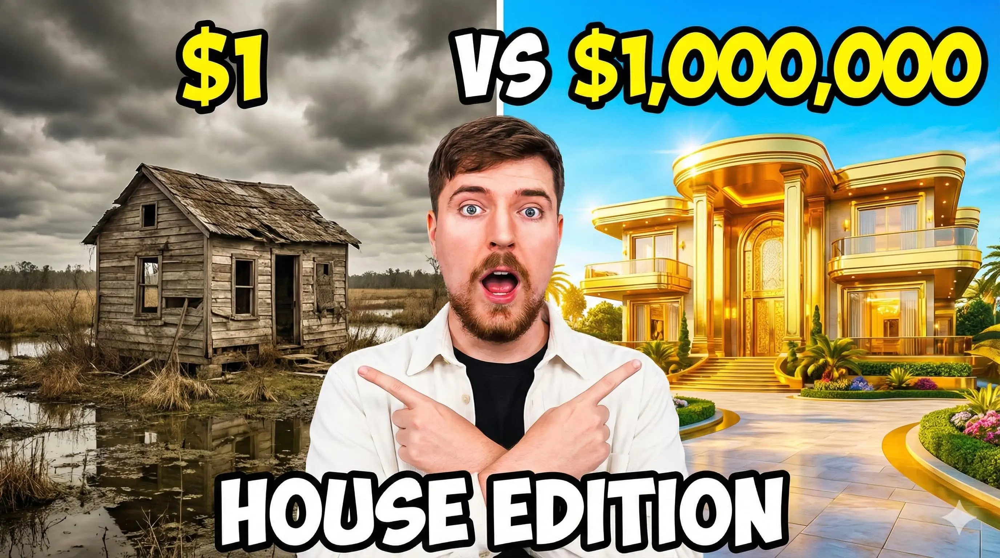

---

#### MrBeast Style - Construction/Cutaway

**Tags:** `mrbeast`, `youtube`, `thumbnail`, `cutaway`, `underground`

```json
{
  "style": "MrBeast Construction Cutaway",
  "description": "Cross-section view showing interior of underground or hidden structures",
  "composition": {
    "perspective": "Side cross-section view",
    "layout": "Multi-level structure with visible internal rooms",
    "style": "Cutaway diagram but photorealistic"
  },
  "structure": {
    "type": "Underground bunker, secret base, or hidden facility",
    "levels": "Multiple floors or rooms visible",
    "details": "Distinct rooms with different purposes (bedroom, gaming, storage, etc.)"
  },
  "interior_elements": {
    "rooms": "Clearly defined spaces with furniture and equipment",
    "connections": "Tunnels, ladders, stairs between levels",
    "lighting": "Individual lighting in each room creating cozy atmosphere",
    "furnishings": "Gaming setups, beds, storage, luxury items"
  },
  "exterior_elements": {
    "surrounding": "Earth, dirt, rock textures encasing the structure",
    "contrast": "Clean modern interior vs rough natural exterior",
    "depth": "Shows how deep underground the structure goes"
  },
  "lighting": {
    "interior": "Warm, inviting lights in each room",
    "exterior": "Natural earth tones, darker surroundings",
    "contrast": "Bright interiors stand out against dark earth"
  },
  "colors": {
    "interior": "Warm lighting, colorful furnishings, modern tech",
    "exterior": "Browns, dark grays, natural earth tones",
    "saturation": "High in interior rooms, muted in surrounding earth"
  },
  "variations": [
    {
      "name": "Underwater Base",
      "description": "Cross-section of underwater facility surrounded by ocean and marine life"
    },
    {
      "name": "Space Station",
      "description": "Cross-section of orbital station showing multiple modules in space"
    },
    {
      "name": "Mobile Vehicle",
      "description": "Cutaway of massive RV or plane showing luxury interior while moving"
    }
  ],
  "usage_instructions": {
    "step_1": "ATTACH/UPLOAD an image of yourself or the person for the thumbnail",
    "step_2": "Use this prompt with the attached image to generate the thumbnail",
    "step_3": "The AI will composite the person from your image into the scene (e.g., standing next to the cutaway)",
    "requirement": "You MUST attach an image - AI will use that person as the presenter",
    "note": "Use a photo of the person looking impressed or pointing"
  },
  "prompt_template": "Create YouTube thumbnail (16:9) using the ATTACHED IMAGE of the person: Place them in the foreground reacting to the background. Background: cross-section side view cutaway of underground bunker showing 5 different lit rooms (gaming room, bedroom, kitchen, storage, living area) with furniture and equipment visible, surrounded by brown earth and dirt textures. Person looks amazed pointing at the bunker. Add yellow text top 'SECRET UNDERGROUND' with 8px black outline. White text bottom 'BUNKER BASE' with black outline. Cutaway diagram style, extremely vibrant interior colors, professional YouTube thumbnail style"
}
```

## Example Output


---

#### MrBeast Style - Extreme Scale

**Tags:** `mrbeast`, `youtube`, `thumbnail`, `scale`, `massive`

```json
{
  "style": "MrBeast Extreme Scale",
  "description": "Thumbnail emphasizing massive scale through human vs object contrast",
  "composition": {
    "contrast": "Tiny human figure vs impossibly large object",
    "perspective": "Forced perspective to maximize scale difference",
    "camera_angle": "Low angle looking up (hero shot) OR high angle looking down (abyss shot)"
  },
  "subject": {
    "size": "Small, dwarfed by the massive object",
    "position": "At base of object or edge of pit/structure",
    "expression": "Awe, shock, disbelief, amazement"
  },
  "object": {
    "scale": "Impossibly large, towering or vast",
    "examples": "100-story LEGO tower, mountain of cash, massive pit, giant food item",
    "detail": "Highly detailed to emphasize realistic scale"
  },
  "camera": {
    "low_angle": "Looking up at towering object (hero shot)",
    "high_angle": "Looking down into massive pit or expanse (abyss shot)",
    "technique": "Forced perspective to exaggerate scale difference"
  },
  "lighting": {
    "style": "Bright, clear to show full scale",
    "weather": "Sunny day or dramatic clouds",
    "shadows": "Long shadows emphasizing height/depth"
  },
  "colors": {
    "palette": "Vibrant, eye-catching colors",
    "saturation": "Very high",
    "contrast": "Strong to make scale obvious"
  },
  "emotion": {
    "primary": "Awe and amazement",
    "secondary": "Shock, disbelief at scale",
    "body_language": "Looking up/down, arms spread, jaw dropped"
  },
  "variations": [
    {
      "name": "Giant Food",
      "description": "Tiny person next to world's largest pizza slice or burger"
    },
    {
      "name": "Massive Pit",
      "description": "Person at edge looking down into impossibly deep pit or hole"
    },
    {
      "name": "Explosive Mountain",
      "description": "Person running from mountain-sized pile of TNT or fireworks"
    }
  ],
  "usage_instructions": {
    "step_1": "ATTACH/UPLOAD an image of yourself or the person for the thumbnail",
    "step_2": "Use this prompt with the attached image to generate the thumbnail",
    "step_3": "The AI will composite the person from your image into the scene",
    "requirement": "You MUST attach an image - AI will use that person looking amazed/shocked",
    "note": "Use a photo of the person looking up or amazed"
  },
  "prompt_template": "Create YouTube thumbnail (16:9) using the ATTACHED IMAGE of the person: Place them at the base of the tower looking up in awe. Scene: person standing at base of colossal 100-story tower made entirely of colorful LEGO bricks, extreme forced perspective showing massive scale difference, bright sunny day with blue sky. Person hands on head in shock. Add yellow text top 'WORLD'S BIGGEST' with 8px black outline. White text bottom 'LEGO TOWER' with black outline. Yellow arrow pointing to tower. Extremely oversaturated colors, professional YouTube thumbnail style"
}
```

## Example Output
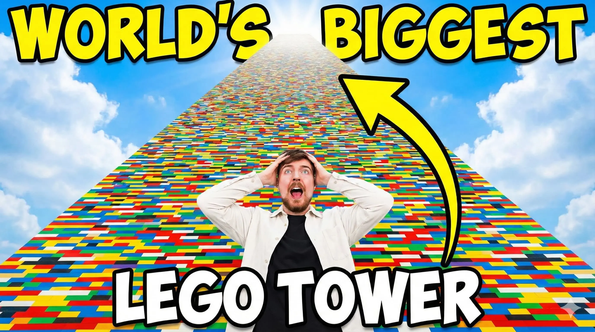

---

#### MrBeast Style - Face-Off

**Tags:** `mrbeast`, `youtube`, `thumbnail`, `competition`, `versus`

```json
{
  "style": "MrBeast Face-Off",
  "description": "Competitive versus thumbnail showing two opposing teams or groups",
  "composition": {
    "layout": "Two opposing sides facing each other",
    "center": "Meeting point or division line",
    "symmetry": "Balanced composition with equal weight on both sides"
  },
  "teams": {
    "left_side": "First team/group with distinct color (red, blue, etc.)",
    "right_side": "Opposing team/group with contrasting color",
    "examples": "Red vs Blue, Men vs Women, Old vs Young, Pro vs Amateur"
  },
  "action": {
    "movement": "Running or charging towards center",
    "posture": "Aggressive, competitive stances",
    "energy": "High intensity, action-packed"
  },
  "background": {
    "setting": "Stadium, arena, battleground, or competition venue",
    "atmosphere": "Competitive, energetic, intense",
    "details": "Crowd, lights, or dramatic environment"
  },
  "lighting": {
    "style": "Bright stadium lights or dramatic spotlights",
    "color_tinting": "Subtle color glow on each team (red/blue tint)",
    "intensity": "High energy, well lit"
  },
  "colors": {
    "team_colors": "Strongly contrasting (red vs blue most common)",
    "saturation": "Very high",
    "contrast": "Maximum to distinguish teams clearly"
  },
  "effects": {
    "motion_blur": "Slight blur to show movement and action",
    "dramatic_effect": "Competition atmosphere, high stakes",
    "quality": "Photorealistic, action shot"
  },
  "variations": [
    {
      "name": "Sports Challenge",
      "description": "Soccer team vs rugby team in competitive showdown"
    },
    {
      "name": "Generational Battle",
      "description": "Gen Z vs Boomers in head-to-head competition"
    },
    {
      "name": "Professional Face-Off",
      "description": "Chefs vs fast food workers, pros vs amateurs"
    }
  ],
  "usage_instructions": {
    "step_1": "ATTACH/UPLOAD an image of yourself or the person for the thumbnail",
    "step_2": "Use this prompt with the attached image to generate the thumbnail",
    "step_3": "The AI will composite the person from your image as the referee/host or main competitor",
    "requirement": "You MUST attach an image - AI will use that person in the center or leading a team",
    "note": "Use a photo of the person shouting or running"
  },
  "prompt_template": "Create YouTube thumbnail (16:9) using the ATTACHED IMAGE of the person: Place them in the foreground as the host/leader. Scene: two groups of people running towards each other in stadium. LEFT SIDE red team in red uniforms. RIGHT SIDE blue team in blue uniforms. Action shot with motion blur. Person in center/foreground shouting instructions. Add yellow text top 'RED VS BLUE' with 8px black outline. White text bottom 'BATTLE ROYALE' with black outline. Extremely vibrant team colors, high contrast, professional YouTube thumbnail style"
}
```

## Example Output


---

#### MrBeast Style - Last To

**Tags:** `mrbeast`, `youtube`, `thumbnail`, `challenge`, `endurance`

```json
{
  "style": "MrBeast Last To Leave Challenge Thumbnail",
  "description": "YouTube thumbnail showing endurance challenge with bold text and closeup action",
  "composition": {
    "layout": "16:9 YouTube thumbnail with dramatic close-up composition",
    "focus": "Extreme close-up of hands on object with visible strain",
    "background": "Blurred contestants, depth of field effect",
    "text_space": "Top and bottom areas for bold text overlays"
  },
  "visual_elements": {
    "foreground": "Sweaty hands gripping luxury car, visible veins and exhaustion",
    "subject_detail": "Close-up showing physical strain, sweat droplets, shaking",
    "background": "Out of focus silhouettes of other contestants collapsing",
    "object": "Expensive car, luxury item, or challenge target"
  },
  "text_overlays": {
    "top_text": "Bold yellow text 'LAST TO LEAVE' or 'LAST TO TOUCH' with black outline",
    "bottom_text": "White text describing prize 'WINS $1,000,000 CAR' with thick black stroke",
    "font_style": "Impact, all caps, extremely bold",
    "timer_element": "Optional countdown timer graphic overlay"
  },
  "graphic_elements": {
    "arrows": "Yellow arrow pointing to hands or contact point",
    "circles": "Red circle highlighting the exact touch point",
    "effects": "Motion lines or stress indicators around hands"
  },
  "colors": {
    "saturation": "Extremely high, vivid car colors",
    "contrast": "Maximum on foreground, desaturated background",
    "palette": "Bright object colors, golden skin tones, vibrant text",
    "editing": "Heavy clarity boost, sharpness on hands, background blur"
  },
  "lighting": {
    "style": "Focused spotlight on hands and contact point",
    "mood": "High tension, dramatic, exhausting",
    "quality": "Photorealistic with enhanced drama"
  },
  "thumbnail_specific": {
    "format": "1280x720px YouTube thumbnail, 16:9",
    "emotion": "Visible exhaustion and determination",
    "clickability": "Immediate understanding of endurance challenge",
    "editing_style": "Professional thumbnail with clear text and graphics"
  },
  "usage_instructions": {
    "step_1": "ATTACH/UPLOAD a close-up image of hands for the thumbnail",
    "step_2": "Use this prompt with the attached image to generate the thumbnail",
    "step_3": "The AI will use your hands image and composite it with the car/object scene",
    "requirement": "You MUST attach an image - AI will use those hands in the final thumbnail",
    "note": "For best results, use a photo of hands with good lighting showing strain/effort"
  },
  "prompt_template": "Create YouTube thumbnail (16:9) using the ATTACHED IMAGE of hands: Show extreme close-up of those exhausted sweaty hands gripping bright red Lamborghini hood, enhance veins visibility, add sweat drops, blurred silhouettes of people collapsing in background. Add bold yellow text top 'LAST TO LEAVE' with thick 8px black outline. White text bottom 'WINS $1,000,000' with 8px black outline. Yellow arrow pointing to hands. Red circle highlighting contact point. Shallow depth of field, extremely vibrant car colors, high tension, professional YouTube thumbnail style"
}
```

---

#### MrBeast Style - Stack/Quantity

**Tags:** `mrbeast`, `youtube`, `thumbnail`, `stack`, `money`

```json
{
  "style": "MrBeast Stack/Quantity",
  "description": "Thumbnail emphasizing overwhelming quantity and abundance",
  "composition": {
    "subject": "Person buried, surrounded, or swimming in massive quantity",
    "items": "Infinite sea of items filling entire background",
    "perspective": "Wide angle showing the overwhelming scale"
  },
  "quantity": {
    "scale": "Massive, overwhelming, seemingly infinite",
    "coverage": "Subject buried up to neck or completely surrounded",
    "items": "Money, cars, luxury items, food, tech, or identical objects"
  },
  "subject": {
    "position": "Buried, swimming, or overwhelmed by items",
    "expression": "Shocked, overwhelmed, amazed",
    "visibility": "Partially or fully surrounded by the items"
  },
  "items": {
    "examples": "Golden coins, cash stacks, cars, phones, food items, LEGO bricks",
    "appearance": "Sparkling, detailed, high quality textures",
    "fill": "Background completely filled, showing massive quantity"
  },
  "lighting": {
    "style": "Bright, highlighting the items",
    "effect": "Sparkling or glowing effect on valuable items",
    "quality": "High key to show volume and detail"
  },
  "colors": {
    "palette": "Rich, luxurious colors (gold, vibrant reds, bright colors)",
    "saturation": "Very high",
    "effect": "Eye-catching, wealth and abundance"
  },
  "emotion": {
    "primary": "Overwhelmed by abundance",
    "secondary": "Shock, disbelief, amazement",
    "impact": "Visual excess, more than imaginable"
  },
  "variations": [
    {
      "name": "Food Pool",
      "description": "Person swimming in pool completely filled with cereal or candy"
    },
    {
      "name": "Tech Mountain",
      "description": "Person surrounded by 1,000 identical smartphones or tech items"
    },
    {
      "name": "Nature Burial",
      "description": "Person buried in massive pile of flowers or natural items"
    }
  ],
  "usage_instructions": {
    "step_1": "ATTACH/UPLOAD an image of yourself or the person for the thumbnail",
    "step_2": "Use this prompt with the attached image to generate the thumbnail",
    "step_3": "The AI will composite the person from your image buried in the coins",
    "requirement": "You MUST attach an image - AI will use that person's face/upper body",
    "note": "Use a photo of the person looking overwhelmed/shocked"
  },
  "prompt_template": "Create YouTube thumbnail (16:9) using the ATTACHED IMAGE of the person: Place them buried up to the neck in a massive room filled with millions of shiny golden coins. Person looks shocked/overwhelmed. Wide angle shot emphasizing overwhelming quantity. Add yellow text top 'BURIED IN' with 8px black outline. White text bottom '1,000,000 GOLD COINS' with black outline. Extremely vibrant gold colors, high saturation, professional YouTube thumbnail style"
}
```

## Example Output


---

#### MrBeast Style - Survival Challenge

**Tags:** `mrbeast`, `youtube`, `thumbnail`, `survival`, `challenge`

```json
{
  "style": "MrBeast Survival Challenge Thumbnail",
  "description": "YouTube thumbnail with MrBeast clearly visible, shocked expression, trapped in extreme survival challenge",
  "composition": {
    "layout": "16:9 YouTube thumbnail, split view (above and below water/surface)",
    "subject": "MrBeast in red jacket, clearly visible inside transparent glass cube, shocked worried expression looking at camera",
    "perspective": "Medium-wide shot showing both MrBeast's face/body AND the dangerous environment",
    "text_placement": "Top left for title, bottom for description"
  },
  "subject_details": {
    "person": "MrBeast (or main YouTuber) prominently visible, NOT tiny",
    "clothing": "Bright red or blue jacket/hoodie for high contrast",
    "facial_expression": "Shocked, worried, dramatic expression looking toward camera",
    "body_language": "Arms out, hands visible, conveying desperation or shock",
    "visibility": "Face and upper body clearly recognizable even at thumbnail size"
  },
  "visual_elements": {
    "main_scene": "Split view - above water showing sunset sky, below water showing sharks circling",
    "glass_cube": "Transparent cube visible both above and below water surface",
    "environment": "Vast endless ocean on all sides",
    "danger": "3-5 large sharks circling underwater, clearly visible and menacing",
    "sky": "Dramatic golden/orange sunset with clouds"
  },
  "text_overlays": {
    "top_text_line1": "White bold text 'MRBEAST' with thick 8px black outline",
    "top_text_line2": "Yellow bold text 'SURVIVE' directly below, with thick 8px black outline",
    "bottom_text": "Huge white text '100 DAYS TRAPPED IN GLASS' with thick 8px black outline, taking up bottom 25%",
    "font": "Impact font, all caps, extremely bold",
    "arrow": "Bright yellow curved arrow pointing from 'SURVIVE' text down to the glass cube"
  },
  "graphic_elements": {
    "arrow_style": "Thick yellow curved arrow with black outline, pointing to subject",
    "text_effects": "Drop shadow and glow on all text for maximum readability",
    "optional": "Red circle around sharks or danger elements"
  },
  "colors": {
    "saturation": "EXTREMELY high - boosted 150-200% beyond natural",
    "contrast": "Maximum contrast, oversaturated intentionally",
    "ocean": "Vibrant turquoise blue underwater, dramatic dark blue depths",
    "sky": "Golden orange sunset, purple/pink clouds",
    "editing": "Heavy color grading, extreme clarity, HDR-style boosted"
  },
  "lighting": {
    "above_water": "Golden hour dramatic sunset lighting",
    "below_water": "Moody blue underwater lighting with visible light rays",
    "subject": "Well-lit so face is clearly visible",
    "mood": "Epic, dramatic, life-threatening situation"
  },
  "thumbnail_specific": {
    "format": "1280x720px, 16:9 aspect ratio",
    "face_visibility": "Person's face MUST be clearly visible and recognizable",
    "emotion": "Shocked/worried expression is critical for engagement",
    "clickability": "Immediately understand: person trapped, sharks, extreme danger",
    "style": "Professional YouTube thumbnail, Photoshop composite with text layers"
  },
  "usage_instructions": {
    "step_1": "ATTACH/UPLOAD an image of yourself or the person for the thumbnail",
    "step_2": "Use this prompt with the attached image to generate the thumbnail scene",
    "step_3": "The AI will composite the person from your uploaded image into the survival scene",
    "requirement": "You MUST attach an image of a person - the AI will use that person's face and body in the thumbnail",
    "note": "Do not describe a person - always use an attached reference image for best results"
  },
  "prompt_template": "Create YouTube thumbnail (16:9) using the ATTACHED IMAGE of the person: Place them inside transparent glass cube floating in ocean, with shocked worried expression looking at camera, arms spread showing desperation. Split view showing above water (dramatic golden sunset sky) and below water (5 large sharks circling menacingly). Add white text top left 'MRBEAST' with thick 8px black outline. Yellow text below 'SURVIVE' with thick 8px black outline. Yellow curved arrow pointing down to cube. Huge white text bottom '100 DAYS TRAPPED IN GLASS' with 8px black outline. Extremely oversaturated vibrant colors, maximum contrast, professional YouTube thumbnail style"
}
```

## Example Output


---

#### MrBeast Style - Transformation

**Tags:** `mrbeast`, `youtube`, `thumbnail`, `transformation`, `before-after`

```json
{
  "style": "MrBeast Transformation Thumbnail",
  "description": "YouTube thumbnail with dramatic before/after split screen and bold text labels",
  "composition": {
    "layout": "16:9 vertical split screen thumbnail",
    "left_side": "Before state - dirty, broken, neglected (desaturated)",
    "right_side": "After state - clean, restored, amazing (vibrant)",
    "divider": "Clean vertical line down the center",
    "text_placement": "BEFORE and AFTER labels on respective sides"
  },
  "visual_elements": {
    "before_side": "Trash-covered beach, cluttered house, or destroyed area with muted colors",
    "after_side": "Pristine beach, luxury mansion, or restored paradise with vivid colors",
    "contrast": "Maximum visual difference between the two sides",
    "details": "Clear visible improvements, dramatic transformation"
  },
  "text_overlays": {
    "before_label": "Bold white text 'BEFORE' with black outline on left side",
    "after_label": "Bold white text 'AFTER' with black outline on right side",
    "main_text": "Optional top text 'WE CLEANED THE OCEAN' in yellow with black outline",
    "font_style": "Impact, all caps, extremely bold and readable"
  },
  "graphic_elements": {
    "arrows": "Optional arrows showing the transformation direction",
    "highlights": "Circles or boxes highlighting key improvements",
    "effects": "Glow or emphasis on the most dramatic changes"
  },
  "colors": {
    "before_saturation": "Low, desaturated, gray and brown tones",
    "after_saturation": "Extremely high, vibrant blues, greens, whites",
    "contrast": "Maximum between sides to emphasize transformation",
    "editing": "Heavy color grading difference between left and right"
  },
  "lighting": {
    "before": "Dim, cloudy, depressing lighting",
    "after": "Bright, sunny, golden hour perfection",
    "quality": "Photorealistic with enhanced contrast"
  },
  "thumbnail_specific": {
    "format": "1280x720px, 16:9 split screen",
    "impact": "Immediately obvious dramatic transformation",
    "clickability": "Clear story of amazing change",
    "editing_style": "Professional YouTube thumbnail with text labels"
  },
  "usage_instructions": {
    "step_1": "ATTACH/UPLOAD an image of yourself or the person for the thumbnail",
    "step_2": "Use this prompt with the attached image to generate the thumbnail",
    "step_3": "The AI will composite the person from your image into the center or foreground",
    "requirement": "You MUST attach an image - AI will use that person as the presenter",
    "note": "Ideally use a photo of the person looking shocked or pointing"
  },
  "prompt_template": "Create YouTube thumbnail (16:9) using the ATTACHED IMAGE of the person: Place them in the CENTER reacting to the split screen behind them. LEFT SIDE: dirty trash-covered beach with muted desaturated colors. RIGHT SIDE: pristine white sand beach with crystal turquoise water and bright sunny sky. Person should look shocked/amazed pointing at the clean side. Add bold white text 'BEFORE' on left with 8px black outline. Bold white text 'AFTER' on right with 8px black outline. Yellow text at top 'WE CLEANED THE OCEAN' with black outline. Maximum saturation contrast between sides, professional YouTube thumbnail style"
}
```

## Example Output
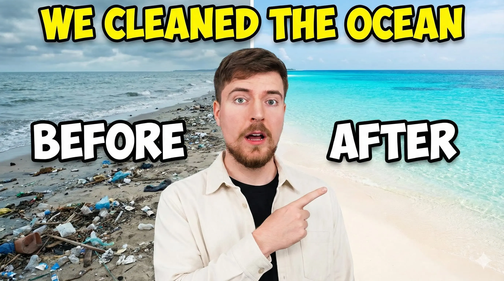

---

#### MrBeast Style - Trap/Danger

**Tags:** `mrbeast`, `youtube`, `thumbnail`, `danger`, `trap`

```json
{
  "style": "MrBeast Trap/Danger",
  "description": "High-stakes danger thumbnail showing deadly traps or obstacle courses",
  "composition": {
    "perspective": "First person POV or wide shot showing full trap",
    "layout": "Dangerous obstacles clearly visible and threatening",
    "framing": "Emphasize the danger and difficulty"
  },
  "trap_elements": {
    "obstacles": "Lasers, spikes, swinging axes, crushing walls, lava pits",
    "danger_level": "Life-threatening appearance, high stakes",
    "complexity": "Complex obstacle course or deadly maze"
  },
  "perspective_options": {
    "first_person": "POV looking at approaching danger",
    "wide_shot": "Full view showing scale and complexity of trap",
    "dramatic_angle": "Low or high angle emphasizing danger"
  },
  "lighting": {
    "style": "Dark, moody with dramatic highlights",
    "colors": "Red warning lights, ominous shadows",
    "mood": "Dangerous, high-stakes, threatening",
    "effect": "Volumetric fog or smoke for atmosphere"
  },
  "colors": {
    "palette": "Dark tones with red warning lights",
    "danger_colors": "Reds, oranges (fire/lava), harsh whites (lasers)",
    "saturation": "High on danger elements, desaturated background",
    "contrast": "Very high for dramatic effect"
  },
  "atmosphere": {
    "mood": "Danger, high stakes, life or death",
    "tension": "Maximum suspense",
    "impact": "Viewer feels the danger"
  },
  "effects": {
    "visual": "Motion blur on moving obstacles, laser beams visible",
    "environmental": "Smoke, fog, sparks, warning lights",
    "quality": "Cinematic, movie-like danger scene"
  },
  "variations": [
    {
      "name": "Lava Floor",
      "description": "Floor is lava challenge with platforms and rising molten danger"
    },
    {
      "name": "Laser Maze",
      "description": "Impossible laser maze with crisscrossing red beams in dark room"
    },
    {
      "name": "Height Challenge",
      "description": "Walking tightrope between skyscrapers with dizzying drop below"
    }
  ],
  "usage_instructions": {
    "step_1": "ATTACH/UPLOAD an image of yourself or the person for the thumbnail",
    "step_2": "Use this prompt with the attached image to generate the thumbnail",
    "step_3": "The AI will composite the person from your image running or dodging the trap",
    "requirement": "You MUST attach an image - AI will use that person in danger",
    "note": "Use a photo of the person looking scared or running"
  },
  "prompt_template": "Create YouTube thumbnail (16:9) using the ATTACHED IMAGE of the person: Place them running away from hazardous obstacle course with massive swinging axes and lasers. Person looks terrified looking back. Red warning lights flashing, dark moody atmosphere, fog. Add yellow text top 'DEADLY' with 8px black outline. White text bottom 'OBSTACLE COURSE' with black outline. Red danger symbols. High contrast dramatic shadows, professional YouTube thumbnail style"
}
```

## Example Output
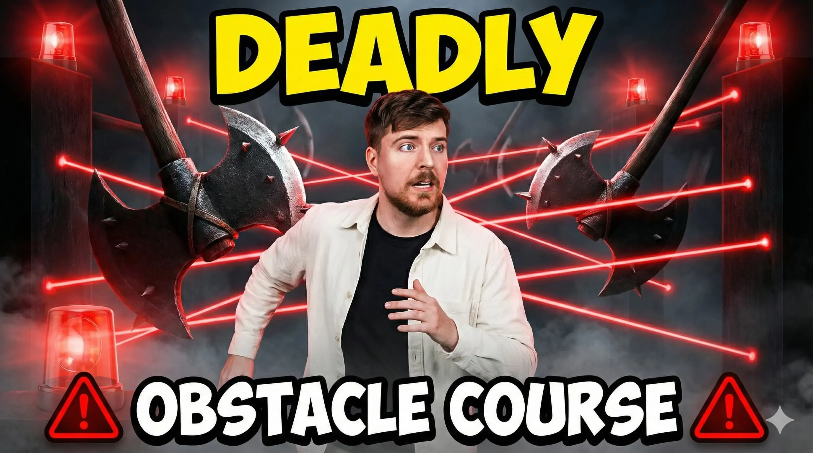

---

#### MrBeast Style - Vehicle/Speed

**Tags:** `mrbeast`, `youtube`, `thumbnail`, `vehicle`, `action`

```json
{
  "style": "MrBeast Vehicle/Speed",
  "description": "High-octane action thumbnail featuring vehicles in extreme situations",
  "composition": {
    "focus": "Vehicle in dramatic action moment",
    "angle": "Dynamic angle showing movement and speed",
    "framing": "Capture the peak action moment"
  },
  "vehicle": {
    "type": "Expensive (Lamborghini, Ferrari), Military (Tank), or Fast (Train, Jet)",
    "condition": "Mid-action, jumping, crashing, or racing",
    "prominence": "Main subject, clearly visible and impressive"
  },
  "action": {
    "type": "Crashing, jumping, racing, colliding, or destroying",
    "intensity": "Maximum action, peak moment",
    "drama": "Destruction, speed, or impressive stunt"
  },
  "effects": {
    "motion_blur": "Speed lines, motion blur to show velocity",
    "destruction": "Sparks flying, debris, smoke, explosions",
    "environmental": "Dust clouds, tire marks, impact effects"
  },
  "background": {
    "setting": "Racetrack, desert, open road, or urban environment",
    "atmosphere": "Action movie aesthetic",
    "details": "Environmental destruction, dramatic landscape"
  },
  "lighting": {
    "style": "Dramatic, action movie lighting",
    "effect": "Bright highlights on vehicle, dramatic shadows",
    "mood": "Intense, high-energy, explosive"
  },
  "colors": {
    "palette": "Vibrant vehicle colors, warm explosion tones",
    "saturation": "Very high",
    "contrast": "Strong to emphasize action",
    "accents": "Orange/red explosions, metallic vehicle shine"
  },
  "camera": {
    "angle": "Low angle for power, or action angle for drama",
    "movement": "Frozen peak action moment",
    "style": "Action movie cinematography"
  },
  "variations": [
    {
      "name": "Train Collision",
      "description": "Stopping runaway train with wall of cars, massive collision"
    },
    {
      "name": "Yacht vs Nature",
      "description": "Massive yacht confronting tsunami wave"
    },
    {
      "name": "Speed Race",
      "description": "Ferrari racing against modified go-kart in dramatic showdown"
    }
  ],
  "usage_instructions": {
    "step_1": "ATTACH/UPLOAD an image of yourself or the person for the thumbnail",
    "step_2": "Use this prompt with the attached image to generate the thumbnail",
    "step_3": "The AI will composite the person from your image reacting to the stunt",
    "requirement": "You MUST attach an image - AI will use that person in foreground",
    "note": "Use a photo of the person screaming or looking shocked"
  },
  "prompt_template": "Create YouTube thumbnail (16:9) using the ATTACHED IMAGE of the person: Place them in foreground screaming/reacting to the background action. Background: military tank mid-air jumping over yellow school bus, massive fiery explosion. Action movie cinematography, dust and debris. Add yellow text top 'TANK VS' with 8px black outline. White text bottom 'SCHOOL BUS' with black outline. Extremely vibrant explosion colors, high energy, professional YouTube thumbnail style"
}
```

## Example Output
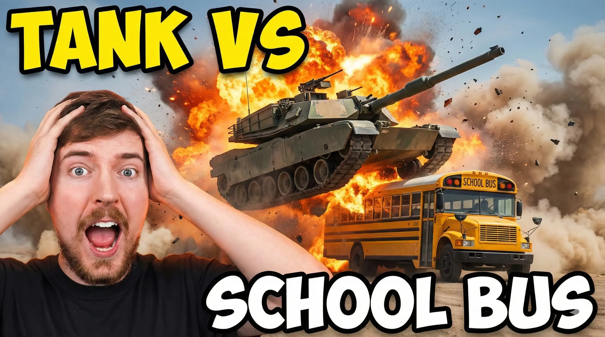

---

